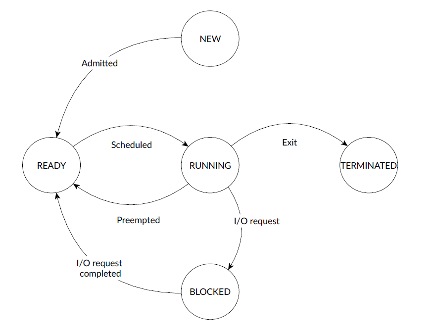
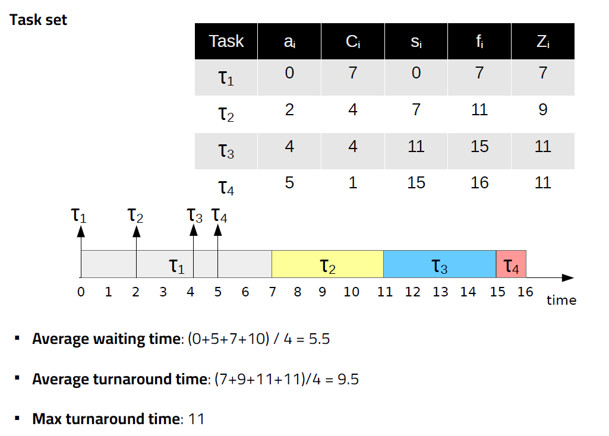
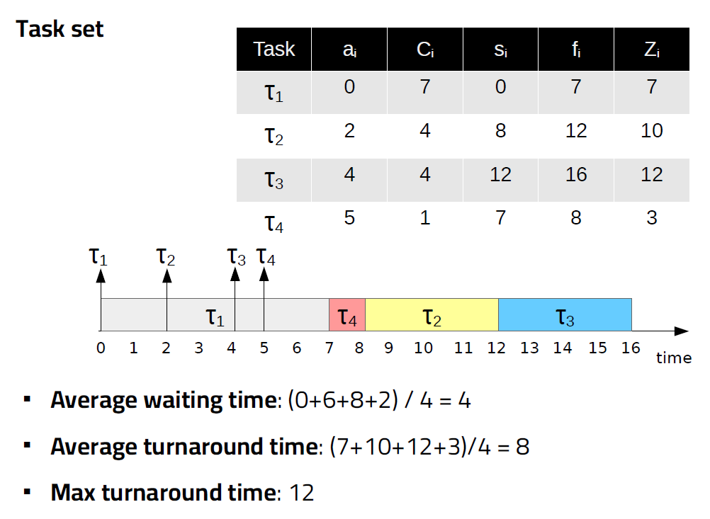
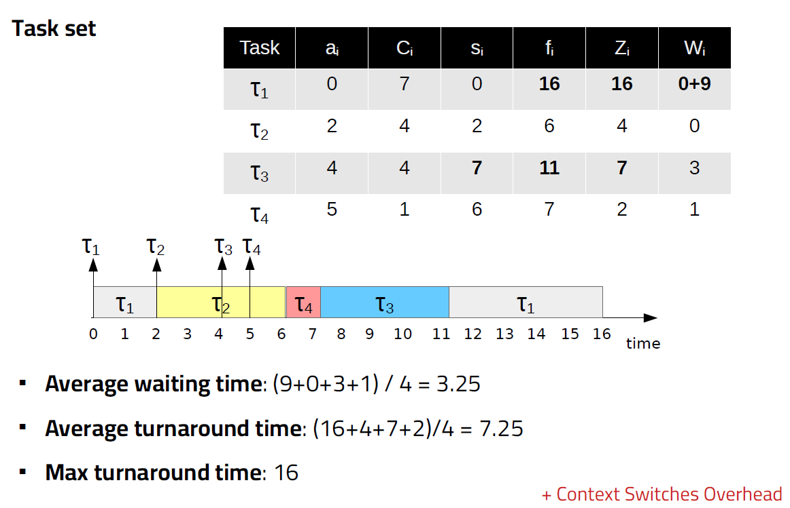
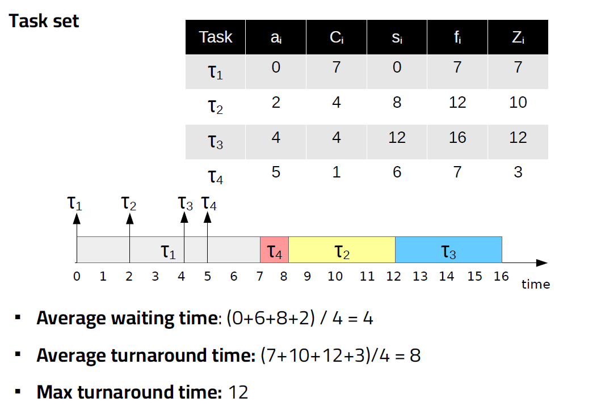
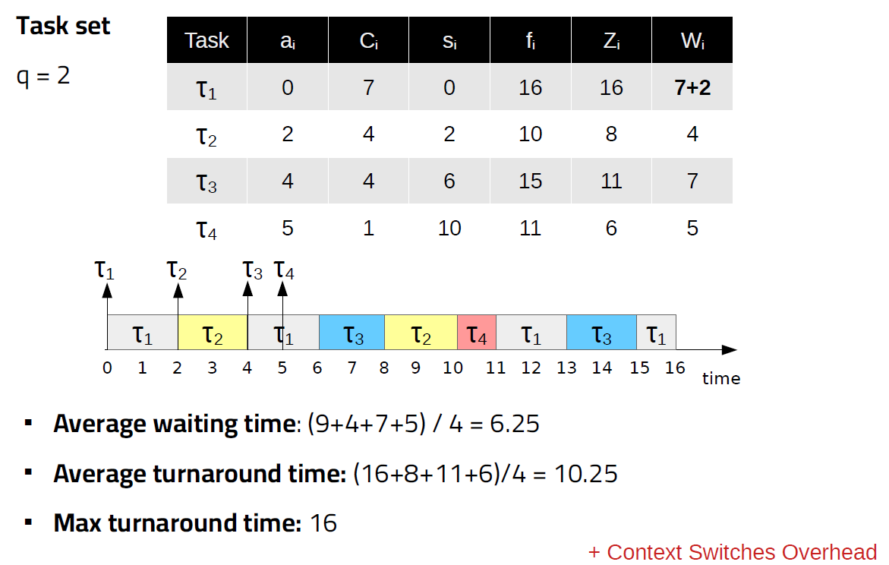
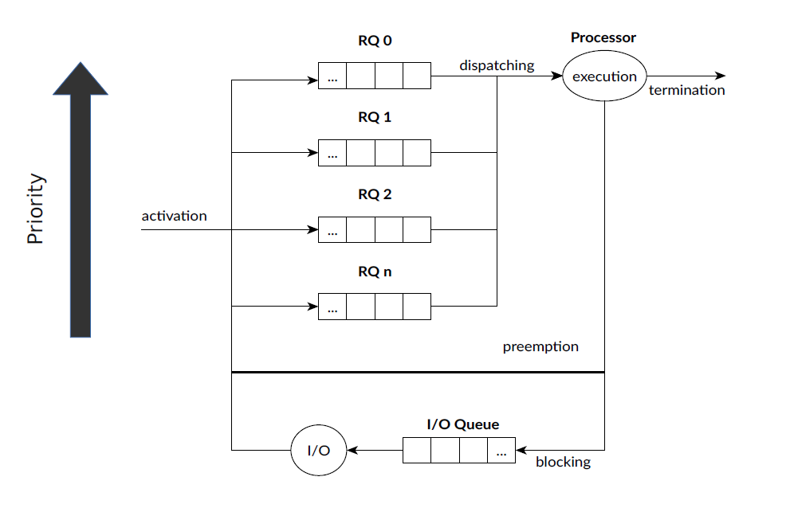

# AOS

## Multiprocessing and IPC

### Definitions

- program: sequence of instruction stored somewhere, not in execution
- application: user-oriented concept of program, describe programs with GUI
- process: instance of a program currently executing
- thread: smallest schedulable unit of execution
  - process can contain multiple threads of execution (see later)
- task: not unique definition, usually synonym of thread, but depends on contex

### Process

- instance of a program currently in execution
- has an isolated address space
- can contain one or more threads

### Threads

- smallest schedulable execution unit
- belong to the memory address space of a process
- share memory address space with other threads of the same process
  - can synchronize each other
  - can access global aread (heap, data, ..)
  - can access variables in other thread if address is known

## Communication betweeen processes

How can we have different processes communicate with each other? They have different address space.

OS offers inter process communication. There are different ways of doing . First we see how to spawn new processes and then how to communicate.

### Forking

`fork()` spawns a new child process which is a copy of itself. The child program will be exactly the same and will start from the instruction following the fork, except from the return value of the `fork()`:

- 0 in the child process
- child PID in the parent process

The two processes will have a different address space, the memory is not actually copied until one of the two processes writes on it (copy-on-write) for efficiency.

We have no control over which one of the two processes will execute first a certain part, they are concurrent.

Each process has:

- exactly one parent
- zero or more child processes
- PID: Process IDentifier
  - `pid_t`, currently 32 bit integer
  - limeted by `/proc/sys/pid_max`
- PPID: Parent PID

### Executing

Load a new program and replace the current process image with it.

It uses the `execve` syscall, C offers several interface to this with some slight variations:
`exec,execlp,execle,execv,execvp,execve`

structure is exec + options

- -l accepts list of parameters, NULL terminated
- -v accepts array of NULL terminated strings
- -p search the PATH environment variable
- -e allows to specify new environment variables

### Inter-Process Communication (IPC)

We will follow the POSIX standard (no SystemV):

- newer
- IEEE 1003.1-2017 follow posix standard
- thread-safe

We will see the following POSIX components:

- signals
- pipes (also called unnamed pipes)
- FIFO (also called named pipes)
- message queues
- shared memory
- semaphores

#### Signals

- unidirectional
- no data transfer, contain only the signal type
- asynchronous

Used to signal some event (I/O operation done, exceptions):

- SIGCHLD, child sends to parent when it terminates
- SIGILL, sent to a process by the OS if it tries to executes an illegal instruction
- many other

Most signals by default cause the termination of the process, but the behaviour can be overridden with a custom signal handler.

Sending signal

```C
#include <signal.h>
#include <sys/types.h>
int kill(pid_t pid, int sig);
// pid: pid of the receiving program
// sign: the signal to send
// returns 0 on success -1 on fail
```

Handling signal

```C
#include <signal.h>
int sigaction(int signum, const struct sigaction *act, struct sigaction *oldact);
// signum: the signal to handle
// act: handler to call when receiving the signal
// oldact: saves old handler (can be NULL)
// returns 0 on success -1 on fail
```

The `act` structure contains all the info on handling the signal

```C
struct sigaction {
void (*sa_handler)(int);
void (*sa_sigaction)(int, siginfo_t *, void *);
sigset_t sa_mask;
int sa_flags;
void (*sa_restorer)(void);
};
```

- `sa_handler`: function to handle the signal (or `SIG_IGN` to ignore it)
- `sa_sigaction`: alternative handler that accepts input data
- `sa_mask`: set a mask to block certain signals (Not all signals can be blocked or ignored)*
- `sa_flags`: various options, see docs
- `sa_restore`: not in POSIX, not for user use, don't use

*masked signals are queued for later processing (SIGKILL and SIGSTOP cannot be masked)

#### Pipes

Based on the producer/consumer pattern, they are unidirecitonal queues where data is written/read FIFO.

In Linux, the OS guarantees that only one process at a time can access the pipe.

Creating a pipe

```C
#include <unistd.h>
#include <fcntl.h>

int pipe(int pipefd[2]);
int pipe2(int pipefd[2], int flags);
```

`pipefd` will be filled with two file descriptors:

- `pipefd[0]` the read end of the pipe
- `pipefd[1]` the write end of the pipe

`flags` can be various options (e.g. non blocking if full/empty)

To use a pipe one can directly do r/w operations on them with low level `read` and `write` or open them as a stream (like a file).

#### FIFO

Similar to pipes, they are based on special files in the filesystem, but no actual I/O is done, the OS passes the data. (It sorts of pretend that it is a file, usually under `/tmp/something`).

Creating a FIFO

```C
#include <sys/types.h>
#include <sys/stat.h>

int mkfifo(const char *pathname, mode_t mode);
```

#### Message queues

Suitable for multiple writers and readers, based on a priority queue. Can be accessed via special files in the `/dev/mqueue/` directory. (requires POSIX real-time extension library)

Creating a message queue

```C
#include <mqueue.h>
mqd_t mq_open(const char *name, int oflag, mode_t mode, struct mq_attr *attr);
```

- `name`: a unique name for the message queue, starting with `/`
- `oflag`: opening flag O_RDONLY, etc
- `mode`: the permission to give the file
- `attrs`: attributes (see struct)

  ```C
  struct mq_attr {
  long mq_flags; // 0 or NON_BLOCK
  long mq_maxmsg; // max nr. messages in the queue
  long mq_msgsize; // max message size in bytes
  long mq_curmsgs; // nr. messages currently in the queue
  };
  ```

A process can use the queue using these functions (args are self explainatory, priority is 0-31, same priority messages follow FIFO logic)

```C
#include <mqueue.h>
int mq_send(mqd_t mqdes, const char *msg_ptr, size_t msg_len, unsigned int msg_prio);

int mq_receive(mqd_t mqdes, char *msg_ptr, size_t msg_len, unsigned int *msg_prio);
```

#### Shared memory

Allow processes to share a memory segment, based on the *memory mapping* concept (require POSIX real-time extension library).

NOTE: shared memory access needs to be properly sinchronized, see later.

To use shared memory:

- create a shared memory area (args are the same as mqueue, returns a file descriptor)
  
  ```C
  #include <sys/mman.h>
  #include <sys/stat.h>
  #include <sys/fcntl.h>
  
  int shm_open(const char *name, int oflag, mode_t mode);
  ```

- specify the size of the special object with `fd_truncate`
- `mmap` the fd to an area of the memroy of the process

When the process is done, some cleanup is needed

```C
#include <sys/mman.h>

// delete the mapping in the process memory
int munmap(void *addr, size_t length);

// removes shared memory object created with the open
int shm_unlink(const char *name);
```

### Synchronization

The simplest mechanism is the `wait()` (and `waitpid(pid_t pid)`) primitive:

- wait:  suspends the execution until one child completes
- waitpid:  suspends execution until that specific child completes

signatures:

```C
pid_t wait(int *status);
pid_t waitpid(pid_t pid, int *status, int options);
```

status is used to collect the return value from the child process (can be NULL if i don't care)

#### zombie processes

If the parent process does't call `wait` before exiting the child processes will become zombies (they are ended but are waiting to return the exit value) and consume resources.

All orphan children are adopted by init that calls wait and frees memory and PID number.

Zombie processes are a sign of bad programming.

#### Semaphores

The approach based on `wait` is very limited. POSIX provides inter-process semaphores. The general logic is simple:

- semaphore counter == 0 ---> WAIT
- semaphore counter > 0 ---> proceed
  - if counter can only be 0 or 1 then it's a binary semaphore

There are 2 atomic functions to interact with the semaphore:

- `wait()` blocks until counter > 0, then decrements and proceed
- `post()` increment counter

Similarly to pipes, they can be named or unnamed. `pthread` library is required to use those.

```C
#include <semaphore.h>

// unnamed semaphores
// create
int sem_init(sem_t *sem, int pshared, unsigned int value);
// destroy
int sem_destroy(sem_t *sem);

// named semaphores
// create
sem_t * sem_open(const char *name, int oflags);
sem_t * sem_open(const char *name, int oflags, mode_t mode, unsigned int value);
// destroy
int sem_close(sem_t *sem);
int sem_unlink(const char *name);

// interacting with the semaphore
int sem_wait(sem_t *sem);
int sem_trywait(sem_t *sem);  // non blocking alternative
int sem_timedwait(sem_t *sem, const struct timespec *timeout);

int sem_post(sem_t *sem);
```

All functions return 0 on success and -1 on error.

#### Final notes

Choosing which IPC method do use is not trivial and can impact performance. The best choice depends on several variables:

- data size and type
- machine architecture
- system workload
- ...

See [this link](https://www.cl.cam.ac.uk/research/srg/netos/projects/ipc-bench/) for a study on IPC performance.

## Task scheduling

Scheduler: OS component responsible of establishing the order of execution of the tasks. The ordering alg. is called scheduling policy.

Idea:

- tasks are preeempted by the OS in order to dispatch another task
  - can be task triggered also but it's unusual
  - the OS also dispatches another task when the current one is blocked waiting for I/O operations
- preemption is performed via context switch: save current registers and load back the other task

Tasks can be in different states:



- new: task just created
- ready: task can be dispatched at any time
- running: currently using the CPu
- blocked: waiting on an I/O request
- terminated: the task has exited

In reality there are much more states defined in the Linux kernel, but those are the major ones.

### Task model

|[task_model](assets/task_model.png)

- `a_i` arrival time, when the tasks is ready to be scheduled
- `s_i` start time, starts execution
- `W_i` wait time, time spent waiting in the queue `W_i = s_i - a_i`
- `f_i` finishing time, when the execution terminates
- `C_i` computation time (or burst time), time necessary for the processor to execute the task (without interruptions)
- `Z_i` turnaround time, total time taken from whne the task is ready to when it completes `Z_i = f_i - a_i` (NOTE: not the same as `W_i + C_i` because there can be interruptions)

Based on the operation done by the task we distinguish between:

- CPU-bound
  - spends most of the time executing stuff
  - `Z_i ~ W_i + C_i`
- I/O bound
  - spends most of the time waiting for I/O operation
  - `Z_i >> W_i + C_i`

### Platform model

A computing system is composed of:

- `m` processing elements (PE) CPU
  - to each CPU, at each time `t`, it is assigned zero or one task
- `s` additional resources R
  - each resource, at each time `t` is assigned to zero or more tasks

### Problem statement

Given

- a set of `n` tasks
- a set of `m` PE
- a set of resources `R`

Compute an optimal schedule and allocation. (NP-complete problem)

This is very difficult: what does optimal mean? There can be different objective that require different policies to be in place in order to achieve it:

- maximize processor utilization
- maximize throughput: number of tasks completing per time unit
- minimize waiting time: time spent ready in the wait queue
- ensure fairness
- minimize scheduling overhead
- minimize turnaround time
- and many more: energy, power, temps, ....

These objective are generally in contrast with each other, we need to find a good balance.

#### Starvation

Undesirable condition in which one or more task cannot execute due to lack of resources (e.g. low priority task that always get pushed back in favor of higher priority tasks)

### Scheduling algorithms classification

- preemptive vs not preemptive
  - preemptive schedulers, can interrupt tasks to allocate CPU to another task, required for responsive systems
  - not preemptive, a task when it's scheduled runs until completion. Has minimum overhead but bad for responsiveness
- static vs dynamic
  - static, scheduler decisions are based on fixed parameters known before task activation (not very realistic in general)
  - dynamic, scheduler decisions are based on parameters that change at run time and new tasks can be added
- offline vs online
  - offline, run once before activation, when the schedule is decided it doesn't change
  - online, executed at run time during task execution, new tasks can be added
- optimal vs heuristic
  - optimal can give some guarantees but usually has much higher overhead
  - heuristic has no guarantees but in practice it can be almost as good with much lower overhead

### Scheduling algorithms

Simple algorithms that target systems with only one processor.
#### First-In-First-Out (FIFO)

First-In-First-Out (FIFO) scheduler:

- tasks scheduled in order of arrival
- non preemptive

The advantage is that it is very simple to implement and doesn't need to know anything about processes but it is not good for responsive systems (long tasks monopolize the CPU, short tasks are penalized)



#### Shortest Job First (SJF)

Shortest Job First (SJF) scheduler:
 
- tasks scheduled in ascending order of computation time `C_i`
- non preemptive

It is the optimal non preemptive scheduler w.r.t. minimizing waiting time, but there is the risk of starving long tasks. Moreover, we need to know the time required to complete ahead of time.



#### Shortest Remaining Time First (SRTF)

Shortest Remaining Time First (SRTF) scheduler:

- preemptive variant of SJF
- it uses the remaining execution time instead of the total to schedule next task

It is more responsive than SJF but shares the same disadvantages



The preemption occurs when a new tasks arrives but only if the new tasks has a shorter remaining time than the current task, otherwise the current task continues.

#### Highest Response Ratio Next (HRRN)

Highest Response Ratio Next (HRRN) scheduler:

- select task with the highest response ration, computed as
  - `RR_i = (W_i + C_i) / C_i`
- not preemptive

It prevents starvation of longer tasks w.r.t. SJF but again, we need to know `C_i` in advance.



#### Round Robin (RR)

Round Robin (RR) scheduler:

- task are scheduled to run for a given amount of time `q` (quantum or time slice)
- preemptive

This approach has several advantages:

- computable maximum waiting time `(n - 1) * q`
- no need to know `C_i` in advance
- good to achieve fairness and responsiveness goals
- no starvation

However, it has a worse turnaround than SJF.



Preemption occurs at the end of the time quantum that the task has allocated (or before if the tasks ends). The preempted task is put back at the end of the queue. New tasks are added to the ready queue in a FIFO fashion.

NOTE: if a task is preempted at the same time a new arrives the order of operation is

- add new tasks at the end of the queue
- preempt the current task and put at the end of queue

The value of the quantum of time is very important:

- long quantum:
  - tend to FIFO scheduler
  - favors CPU-bound tasks
  - low overhead (less context switches)
- short quantum:
  - reduce average waiting time
  - favors I/O-bound tasks
  - good for responsiveness and fair scheduling
  - higher overhead (more context switches have to occur)

In Linux the default time quantum for RR scheduler is stored in `/proc/sys/kernel/sched_rr_timeslice_ms` (default 100ms)

### Priority-based scheduling and multi-level scheduling

Can assign a priority to each task to specify its importance. Can be fixed at design time or change dynamically at run time. It is usually expressed using an integer value, the lower the value the higher the priority.

In a priority-based scheduler usually there are multiple ready queues, divided by priority. The first task to schedule is picked from the topmost non-empty queue. Tasks can be preempted if a higher priority task arrives.



For each of these queues i can use a different scheduling algorithm. 

Of course this approach could cause starvation of tasks with lower priority, so we need to use correctly the scheduling algorithms at the different queues.

Example:  
use RR for each queue, but use a longer quantum for lower priority tasks to compensate for the long wait. Then we can assign lower priority to CPU-bound tasks (so they get a longer time slice) and high priority for I/O bound tasks (increase responsiveness).

How can we determine if a task is CPU-bound?

- information provided by the user
- use some feedback mechanism in the scheduler using a dynamic priority (Multi-Level Feedback Queue Scheduling)
  - new tasks are put in the highest priority
  - if the tasks uses the whole quantum, then when it's preempted move it to a lower priority queue
    - the idea is that CPU-bound tasks will use more CPU, so they will be moved to queues with longer quantums, while I/O-bound tasks, since they will block before finishing the quantum, will remain in high priority

This doesn't solve the problem of starvation. To do so we need to do time slicing between all the queues, for instance:

- i have a 100ms time window
- 80ms assigned to first queue (high priority)
- 15ms assigned to intermediate priority
- 5ms assigned to lower priority

This way i can guarantee that all queues get at least a certain percentage of CPU time.

Another option to prevent starvation is the concept of *aging*: the more a task spends time in the ready queue the more its priority is increased. This prevents it from being postponed indefinitely by the arrival of newer tasks.

### Multi-processor scheduling

This problem is way harder, the scheduler also has to choose which CPU to assign the task:

- task synchronization my occur across parallel executions
- difficult to achieve high utilization of all CPU cores
  - need to migrate tasks across cores to balance the load, but this leads to cache miss penalties (the data needs to be loaded in the cache of the new core)
- simultaneous access to shared resources (e.g. chache memory)
  - task scheduled on the same core may trash each other data from the cache (i.e. they need two resources that maps on the same cache address) slowing each other down, it would be more efficient to schedule those on different cores
  - they could still interfere on higher level caches that are shared across cores...

There could be different design choiches for the scheduler:

- single queues vs multiple queues
  - single queue:
    - all tasks wait in a global queue
    - simple design
    - good fairness
    - good for managing CPU utilization
    - issues with scalability, the scheduler runs in any core and require synchronized access to the ready queue (semaphore/mutexes)
  - multiple queues:
    - ready queue for each processor
    - more scalable
    - easier to exploit more easily data locality in caches
    - can use one global scheduler or a per-CPU scheduler
    - potentially more overhead (more data structures to manage)
    - needs load balancing --> rebalance queues if necessary to achieve good utilization and reduce waiting time (i.e. move waiting tasks to idling or less loaded cores)
      - also useful to manage thermals (spread load across cores to avoid hot spots)
      - this has also impact on power consumption and reliability
      - task migration may happen in two ways:
        - push model: a dedicated task periodically checks each queue and rebalances if necessary
        - pull model: a processor may notify an empty queue and pick tasks from other queues
- single scheduler vs multiple per-processor scheduler
- can also use a hierchical queue: global queue that dispatches tasks to the queue of each CPU:
  - better utilization and load balancing
  - good scalability
  - more complex to implement
