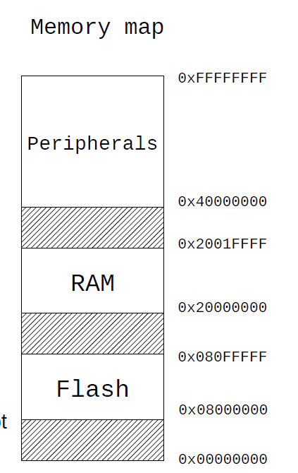
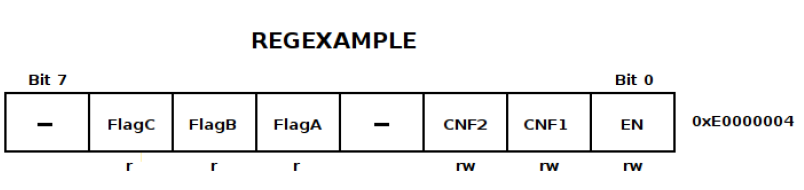
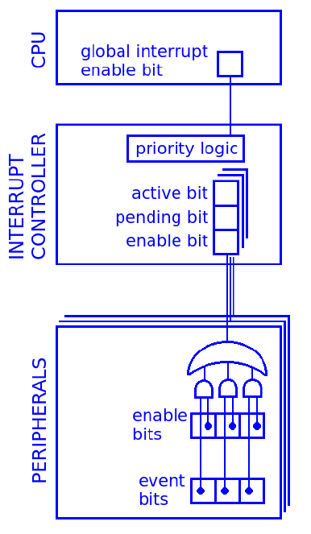
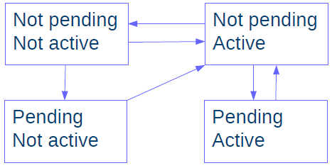
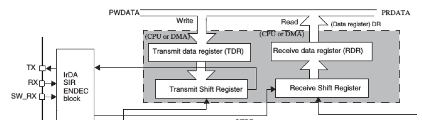
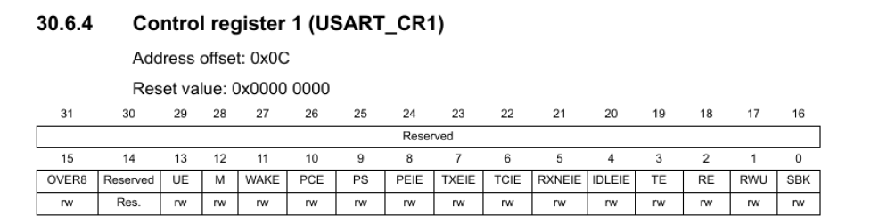
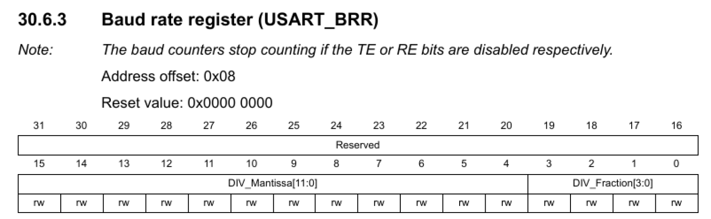
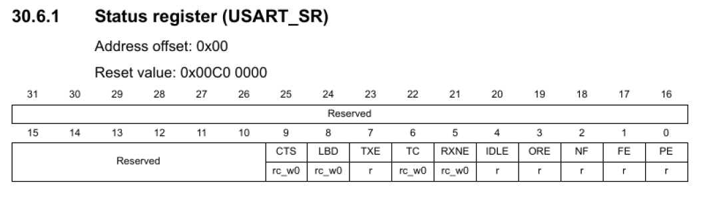

# C++

NOTE: code from these notes is taken either from the lecture slides or from the main repository of the course, that can be found [here](https://github.com/vzaccaria/aos-playground).
## Multithreaded programming in C++

Why multi-threading?

- task parallelism: single application doing multiple tasks at once
- data parallelism: single application doing the same task on different chunks of data

Multi-threading is supported both in HW (multiple cores) and SW (programming languages easily support threads)

### Threads

Lighweight process, shares address space with other threads of the same process.
Each thread has its own stack and context (registers and program counter).

Threads can be handled by the OS or the language runtime (e.g. Objective-C) depending on the implementation.

C++11 introduced the thread class (`std::thread`) that can be used with `include <thread>`.

Thread objects have the following memeber functions:

- `get_id()` returns the thread identifier
- `detach()` see later
- `join()` see later
- `joinable()` check if it is joinable
- `hardware_concurrency()` (static member function) returns info abount how many threads the systems supports (i.e. number of CPU cores)
- `operator=` overload for the move assignement (thread is not copyable)

There are also utility functions in the namespace `std::this_thread` that can be used by the current thread:

- `get_id()` returns the thread identifier
- `yield()` suspend the current thread, allowing other thread to be scheduled to run (returns immediately if it is the only thread in the system, but it's unlikely)
- `sleep_for()` sleep for a certain amount of time
- `sleep_until()` sleep until a given timepoint

```cpp
#include <iostream>
#include <thread>
using namespace std;
using namespace std::chrono;
void myThread() {
    for(;;) {
        cout << "world" << endl;
        this_thread::sleep_for(milliseconds(500));
    }
}
int main() {
    // can pass any function to be run as thread
    thread t(myThread);
    // thread constructor can also accept multiple arguments to pass to the function
    // thread t(example_fun, "parameter");
    // the only requirement is that the arguments need to be copyable
    for(;;) {
        cout << "Hello" << endl;
        this_thread::sleep_for(milliseconds(500));
    }
}

// to compile g++ main.cpp -o test [-std=c++11 -pthread] <-- should be implicit
```

#### Joining threads

Threads terminate when they end the execution of the function (either through return or an exception).
If a thread is joinable, it doesn't terminate completely until a `join()` is called in the thread. The memory is deallocated only after the join call.

It also acts as a synchronization point since the join blocks until the thread terminates.

By default, all threads are joinable, unless explicitly detached.

If the thread destructor is called on a joinable thread that has not yet been joined it causes the whole process to terminate to avoid memory leaks (thread memory only deallocated by OS after join).

```cpp
#include <iostream>
#include <thread>
using namespace std;

void myFunc(const string& s) { /* code */ }

int main() {
    // myFunc is a regular function, can be passed to a thread or called directly
    thread t(myFunc, “world”);
    myFunc(“hello”);
    t.join(); // blocks until the threads terminates
    // if i remove this join i get the error
    // "terminate called without an active exception"
}
```

#### Detaching threads

Lose the possibility of having a synchronization point in the `join()` but the advantage is that the memory of the thread is reclaimed as soon as it terminates.

To detach a thread simply call `detach()` on the thread object.

### Mutual exclusion

Need proper synchronization to operate on shared data if the operations that are done are not atomic.

NOTE: by atomic we mean at the assembly level (e.g. `i++` may seem atomic but can be split in multiple instructions in assembly `load --> increment --> store`). If operations are not atomic we need a way to avoid interleaving in the critical sections.

#### Mutex

The mutex in C++ is implemented in the class `mutex` that can be used by `#include<mutex>` (namespace std).

> A mutex is like a bathroom door    - F. Terraneo 2022

A mutex has 3 member functions:

- `lock()` locks the mutex, blocks if already locked
- `try_lock()` tries to lock the mutex, if unlocked it locks otherwise returns immediately
- `unlock()` unlocks the mutex

Example of code that uses a mutex.

```cpp
#include <iostream>
#include <thread>
#include <mutex>
using namespace std;
static int sharedVariable = 0;
mutex myMutex;

void myThread() {
    for(int i=0;i<1000000;i++) {
        // lock
        myMutex.lock();
        // do opeations on shared data
        sharedVariable++;
        // unlock mutex
        myMutex.unlock();
    }
}

int main() {
    thread t(myThread);
    for(int i=0;i<1000000;i++) {
        myMutex.lock();
        sharedVariable--;
        myMutex.unlock();
    }
    t.join();
    // now i don't need to lock it since after the join the thread has terminated
    cout << "sharedVariable=" << sharedVariable << endl;
}

// with the correct synchronization, the code always prints 0
```

#### Synchronization pitfalls and how to avoid them

- only protecting some critical sections: mutex only protects if it is used (duh)
  need to put every access to the shared data in a critical section and properly lock/unlock the mutex
- deadlocks and indefinitely blocking: mutexes need to be correctly released otherwise they will block other threads forever. This may also happen in not obvious ways.
  
  For instance, if i return without unlocking the mutex it will be locked forever

  ```cpp
  // ....
  mutex myMutex;
  int sharedVariable;

  void myFunction(int value) {
    myMutex.lock();
    if (value<0) {
      cout << "Error" << endl;
      return;  // doesn't unlock the mutex!!
    }
    int *lol = new int; // can cause an exception if out of memeory and return unexpectedly without unlocking
    // ...
    sharedVariable += value;
    myMutex.unlock();
  }
  ```

  How to fix this? We can use special objects to manage those situations. They exploit the fact that the destructor of an object is called automatically when leaving a scope. The destructor of these classes takes care of the unlocking, so mutexes are automatically unlocked when leaving the scope (even in case of exceptions).

  ```cpp
  // ....
  mutex myMutex;
  int sharedVariable;

  void myFunction(int value) {
    // by using braces i limit the scope of the lock_guard, that is automatically destructed
    // when leaving the scope the mutex is unlocked (both on return and exception)
    {
        // create the lck object inside the scope
        lock_guard<mutex> lck(myMutex);
        if (value<0)
        {
            // when leaving the scope, the lck is destroyed, unlocking the mutex
            cout<<"Error"<<endl;
            return;
        }
        sharedVariable += value;
        // when leaving the scope, the lck is destroyed, unlocking the mutex
    }
  }
  ```

  An alternative to `lock_guard` is `unique_lock` (almost the same, i can use both). The only difference is that unique_lock supports the deferred locking (pass the mutex and a flag defer_lock, then lock the object later).

  NOTE: there are also different type of mutexes to handle different situations:

  - `recursive_mutex`, can be locked multiple times by the same owner as long as he unlocks it the same number of times to release it. Useful if i call functions that are going to lock the same mutex because are called in different parts of the program. Recursive mutex has a higher overhead than a standard mutex --> use it only if necessary.
  
    ```cpp
    recursive_mutex myMutex;
    int sharedVariable;
    
    void func2() {
      // it also needs to lock the mutex because it may be used in other parts of the program
      lock_guard<recursive_mutex> lck(myMutex);
      doSomething2();
    }
  
    void func1() {
      // lock the mutex to act on shared data
      lock_guard<recursive_mutex> lck(myMutex);
      doSomething1();
      // call func2 to do some work, with recursive mutex there is no deadlock
      func2();
    }
    ```
  
  - `timed_mutex`, allows to wait for the mutex with a timeout (not very common).

- order of locking: if i lock two mutexes in reverse order in different parts of the program i may end up blocked forever. C++ offers a `lock()` function that accepts any number of mutexes and locks them in the same order every time to avoid this situation.
  
  ```cpp
  mutex myMutex1;
  mutex myMutex2;
  void func2() {
    // notice the order is different in the two functions
    lock(myMutex1, myMutex2);
    // adopt_lock assumes that the mutex is already locked, just manage unlocks
    lock_guard<mutex> lk1(myMutex1, adopt_lock);
    lock_guard<mutex> lk2(myMutex2, adopt_lock);
    doSomething2();
  }
  void func1() {
    // notice the order is different in the two functions
    lock(myMutex2, myMutex1);
    lock_guard<mutex> lk1(myMutex1, adopt_lock);
    lock_guard<mutex> lk2(myMutex2, adopt_lock);
    doSomething1();
  }

  /* note: in C++17 the lines
   *
   *  lock(myMutex2, myMutex1);
   *  lock_guard<mutex> lk1(myMutex1, adopt_lock);
   *  lock_guard<mutex> lk2(myMutex2, adopt_lock);
   *
   * can be replaced by a single line using the scoped locks
   *
   *  scoped_lock lck(myMutex1, myMutex2);
   */
  ```

- concurrency loss: the longer a mutex is locked, the higer the loss of concurrency for the execution. This means that inside a critical section i must only do the strictly necessary work on the shared data and move time consuming operations outside of it. For example:

  ```cpp
  void myFunction() {
    lock_guard<mutex> lck(myMutex);
    sharedVariable++;
    // really bad, i sleep inside the critical section, wasting time
    // also the cout is an I/O operation which is slow
    cout << “The current value is: ” << sharedVariable;
    this_thread::sleep_for(milliseconds(500));
  }

  // to fix this, move the time consuming operations outside of the critical section

  void myFunction() {
    {
        lock_guard<mutex> lck(myMutex);
        sharedVariable++;
    }
    cout << “The current value is: ” << sharedVariable;
    this_thread::sleep_for(milliseconds(500));
  }

  // ... but now i have created a problem
  // cout accesses the shared variable outside of the critical section
  // but i cannot put it inside because it's slow
  // the solution is to create a copy in the critical section and print it later
  // i pay a bit more memory for speed 
  // of course need to evaluate how much memory i'm going to use, it depends on the type of the
  // variable to say if this makes sense
  // in this case it's just an int so it's worth it

  void myFunction() {
    // local variable, not shared
    int temp;
    {
        lock_guard<mutex> lck(myMutex);
        // copy the current value
        temp = ++sharedVariable;
    }
    // print it later, outside of critical section, but still the correct value
    cout << “The current value is: ” << temp << endl;
    this_thread::sleep_for(milliseconds(500));
  }
  ```

  To further reduce loss of concurrency, one can use the `shared_mutex` which basically implements the read-write lock idea. If threads are just reading there is no need to prevent concurrent access, the variable is locked only when someone needs to write. To specify access in read only, there are the functions `lock_shared()`, `try_lock_shared()`, `unlock_shared()`. Instead of using `lock_guard` or `unique_lock` use the `shared_lock` class for sharing access.

  ```cpp
  #include <iostream>
  #include <mutex>
  #include <shared_mutex>
  #include <thread>

  class ThreadSafeCounter {
    public:
        unsigned int get() const {
            // read access only, can use shared_lock
            std::shared_lock<std::shared_mutex> lock(mutex); // shared ownership
            return value;
        }
        void increment() {
            // write access, need to be isolated, use unique_lock
            std::unique_lock<std::shared_mutex> lock(mutex); // unique ownership
            value++;
        }
        void reset() {
            // same as increment
            std::unique_lock<std::shared_mutex> lock(mutex); // unique ownership
            value = 0;
        }
    private:
        mutable std::shared_mutex mutex;
        unsigned int value = 0;
  };
  ```

#### Condition variables

We may have dependencies between threads, for instance one thread may need to wait for another thread to do something before he can proceed.

Note that this is a different type of waiting w.r.t. mutexes, they are necessary for correctness of the program while condition variables are used for efficiency reasons: a thread must not waste CPU time waiting for an event to happen, he will go to sleep and be woken up when he can do his work.

Condition variables have been introduced in C++11 and can be used with `#include<condition_variable>` and have the following member functions:

- `wait(unique_lock<mutex> &)` blocks thread until another thread wakes it up. The lockable object that is passed is unlocked for the duration of the wait
- `notify_one()` wakes up one thread that is waiting on this condition variable
- `notify_all()` wakes up all threads waiting on this condition variable. If no thread is waiting does nothing.

Here is an example on how to use condition variables:

```cpp
#include <iostream>
#include <thread>
#include <mutex>
#include <condition_variable>
using namespace std;
string shared;
mutex myMutex;
condition_variable myCv;

void myThread() {
    string s;
    {
        unique_lock<mutex> lck(myMutex);
        // while instead of if because of spurious wakeups (i.e. woken up randomly, doens't really happen but still)
        while(shared.empty())
            // data is not ready, wait
            // - unlocks mutex
            // - put thread to sleep
            // these operation are done atomically
            myCv.wait(lck);
            // when woken up, the mutex is locked again
        s = shared; 
    }
    cout << s << endl;
}

int main() {
    thread t(myThread);
    string s;
    // read from stdin
    cin >> s;
    {
        unique_lock<mutex>
        lck(myMutex);
        shared = s;
        // wake up the thread that is waiting (if any)
        myCv.notify_one();
    }
    t.join();
}
```

There is also the type `condition_variable_any` that can accept any mutex type instead of just a unique lock.

### Design patterns in concurrent programs

#### Producer/consumer

One or multiple threads "produce" data that needs to be "consumed" by other threads. A queue is put in between to decouple the production rate from the consumption rate. This way the synchronization point is the access to the queue instead that synchronizing directly the threads.


We need to implement the queue so that concurrent access is thread-safe.

Implement it as a template so that i can pass whatever data to it.

```cpp
// synchronized_queue.h
#ifndef SYNC_QUEUE_H_
#define SYNC_QUEUE_H_

#include <list>
#include <mutex>
#include <condition_variable>

template<typename T>
class SynchronizedQueue {

public:
    SynchronizedQueue() {}
    void put(const T & data);
    T get();
    size_t size();

private:
    // disallow copy constructor and operator= (cannot copy this structure)
    SynchronizedQueue(const SynchronizedQueue &) = delete;
    SynchronizedQueue & operator=(const SynchronizedQueue &) = delete;
    
    // list to store elements, a mutex to regulate access and 
    // condition variable to notify when data is ready
    std::list<T> queue;
    std::mutex myMutex;
    // condition variable is essential to avoid that the waiting thread
    // spins doing nothing and occupying CPU time
    // without cv the queue still works but it's not efficient
    std::condition_variable myCv;
};

// it's a template, whole implementation in the header file
template<typename T>
void SynchronizedQueue<T>::put(const T& data) {
    // lock mutex
    std::unique_lock<std::mutex> lck(myMutex);
    // add data to the queue
    queue.push_back(data);
    // notify a thread that data is available
    myCv.notify_one();
    // we avoid notify_all because only one thread is
    // able to consume the piece of data that we just pushed
}

template<typename T>
T SynchronizedQueue<T>::get() {
    // lock mutex
    std::unique_lock<std::mutex> lck(myMutex);
    // as long that the queue is empty, wait on condition variable
    while(queue.empty()) 
        myCv.wait(lck);
    // pop element from queue (2 instructions to get and delete element)
    T result = queue.front();
    queue.pop_front();
    // return the data
    return result;
}

template<typename T>
size_t SynchronizedQueue<T>::size() {
    // just for convenience, still needs to locks the mutex
    std::unique_lock<std::mutex> lck(myMutex);
    return queue.size();
}

#endif // SYNC_QUEUE_H_
```

The threads that use this queue, do not need to explicitly handle synchronization to share data, it's the queue that takes care of that.

```cpp
// include the header that i defined
#include "synchronized_queue.h"
#include <iostream>
#include <thread>

using namespace std;
using namespace std::chrono;

// declare shared queue
SynchronizedQueue<int> queue;

void myThread() {
    for(;;) 
        cout << queue.get() << endl;
}

int main() {
    thread t(myThread);
    for(int i=0;;i++) {
        // the queue handles the synchronization, just put and get from queue
        queue.put(i);
        this_thread::sleep_for(seconds(1));
    }
}
```

#### Active object

Have an object that is a thread. Normal threads do not have an explicit way to communicate with other threads.

The idea of this pattern is to wrap a thread into an object and allowing to call instance methods to interact with the thread.

```cpp
// active_object.h
#ifndef ACTIVE_OBJ_H_
#define ACTIVE_OBJ_H_

#include <atomic>
#include <thread>

class ActiveObject {
public:
    ActiveObject();
    virtual ~ActiveObject();
    
private:
    // execute the thread
    virtual void run();
    // disallow copy, same reasoning as queue, it doesn't make sense to copy
    ActiveObject(const ActiveObject &) = delete;
    ActiveObject& operator=(const ActiveObject &) = delete;
protected:
    std::thread t;
    // shared access without mutex, interact with load() and store()
    std::atomic<bool> quit;
};

#endif // ACTIVE_OBJ_H_


// active_object.cpp
#include "active_object.h"
#include <chrono>
#include <functional>
#include <iostream>

using namespace std;
using namespace std::chrono;

// use initializer list (optimize the initialization)
// initialize the thread to execute the run method and the current object + quit to false
ActiveObject::ActiveObject() : t(&ActiveObject::run, this), quit(false) {}

// note: here it is implemented to show how to use it but it is declared as virtual
// so to create an active object one should derive this class and specialize the run method
void ActiveObject::run() {
    // run until quit == false
    while(!quit.load()) {
        cout << "Hello world!" << endl;
        this_thread::sleep_for(milliseconds(500));
    }
}

ActiveObject::~ActiveObject() {
    if(quit.load()) 
        return; // for derived classes (they may override the destructor, if quit already set don't do anything)
    // to terminate thread, set quit to true
    quit.store(true);
    // and wait for the thread to finish
    t.join();
}
```

#### Reactor

Decouple task creation from execution. An executor thread waits on a task queue, any other part of the program can push work to the queue. These tasks are executed sequentially (usually FIFO, but can implement specific scheduling policies).

C++11 function `bind()` and the template class `function<>` allow us to create the task leaving the starting time to the executor thread for later.

```cpp
#include <iostream>
#include <functional>
using namespace std;
void printAdd(int a, int b) {
  cout << a << '+' << b << '=' << a+b << endl;
}

int main() {
  // declare a function
  function<void ()> func;
  // bind function to the parameter
  func = bind(&printAdd, 2, 3);
  // ...
  // execute the function with the arguments that were bound before
  func();
}
```

We can exploit this to implement the reactor:

- do the bind of the function
- push it to the reactor
- the reactor will pop and execute them
  - since the parameters are already bound, it can call it directly

```cpp
// reactor.h
#ifndef REACTOR_H_
#define REACTOR_H_

#include <functional>
#include "synchronized_queue.h"
#include "active_object.h"


// inherit from the active object
class Reactor: public ActiveObject {
public:
    void pushTask(std::function<void ()> func);
    virtual ~Reactor();

private:
    virtual void run();
    SynchronizedQueue<std::function<void ()>> tasks;
};

#endif // REACTOR_H_


// reactor.cpp
#include "reactor.h"

using namespace std;

// pushed as last task before joining because otherwise it would
// block forever if the work queue is empty (thread will wait forever and never join)
void doNothing() {}

// put the function with the already bound parameters in the queue
void Reactor::pushTask(function<void ()> func) {
    tasks.put(func);
}

Reactor::~Reactor() {
    quit.store(true);
    pushTask(&doNothing);
    t.join(); // variable t of type thread derived from ActiveObject
}

void Reactor::run() {
    while(!quit.load()) 
        tasks.get()(); // get a function and call it
        // get() --> returns a function --> () --> calls it
}
```

Limitations of the reactor pattern:

- task processed sequentially
- latency of execution depends on length of queue
- do not exploit multicore

To overcome this limitations we use a new pattern, that has a similar approach but using more than one worker thread.

#### ThreadPool

One or more queues of tasks that are executed by a fixed set of worker threads. Save the thread creation overhead.

- usually nr thread is the same as CPU threads to exploit maximum parallelism

```cpp
// threadpool.h
#ifndef THREADPOOL_H_
#define THREADPOOL_H_

#include <atomic>
#include <functional>
#include <mutex>
#include <thread>
#include <vector>
#include "synchronized_queue.h"

// note that it doesn't inherit from active object, i have multiple threads
class ThreadPool {
public:
    // default value is 0
    ThreadPool(int nr_threads = 0);
    virtual ~ThreadPool();

    // could also put these functions in the cpp file
    void pushTask(std::function<void ()> func) {
        // remember that threas safety is handled by the queue
        work_queue.put(func);
    }

    int getWorkQueueLength() {
        return work_queue.size();
    }

private:
    ThreadPool(const ThreadPool&)=delete;
    ThreadPool& operator=(const ThreadPool&)=delete;

    void worker_thread();

    std::atomic<bool> done;              // thread pool status
    unsigned int thread_count;           // thread pool size
    // can use a synchronized queue since i already have it
    // i could also use a list with a mutex but why reinvent the wheel
    SynchronizedQueue<std::function<void()>> work_queue;
    std::vector<std::thread> threads;    // worker threads
};

#endif // THREADPOOL_H_


// thread_pool.cpp
#include "thread_pool.h"

void doNothing() {}

ThreadPool::ThreadPool(int nr_threads) : done(false) {
    // on zero, use the number of threads in the system
    if (nr_threads <= 0) 
        thread_count = std::thread::hardware_concurrency();
    else
        thread_count = nr_threads;
    // add threads to the array of workers
    for(unsigned int i=0; i < thread_count; ++i)
        // all threads run the worker_thread function
        threads.push_back(std::thread(&ThreadPool::worker_thread, this));
}

ThreadPool::~ThreadPool() {
    done = true;  // implicitly call store since it is declared as atomic
    // same reason as reactor, i need to push a task to each thread so that 
    // they will execute it and check that done == true
    for(unsigned int i=0; i < thread_count; ++i) 
        pushTask(&doNothing);
    // convenient way to iterate over a vector
    for(auto & th: threads)  // auto can be used when type can be inferred by compiler 
        th.join();
}

void ThreadPool::worker_thread() {
    // note that no lock is needed to run tasks
    while(!done) 
        work_queue.get()(); // get a function and call it, same as reactor
}
```

### Final notes

Even if there is parallelism in the code to exploit sometimes it is not possible to do so. This is because managing locks and threads induces some overhead, so if the tasks to parallelize are very short then the overhead outweights the benefits of parallelism (e.g. mutex lock takes ~100 clock cycles, even if unlocked, while a simple operation such as an addition can take only 1).

Need to think and benchmark the execution time to get the best trade-off.

MEMO: if i need to get a return value from a thread, i can do 3 things:

- global variables
- wrap the function in an helper function that returns void and takes an additional parameter as a pointer to return the value
- pass a lambda to the thread

```cpp
// function i want to execute in a thread
// note that samples is passed by reference to avoid copy
vector<float> compute(const vector<float>& samples) { /* code here */}

// wrapper function to be executed by the thread
void computeHelper(const vector<float>& samples, vector<float> *result) {
    *result = compute(samples);
}

// to use it in a thread
int main() {
    vector<float> samples = getSamples();
    // declare variable for the result
    vector<float> result;
    //create thread
    thread t(computeHelper, samples, &result);
    // wait for completion
    t.join()
}
```

It is also possible to do this implicitly using a lambda function. In this case i do not need to declare the helper function.

```cpp
vector<float> compute(const vector<float>& samples) { /* code here */}

// to use it in a thread
int main() {
    vector<float> samples = getSamples();
    // declare variable for the result
    vector<float> result;
    //create thread
    thread t([&]{
        // lambda function to be executed by the thread, does the same as the code above
        result = compute(samples);
    });
    // wait for completion
    t.join()
}
```

## Handson analysis and development of OS code

OS programming requires interfacing with the hardware. We will start with a microcontroller running Miosix. Later we will extend this knowledge to Linux.

### Microcontroller

Integrates CPU memory and peripherals in a single component, targets embedded and real time systems.

They use dedicated OSes that:

- emphasize real-time operations
- small memory footprint
- operate without virtual memory (microcontroller lacks MMU)
- use execute in place (xip) when possible (i.e. run code directly off the flash without loading in RAM), both RAM and flash are addressable by microcontroller.

  

- sometimes there is no loadable program, there is a single monolithic firmware (kernel and applications compiled toghether in a single binary)

We will see Miosix, OS designed and optimized for microcontrollers with support for C and C++ standard libraries and POSIX. The userspace is optional and can develop directly in kernelspace (which is also POSIX compliant).

#### Linker script and boot

Example of linker script for the memory map above.
Remember that the linker's job is to combine all the output files from the compilation process (i.e. `.o` files) into a single binary that can be loaded in memory.

```c
// first function executed when the machine is booted
// uses this to build the call graph and remove unused function
// (i.e. remove function not reachable from the entry)
// see assembler file for definition
ENTRY(Reset_Handler)

// defines the memory regions
MEMORY
{
    // name(permissions) : ORIGIN = start_address, LENGTH = dimesion
    flash(rx) : ORIGIN = 0x08000000, LENGTH = 1M
    ram(wx) : ORIGIN = 0x20000000, LENGTH = 128K
}
// start address of the stack (immediately after the RAM)
_stack_top = 0x20000000+128*1024;

// how to map sections of object files into the memory regions defined before
SECTIONS
{
    // "." is a special variable called location counter, it is incremented
    // after each section mapping by the size of that section
    . = 0;
    
    // create sections of the output file
    // .name :
    // {
    //    what to put in this section
    // } > where to map it
    .text :
    {
        // startup code must go first
        // defined later in the assembler file
        // KEEP is used to specify that it must be kept even if unused
        // since it is not called by anyone (just initialization code)
        // also it is put at the beginning of text so that will be the first thing to run
        // see the assembler file for the definition
        KEEP(*(.isr_vector))
        // "*" means every input file
        // so basically map every .text section to the .text section of the final binary
        *(.text)
        // align this section to be multiple of 4 bytes
        // this is required by the ABI, architecture dependent
        . = ALIGN(4);
        // same as .text, combine all rodata sections into one
        *(.rodata)
    } > flash // where this needs to be stored

    .data :
    {
        //_data and _edata save to current location counter of the
        // start and end of data respectively
        _data = .;
        *(.data)
        . = ALIGN(8);
        _edata = .;
    // store the initialized data in the flash that will be loaded in RAM on boot
    // the syntax is > ram AT > flash which means to store a shadow copy in the flash
    // "load this in ram but store a copy in the flash, but do not resolve references to the shadows copy"
    // the shadows copy to flash is necessary because we need to store the initial values
    } > ram AT > flash
    
    // pointer to the data section (the end of text section)
    _etext = LOADADDR(.data);

    // save start of bss, note that in this case it is done outside the block
    // it is not an alternative syntax, we must do like this because in legacy languages
    // global uninitialized variables were handled differently
    // tl;dr put inside for .data and put outside for .bss
    _bss_start = .;
    .bss :
    {
        *(.bss)
        . = ALIGN(8);
    } > ram
    // save end of bss
    _bss_end = .;
    
    _end = .;
}
```

This is the resulting linker script, but how does the OS boot? Where does the processor start the execution from when powered on?

It depends on the architecture:

- set program counter to 0x0 and start from there
- read a pre-defined memory location and use that value to initialize the program counter (ARM Cortex approach, the one we will use)
  - for instance on STM32F407 it's the address `0x8000004` (base flash + 4)

But still this is not the place to put our first function, we need some assembly code to satisfy the assumptions on which high level languages such as C and C++ depend on to work. So the idea is to write an assembly function to satisfy this assumptions and then start executing C code.

For C:

- stack pointer must point to the top of a suitable memory area
- global and static initialized variables must be set to their initial value
- global and static uninitialized variables must be set to 0

These instructions are put in an assembler file:

```C
    // specify assembly to use
    .syntax unified
    .cpu cortex-m4
    .thumb
    
    // crate a new section
    // this section is required by the arm architecture
    // and contain the initial value of stack pointer and the
    // initial value of the program counter
    .section .isr_vector
    // create a data structure containing references to the areas that
    // we defined in the linker script
    .global __Vectors
__Vectors:
    .word _stack_top     // initial value of stack pointer
    .word Reset_Handler  // initial value of program counter, defined later


    // define the code
    .section .text
    .global Reset_Handler
    .type Reset_Handler, %function

// define the starting function
Reset_Handler:
    // copy .data from flash to RAM
    // use the addresses of the sections saved before in the linker script
    // to check the boundaries
    ldr r0, =_data
    ldr r1, =_edata
    ldr r2, =_etext
    // if .data is empty, skip this
    cmp r0, r1
    beq nodata
// loop that copies the data
dataloop:
    ldr r3, [r2], #4
    str r3, [r0], #4
    cmp r1, r0
    bne dataloop
// same as above, copy the .bss, if present
nodata:
    ldr r0, =_bss_start
    ldr r1, =_bss_end
    cmp r0, r1
    // .bss empty
    beq nobss
    movs r3, #0
// initialize all .bss to zero
bssloop:
    str r3, [r0], #4
    cmp r1, r0
    bne bssloop
nobss:
    // jump to kernel C entry point
    bl kernel_entry_point
    .size Reset_Handler, .-Reset_Handler
```

If kernel is written in C++, like Miosix, there are more requirements to be satisfied:

- all of the C requirements
- constructor of global objects need to be called before main
- if exceptions are used, additional sections are generated by the compiler and need to be handled by the linker script
  - we will skip this part for simplicity

In order to satisfy these requirements we need to modify the linker and assembler scripts.

```C
// in the linker file
// inside the .text section
// table of global constructors, for C++
.text :
{
    // other initialization code, same as C
    . = ALIGN(4);
    __init_array_start = .;
    // this is only present if there are global variables
    // pointers to constructors that need to be called
    // also use KEEP to make sure that they will not be removed if never called again
    KEEP (*(.init_array))
    __init_array_end = .;
}


// in the assembler file, take care of initialization
// change only the nobss section
// this is necessary because the constructor of objects can reference global data
// so we need to initialize them before
nobss:
    // call global contructors for C++
    // can't use r0-r3 as the callee
    // doesn't preserve them
    ldr r4, =__init_array_start
    ldr r5, =__init_array_end
    // as usual, if section is empty skip
    cmp r4, r5
    beq noctor
// iterate over the function pointers of the constructor
// and call them
ctorloop:
    ldr r3, [r4], #4
    // jump to the function (like a x86 call)
    blx r3
    cmp r5, r4
    bne ctorloop
noctor:
    // jump to C++ kernel entry point */
    bl kernel_entry_point
    .size Reset_Handler, .-Reset_Handler
```

#### Hardware peripherals

The most common way used by hardware peripherals to expose the functionality is the use of peripheral registers.
These registers are mapped to specific locations in the physical address space.

From the programming point of view, these registers can be accessed like variables (e.g. load/store or directly via software), can be 8, 16 or 32 bits wide. (NOTE: need to consider concurrent access to the device)

However, unlike variables:

- writing with them causes the peripheral to do something
- need to know the actual address since it is mapped there
- shared between hw and sw, some events may change the value saved there to change even if the program didn't write there (e.g. to signal some condition)

To know where peripherals are mapped refer to the datasheet of the microcontroller.

How can we write to specific registers from our C/C++ code?
There are different methods (assume 32bit register `IODIR0` at address `0xe0028008`)

```C
// method 1, use the address directly
void clearReg()
{
    // so here what we do is
    // volatile to specify to the compiler to disable optimization
    // usigned int to match the size (32 bit)
    // cast to pointer
    // dereference it
    // assign the value
    (*((volatile unsigned int *) 0xe0028008)) = 0;
}


// method 2, define a macro with the name of the register
// microcontroller producers often provide directly the header
// with all the macro defined
#define IODIR0 (*((volatile unsigned int *) 0xe0028008))

void clearReg()
{
    // access using the defined macro
    IODIR0 = 0;
}


// method 3, if a peripheral has more than one register
// group them in a data structure mapped to the base address
// the struct has to match the memory layout of the registers
struct GpioRegs
{
    volatile unsigned int CRL;  // 0xfeeab00, size 4 (32 bit)
    volatile unsigned int CRH;  // 0xfeeab04, size 4 (32 bit)
    // unused variable to fill a gap in the addresses
    // not volatile because it is never meant to be accessed
    // doesn't waste memory since it is unmapped
    unsigned int gap;
    volatile unsigned short BSRR; // 0xfeeab0c, size 2 (16 bit)
    volatile unsigned short BRR;  // 0xfeeab0e, size 2 (16 bit)
};

#define GPIO ((GpioRegs*)0xfeeeab00)

void clearReg()
{
    // access using the defined macro, like a struct
    GPIO->CRL = 0;
}
```

##### Bit manipulation

Since memory is only addressable at a byte level, i need to find a way to change single bits in the registers to interact with the peripheral. Consider this example:



- name: `REGEXAMPLE`
- address: `0xe0000004`

Note that each bit has different access permissions while some are unused.

I need to use bitwise operations to alter the contents.

In general to:

- set one bit --> do an OR between the register and a bitmask composed of all zeroes except for the position i want to set
  - set `EN` bit: `REGEXAMPLE |= (1<<0)`  note: its the same as `REGEXAMPLE = REGEXAMPLE | (1<<0)`  
- clear one bit --> do an AND between the register and a bitmask composed of all ones except for the position i want to clear
  - clear `CNF2` bit: `REGEXAMPLE &= ~(1<<2)`
- check if one bit is set --> do an AND between the register and a bitmask composed of all zeroes except for the position that i want to test (memo: 0 is false, whatever other value is true)
  - test if `FLAGA` is set: `if (REGEXAMPLE & (1<<4)) { /* do stuff */ }`

NOTE: to create a bitmask we use a the constant 1 --> `00000001` and shift left of the positions that i need, e.g. shift by 3 position `(1<<3) ---> 00000001 becomes 00001000`. Use the bitwise not `~` to invert the bitmask `~(1<<3)  ---> 00001000 becomes 11110111`.

#### Concurrency in register access

Typically in a peripheral registers we have different kind of bits:

- control bits
  - change behaviour of the peripheral
  - usually readable/writable by sw
  - usually changes infrequently
- status flags
  - allow sw to query peripheral status
  - read only because the hw sets the to signal something to the sw
  - also r/w if the the sw needs to clear them
- data bits
  - exchange data between hw and sw
  - r, w, or r/w depending on the expected data flow

The most common situation that can cause concurrency issues are the status flag

- the hw sets them to signal something
- the sw clears them to acknowledge it

For instance suppose that there is a flag in position 1 in a register and we want to clear it:

`REG &= ~(1<<0)`

This is a read-modify-write operation! If the hw sets other flag bits during this operation they will be overwritten by the assignment (read --> hw updates flag --> i write back the old bits).

However in this case we cannot have a sw-only solution since the concurrency is between hw and sw parts.

The solution must be implemented in the hw with advanced access permissions, the most common is *read and clear by writing 1 (rc_w1)*:

- a bit can be read and cleared by writing 1 to it i.e. `REG = (1<<0)` (notice no `&=`, just a write)
- lose the possibility to write a value to that bit, but since i only need to clear them it is fine
- writing 0 does nothing

NOTE: there is also the *read and clear by writing 0 (rc_w0)* same logic, but write 0 instead of 1 to clear, `REG = ~(1<<0)`, depends on the peripheral.

The hw ensures that there are no race conditions.

#### Interrupts

Hardware needs to notify something but needs to do it now, cannot wait for sw to read a flag.

Basically interrupts allow the hw to call a sw function (interrupt service routine ISR) when an event occurs. Interrupt can pause the normal code execution between any two assembly instructions. After the handling of the interrupt (ISR returns) the execution is resumed.

An ISR must never block! They should always run to completion, no sleep, no I/O, no mutex.
Also, they should be as fast as possible to avoid random delays in code execution (especially in real time OSes).

In general these three componenents need to be correctly setup to manage interrupts from a peripheral:



A peripheral can have multiple events to signal (data fully transmitted, data received, timeout, ...) and have a mask to choose which of these one to enable (i.e. that can cause an interrupt to the CPU).
A developer may choose to disable some of the interrupt, for instance if he wants to manage them by polling.

If an interrupt is generated, there is a single bit line to the interrupt controller (all peripherals are connected to it) that brings the signal. The controller implements a logic to decide the priority of each peripheral and has a single line to the CPU.

The CPU can decide to disable all interrupts and signal this to the controller that queues them up in a "pending" status. When interrupts are re-enabled the controller sends them to the CPU. OSes offer ways to disable interrupts to protect some critical sections from being interrupted.

On ARM, the interrupt controller has 3 bits for each peripheral:

- enable bit, if 0 interrupts from that peripheral are ignored
  - need to enable both in the peripheral and the controller
- pending bit, scheduled for execution
- active bit, currenctly executing the corresponding ISR



- all enabled interrupt starts in the `not pending, not active` state
- if an event occurs
  - CPU has enabled interrupts and no other ISR is running --> `not pending, active`
    - on completion go back to `not pending, not active`
  - interrupts disabled or other ISR is running --> `pending, not active`
    - when CPU is available --> `not pending, active`
- if i am in the `not pending, active` and another interrupt from the same peripheral arrives
  - go to `pending, active`: i am currently handling but there are more to do after

##### Concurrency issues with interrupts

We already said that ISR cannot block. Also executions of interrupts vs normal code is not symmetric (interrupts can block normal code and not viceversa) --> we cannot use a mutex.

On a single core CPU without interrupt nesting such as microcontrollers one could simply:

- interrupts just access shared variables
  - since they cannot be interrupted, they are like a critical section, normal code can never interleave with interrupt routines
- normal code disables interrupts when accessing shared variables
  - interrupts occurring during this period are pending and will run later

This will change on multicore systems, see later.

#### Miosix kernel

Miosix provides primitives for synchronization in kernelspace. As we said before, it is POSIX compliant also in kernelspace so the standard C/C++ libraries can be used (mutex/condition_variables).

The new part is how Miosix handles the concurrency with interrupts. The idea is the one described in the section above. Specifically, to disable interrupts, Miosix provides the following primitives:

- `class FastInterruptDisableLock`: the constructor disables interrupts and the destructor re-enables them (make sure that they were enabled before calling this!). Conceptually it is the same as a regular mutex.
- `class InterruptDisableLock`: conceputally equivalent to a recursive_mutex, counts how many times it was called and enables interrupt at the right time
- `class FastInterruptEnableLock and InteruptEnableLock`: temporarily enable interrupts in a scope where they were disabled. The constructor takes the lock disabling interrupts as parameter.

To allow normal code to block for an interrupt (e.g. device driver that waits for a button to be pressed). The idea is the same as a condition variable. In Miosix, all non-interrupt code is an instance of the `Thread` class, that provides the following member functions:

- `IRQwait()`: marks thread as blocked. Must be called with interrupts disabled and immediately after re-enable them and call `yield()` (this is because of how the Miosix work, context switches are done via interrupts)
- `IRQwakeup()`: marks thread as ready, it it has highest priority it is scheduled immediately

NOTE: In Miosix there is the general convention that functions prefixed with `IRQ` are supposed to be called with interrupt disabled.

Examples:

```cpp
// (this is in the cheatsheet)
// code to block the execution of normal code
// global variable, shared between main code and IRQ
// ISR are called by hw so do not have parameters, only way to communicate is using globals
Thread *waiting = nullptr;

void block()
{
    // disable interrupts
    FastInterruptDisableLock dLock;
    // save which thread is waiting
    waiting = Thread::IRQgetCurrentThread();
    // block the thread
    waiting->IRQwait();
    {
        // re-enable interrupts and yield
        FastInterruptEnableLock eLock(dLock);
        Thread::yield();
    }
}

// code to wakeup normal code from an interrupt routine
void wakeup()
{
    // no thread was waiting for this interrupt
    if(waiting == nullptr) 
        return;
    // wakeup thread waiting for this interrupt
    waiting->IRQwakeup();
    // schedule next thread based on priority
    if(waiting->IRQgetPriority() > Thread::IRQgetCurrentThread()->IRQgetPriority())
        Scheduler::IRQfindNextThread();
    // reset the waiting variable
    waiting = nullptr;
}
```

##### Miosix filesystem

To be accessible to applications, device drivers must be registerd in `/dev` (unix-like approach).

Device drivers are written by subclassing the `Device` class and override the needed functions.

```cpp
class Device
{
    // member functions to override
    public:
        // buffer to read from/write to, the amout of data to r/w and the offset
        virtual ssize_t readBlock(void *buffer, size_t size, off_t where);
        virtual ssize_t writeBlock(const void *buffer, size_t size, off_t where);
        // device specific requests
        virtual int ioctl(int cmd, void *arg)
};

// to istantiate a device, add to devfs (intrusive_ref_ptr is basically a shared_pointer in Miosix)
devFs->addDevice("mydevice", intrusive_ref_ptr<Device>(new MyDriver));
```

### Drivers

Implement a device driver for STM32F407 serial port. We will do this in Miosix (will use a different serial port in Linux), but first describe the protocol.

A serial port is a character-oriented interface that allows to transfer characters between two devices.

2 wires (1 tx 1 rx) + ground. The protocol is as follows:

- idle high (e.g. 1 when idle)
- all bits are transmitted in the same time duration (fixed baud rate, the inverse of bit length)
- to transmit a character
  - send start bit, which is 0
  - send bits of the character (usually 8)
  - send stop bit, usually 1
- a new character can be transmitted immediately after

This is typically implemented in hw, the sw just need to write the byte in a register and the hw takes care of sending it. On receive, the sw is notified only when the byte is fully received.

We are going to write a driver for USART2.



To interact with this peripheral we will use registers (from the board datasheet):



`CR1`, 32 bit control register 1

- `UE` enables the USART if set (memo set == 1)
- `TE` enables transmit side if set
- `RE` enables receive side if set
- `RXNEIE` enables interrupt when receiving a character



`BRR`, 32 bit to control the baud rate

- to set the baud rate, we do not specify it directly but we put a divsion factor w.r.t. the system clock. In our case:
  - system clock 42MHz
  - desired baud rate 19200 bit/sec
  - from datasheet, clock rate needs to be 16 times the baud rate
  - the division factor is 42MHz / (19200*16) = 136.72
- we can only write to the register **fixed point** (no float) with increment of 1/16 in the decimal part, so the closest value is 136.75 (136 + 12/16)

To do r/w we interact with the `DR` register:

- write to this register causes the char to be transmitted
  - before writing needs to check that the previous transmission is complete
  - we will use polling to check if the char was sent
- read this register returns a single char, the last one received
  - sw should read this as soon as possible because when a new char arrives the previous is overwritten
  - we will use interrupts to check this



- `TXE` if set the transmission register is empty (i.e. data was sent) and ready to accept new char (we will poll this before writing)
- `RXNE` if set a character has been received and can be read by sw
- `FE` indicates an error in the data

These three bits are cleared automatically by hw if characters are read/written.

To have a peripheral communicate with the CPU we need to read the documentation and check which GPIO pins of the CPU are connected to the USART2.

#### Miosix implementation

```cpp
// serial_aos.h
#pragma once

#include "filesystem/console/console_device.h"

/**
 * Simplified serial port driver for the AOS course.
 *
 * Classes of this type are reference counted, must be allocated on the heap
 * and managed through intrusive_ref_ptr<FileBase>
 */
 // as said before, subclass Device and implement the read and write functions
class SerialAOS : public miosix::Device
{
public:
    SerialAOS();

    /**
     * Write a block of data
     * \param buffer buffer where take data to write
     * \param size buffer size
     * \param where where to write to (ignored in TTY devices)
     * \return number of bytes written or a negative number on failure
     */
    ssize_t writeBlock(const void *buffer, size_t size, off_t where);

    /**
     * Read a block of data
     * \param buffer buffer where read data will be stored
     * \param size buffer size
     * \param where where to read from (ignored in TTY devices)
     * \return number of bytes read or a negative number on failure. Note that
     * it is normal for this function to return less character than the amount
     * asked
     */
    ssize_t readBlock(void *buffer, size_t size, off_t where);
};


// serial_aos.cpp
#include <mutex>
#include "serial_aos.h"
#include "kernel/queue.h"  // is a synchronized queue
#include "interfaces/gpio.h"
#include "kernel/scheduler/scheduler.h"

using namespace std;
using namespace miosix;

// 2 mutexes because r/w can happen simoultaneously by the hw
static mutex txMutex;          // < Mutex locked during transmission
static mutex rxMutex;          // < Mutex locked during reception
static Queue<char,64> rxQueue; // < Queue between rx interrupt and readBlock


SerialAOS::SerialAOS() : Device(Device::TTY)
{
    // some of the registers we're accessing are shared among many peripherals
    // and this code fragment is so short that disabling interrupts is recomended
    InterruptDisableLock dLock;

    // claim GPIOs for our serial port
    // using name = Gpio<PORT, PIN>
    using u2tx=Gpio<GPIOA_BASE,2>;
    using u2rx=Gpio<GPIOA_BASE,3>;
    // ALTERNATE is used for peripheral
    u2tx::mode(Mode::ALTERNATE);
    u2rx::mode(Mode::ALTERNATE);
    // set the multiplexer to the correct value (check datasheet)
    u2tx::alternateFunction(7);
    u2rx::alternateFunction(7);
    
    // enable clock gating for the serial port peripheral
    // by default unused peripherals are turned off
    RCC->APB1ENR |= RCC_APB1ENR_USART2EN;
    
    // set our port speed. We want 19200 bit/s. We need to divide serial port
    // peripheral input clock (42MHz) by a factor that gives 16 times 19200Hz
    // (the 16 times requirements is just because that's how this peripheral
    // works) 42MHz / (19200*16) = 136.72, approximated to 136 and 12/16.
    // 136 in the integer part, 12 in the fractional part
    // (integer part starts at bit 4, hence the shift)
    USART2->BRR=136<<4 | 12;

    USART2->CR1 = USART_CR1_UE     //Enable port
                | USART_CR1_RXNEIE //Interrupt on data received
                | USART_CR1_TE     //Transmission enbled
                | USART_CR1_RE;    //Reception enabled
    
    //Finally, we need to set up the interrupt controller
    NVIC_SetPriority(USART2_IRQn,15); //Lowest priority for serial
    NVIC_EnableIRQ(USART2_IRQn);
}

// implement functions to enable applications to read/write using the USART
ssize_t SerialAOS::writeBlock(const void *buffer, size_t size, off_t where)
{
    // to protect against multiple threads calling this function
    unique_lock<mutex> l(txMutex);

    // simplest possible implementation, poor performance: serial ports are slow
    // compared to the CPU, so using polling to send data one chracter at a time
    // is wasteful. The piece that is missing here is to set up the DMA to send
    // the entire buffer in hardware and give us a DMA end of transfer interrupt
    // when the job is done. We are omitting DMA for simplicity.
    const char *buf=reinterpret_cast<const char*>(buffer);

    // send data one char at a time
    for(size_t i=0;i<size;i++)
    {
        // as long as the data is not set, spin (keep polling)
        while((USART2->SR & USART_SR_TXE)==0) ;
        // put one char at a time from the buffer
        USART2->DR=*buf++;
    }
    // return the number of chars sent
    return size;
}

// for the read we will use interrupts
/**
 * \internal interrupt routine for usart2 actual implementation
 */
void __attribute__((noinline)) usart2irqImpl()
{
   unsigned int status=USART2->SR;
    if(status & USART_SR_RXNE)
    {
        // reading the character also clears the interrupt flag
        char c=USART2->DR;
        // if there was no error, put character in the queue
        if((status & USART_SR_FE)==0)
        {
            // high priority process wakeup, for optimization
            // if i wake up a higher priority thread do context switch
            bool hppw;
            if(rxQueue.IRQput(c,hppw)==false); // fifo overflow
            if(hppw) Scheduler::IRQfindNextThread();
        }
    }
}

ssize_t SerialAOS::readBlock(void *buffer, size_t size, off_t where)
{
    if(size<1) return 0;
    // to protect against multiple threads calling this function
    unique_lock<mutex> l(rxMutex);

    // simplest possible implementation, poor performance: this time we DO block
    // waiting for data instead of polling (the blocking is hidden in the
    // synchronized queue) but we return after having read only one character.
    // we should try to fill as many bytes of the buffer as possible, BUT also
    // return prematurely if no more chracter arrive. The piece that is missing
    // here is using the peripheral idle line detection, omitted for simplicity.
    char *buf=reinterpret_cast<char*>(buffer);
    char c;
    // returns only 1 char for simplicity
    // the queue handles the synchronization, get blocks if there are no chars
    rxQueue.get(c);
    buf[0]=c;
    return 1;
}

// NOTE
// to actually add it to the file system we need to add this class to the OS via the function
// devFs->addDevice("serialaos", intrusive_ref_ptr<Device>(new SerialAOS));
```

#### Linux API

Write a driver for the a 16550 serial port in Linux.

The Linux kernel, unlike Miosix, lives in virtual memory but peripherals are still in physical address space, so we need to use some special functions to access these registers, which for x86 are:

- `request_region(peripheral_base_addr, peripheral_size, "drivername");`
- `release_region(peripheral_base_addr, peripheral_size);`

to read and write we use these (b, w, l are 8, 16, 32 bits respectively)

- `inb(addr) / inw(addr) / inl(addr)`: read from desired memory location (that was requested before)
- `outb(byte, addr) / outw(shortint, addr) / outl(int, addr)`: write to a desired memory location

Also, Linux doesn't support POSIX, so no mutex, thread and condition variables, there are specific API.

To manage kernel threads:

- `task_struct *t = kthread_run(threadfunc, arg, “threadname”);`: create a kernel thread executing threadfunc. Passes arg (a void *) to threadfunc, like pthread_create
- `kthread_stop(t);`: join a kernel thread
- `kthread_should_stop()`: must be called periodically in the kernel thread
kthread_stop makes it return true, and the thread function must
return

Mutexes:

- `mutex_init(&mutex);` initializes the mutex struct, must be called before using it
- `mutex_lock(&mutex);`
- `mutex_unlock(&mutex);`

There are no lock objects to automatically lock/unlock the mutex in a given scope, Linux is written in C, not C++.

To handle concurrency with interrupt, `spin_lock` is used instead. Must be called correctly from normal code and interrupts if access shared data.

NOTE: on single core machines these calls do nothing since the interrupt is automatically the only one that accesses the shared data, but they are necessary on a multicore machine.

- `spin_lock_init(&spinlock);`: initializes the spinlock struct, must be called before using it
- `spin_lock(&spinlock); spin_unlock(&spinlock);`: must be called from the interrupt side while accessing shared data
- `spin_lock_irq(&spinlock); spin_unlock_irq(&spinlock);`: must be called form the normal code side, also disable interrupts

Also, like in Miosix, a thread can wait for an interrupt to happen and be woken up by it. It is required to declare a struct `wait_queue_head_t`. It is somewhat like a condition variable but between kernel code and interrupts.

- `init_waitqueue_head(&waitqueue);`: initializes the wait_queue_head_t, must be called before using it
- `wait_event_interruptible_lock_irq(waitqueue, condition, spinlock);`: equivalent of condition variable wait, atomically unlocks the spinlock and block until condition becomes true. Of course, can only be called from normal code, not from an IRQ
- `wake_up(&waitqueue);`: equivalent of notify_one(), wake one thread from the wait queue.
Can be called from an IRQ

How can we expose the device in `/dev`? No classes in C, so there is a struct with function pointers to read and write functions, should be initialized with the correct functions.

```C
struct file_operations my_driver_fops = {
    .owner=THIS_MODULE,
    .write=my_driver_write,
    .read=my_driver_read,
};

// signature of the functions
ssize_t write(struct file *f, const char __user *buf, size_t size, loff_t *o);
ssize_t read(struct file *f, char __user *buf, size_t size, loff_t *o);
```

Then we can register it as a char device

```C
// register the device and pass the struct
int major=register_chrdev(0, "name", &my_driver_fops);

// to unregister the driver, you can use
unregister_chrdev(major, "name");


// read and write from process memory
// checks that the addresses are correct (fall in process space)
unsigned copy_from_user(void *to, const void __user *from, unsigned n);
unsigned copy_to_user(void __user *to, const void *from, unsigned n);
```

#### Linux driver example

For a 16550 port we just need to consider 5 registers:

- `THR`, one byte where data can be written, need to wait until previous char has been sent before passing the next
- `RBR`, same as above but for receiver
- `LSR`, status flags
  - bit 0 `DR`, set if there is an unread char
  - bit 3 `FE`, set if error on receiption
  - bit 5 `THRE`, set if new char can be transmitted
- `IER`, allows to enable interrupts
  - bit 0, enable interrupt on receive char
  - bit 2, enable interrupt on receive errror
- `IIR`, interrupt identification register, query cause of interrupt

We will use polling for transmission and interrupt for reception, same as before.

How can we write a drive in Linux?

Linux has modules that can be loaded, see comments on how to do that.

```C
#include <linux/init.h>
#include <linux/kernel.h>
#include <linux/module.h>
#include <linux/ioport.h>
#include <linux/interrupt.h>
#include <linux/wait.h>
#include <linux/spinlock.h>
#include <linux/fs.h>
#include <asm/io.h>

// stolen from ttyS1, must edit kernel config to free up port from default driver
#define PORT_BASE 0x2F8
#define PORT_SIZE 8
#define PORT_IRQ  3

//16550 registers, see datasheet
#define RBR PORT_BASE+0
#define THR PORT_BASE+0
#define IER PORT_BASE+1
#define IIR PORT_BASE+2
#define FCR PORT_BASE+2
#define LSR PORT_BASE+5

static int major;                 // returned when registering our device in /dev
static spinlock_t txLock, rxLock; // synchronizes transmit code an receive queue
// all these are for managing queue
static const int bufsize=64;
static char rxbuffer[64];         // we do not have a synchronized queue offered, need to implement
static int putpos=0;
static int getpos=0;
static volatile int numchar=0;
// "condition variable" for waiting threads
static wait_queue_head_t waiting; // for blocking threads waiting on read

// interrupt routine
static irqreturn_t serial_irq(int irq, void *arg)
{
    // ISR on Linux should return if it was handled or discarded
    char c;
    // check which interrupt was triggered
    switch(inb(IIR) & 0xf)
    {
        case 0x6: // RLS
            inb(LSR); // read LSR to clear interrupt
            inb(RBR); // read RBR to discard char that caused error
            return IRQ_HANDLED;
        case 0x4: // RDA
            c=inb(RBR); // read LSR to get character and clear interrupt
            spin_lock(&rxLock);
            // put character in queue if there's space left
            if(numchar<bufsize)
            {
                rxbuffer[putpos]=c;
                if(++putpos>=bufsize) putpos=0;
                numchar++;
            }
            // wakeup thread if any
            wake_up(&waiting);
            spin_unlock(&rxLock);
            return IRQ_HANDLED;
        default:
            return IRQ_NONE;
    }
}

static ssize_t serialaos_write(struct file *f, const char __user *buf, size_t size, loff_t *o)
{
    int i;
    char c;
    // simplest possible implementation, poor performance: serial ports are slow
    // compared to the CPU, so using polling to send data one chracter at a time
    // is wasteful. The piece that is missing here is to set up the DMA to send
    // the entire buffer in hardware and give us a DMA end of transfer interrupt
    // when the job is done. We are omitting DMA for simplicity.
    spin_lock(&txLock);
    // for all characters in the buffer
    for(i=0;i<size;i++)
    {
        // copying one byte at a time is slow, can be optimized
        // use the copy_from_user to validate that data is from a correct location
        if(copy_from_user(&c, buf+i, 1)!=0)
        {
            // we are not in C++ need to unlock mutexes explicitly
            spin_unlock(&txLock);
            return -1;
        }

        // polling until we can send the next character
        while((inb(LSR) & (1<<5))==0) ; //Poll till bit THRE is 1
        // function to send a byte to the register
        outb(c, THR);
    }
    // remember to unlock
    spin_unlock(&txLock);
    return size;
}

static ssize_t serialaos_read(struct file *f, char __user *buf, size_t size, loff_t *o)
{
    char c;
    int result;
    if(size<1) return 0;
    
    // simplest possible implementation, poor performance: this time we DO block
    // waiting for data instead of polling but we return after having read only
    // one character.
    // we should try to fill as many bytes of the buffer as possible, BUT also
    // return prematurely if no more chracter arrive. The piece that is missing
    // here is using the peripheral idle line detection, omitted for simplicity.
    spin_lock_irq(&rxLock);
    //Buffer empty? wait for the interrupt
    // blocks until there is a character
    result=wait_event_interruptible_lock_irq(waiting, numchar>0, rxLock);
    // this is for error handling
    if(result<0) //Interrupted by a signal?
    {
        spin_unlock_irq(&rxLock);
        return result;
    }
    
    // get character from queue
    c=rxbuffer[getpos];
    if(++getpos>=bufsize) getpos=0;
    numchar--;
    spin_unlock_irq(&rxLock);
    
    // remember not to write directly, use safe functions
    if(copy_to_user(buf, &c, 1)!=0) return -1;
    return 1; // we read one character
}

// create the structure with the function to interact
static const struct file_operations serialaos_fops = {
    .owner=THIS_MODULE,
    .write=serialaos_write,
    .read=serialaos_read,
};

static int __init serialaos_init(void)
{
    int result;
    // initialize structures
    init_waitqueue_head(&waiting);
    spin_lock_init(&txLock);
    spin_lock_init(&rxLock);
    
    // request region to access the registers of the peripherals
    if(!request_region(PORT_BASE, PORT_SIZE, "serialaos"))
    {
        // cat /proc/ioports should find who's occupying our port
        pr_info("serialaos: can't access 0x%x\n", PORT_BASE);
        return result;
    }
    
    result=request_irq(PORT_IRQ, serial_irq, IRQF_SHARED, "serialaos", THIS_MODULE);
    if(result < 0)
    {
        release_region(PORT_BASE, PORT_SIZE);
        pr_info("serialaos: can't claim IRQ %d: %d\n", PORT_IRQ, result);
        return result;
    }
    
    outb(0x0, FCR); // disable hardware FIFO
    outb(0x5, IER); // enable RLS, RDA
    //FIXME: We should set the baud rate but in QEMU it doesn't matter

    major=register_chrdev(0, "serialaos", &serialaos_fops);
    pr_info("serialaos: loaded\n");
    return 0;
}

static void __exit serialaos_cleanup(void)
{
    unregister_chrdev(major, "serialaos");
    release_region(PORT_BASE, PORT_SIZE);
    free_irq(PORT_IRQ, THIS_MODULE);
    pr_info("serialaos: bye\n");
}

// always add these at the end to initialize the module on loading
module_init(serialaos_init);
// and the cleanup when it is unloaded
module_exit(serialaos_cleanup);
```
