# Computer Security

## Basic concepts
Security requirements: CIA paradigm
- Confidentiality: information can only be accessed by those who are authorized
- Integrity: information can only be modified by authorized entities and only in the way such entities are entitled to modify them
- Availability: information must be available to all the parties that have the right to access it, within specified time constraint

Starting from here we can see that "A" conflicts with "C" and "I" and this is what makes security hard. I cannot encrypt the data and store them at the bottom of the ocean and call that secure, there are business requirements and time requirements that need to be satisfied that have become stricter and stricter over time.

### Definitions
- Vulnerability: a "shortcut" through the security process that undermines our assumptions that can potentially allow to violate the CIA paradigm.
- Exploit: a specific way to use one or more vulnerabilities to accomplish a specific objective that violates the constraint

There can be a vulnerability without having a working exploit.  
Also some vulnerabilities cannot be completely removed because it would be too inconvenient (impacting usability) or because they are too embedded in the system (hw vulnerabilities like spectre and meltdown). In those case we can only mitigate the vulnerability, we try to make it more difficult to exploit.

Security != protection -> it depends on the threat model we are defending against. We can only make comparisons in the same environment for the same type of threat.

- Threat modeling: defining what **assets** we are protecting against what **threats**
  - Assets: valuable things (yes, things, it can be anything: hw, sw, data, reputation,...) that we want to protect
  - Threats: who and in which ways can damage our assets
- Attack: *intentional* use of one or more exploits to violate the CIA properties of a target system
- Threat agent: whoever is carrying out the attack, also known as attacker

IMPORTANT NOTE:  
attacker != hacker  
an hacker is just someone with advanced understanding of computers and networks while an attakcer seeks to do damage and it's not necessarily knowledgeable (see "cybercrime as a service" in DFC course)

- Risks: Evaluation of the probability of something bad happening to our assets and the damage that it would cause.

RISK = ASSETS x VULNERABILITIES x THREATS

The objective of security is to balance the reduction of the vulnerabilities and the damage containment versus the cost that this will bring to the organization (both direct like, management, operational and equipment and indirect like slower performance, less usability, less privacy).

ANOTHER NOTE:  
more money does not imply more security, we need to configure it appropriately and make sure that our users will not have to leave password on sticky notes under the monitor!

### Trust
We need to define boundaries, some part of the system that will be assumed to be secure (*trusted elements*). Those boundaries change depending on the threat model and on how much trouble/cost are we willing to go through to check everything. Examples of trusted elements for normal users can be the hw of the machine we are using or the operating system that is running. If you are a high profile target (like NSA) maybe you also want to check those.  
Of course if an attacker is able to compromise something in our trusted elements then all our security assumptions will fall.

## Cryptography
Principles:
- encryption mechanism is known to the attacker
- we want to ensure forward secrecy (cannot read previous messages even if the key is broken in the future)
- key needs to be long enough to avoid bruteforcing

KERCKHOFFS'S PRINCIPLE:  
The security of the crypto system relies only on the secrecy of the key and never on the secrecy of the algorithm.

### Perfect cipher
A perfect cipher is a cipher in which an attacker doesn't gain any more knowledge about the message when he sees the ciphertext:
- `P(M=m)` probability that the message sent is `m`
- `P(M=m|C=c)` probability that the message sent is `m` given that the ciphertext is `c`

In a perfect cipher we have that:  
`P(M=m) = P(M=m|C=c)`  
In order to achieve this we need to have a key that is at least as large as the message. This immediately highlights the impracticality of such ciphers even if they are practically possible: i need to share a key as long as the message before starting the communication ([One Time Pad](https://en.wikipedia.org/wiki/One-time_pad)).

### Breaking ciphers
A real world cipher is not perfect and we say that a cipher is broken when there exists a faster way to break it than bruteforcing. There are different types of attacks:
- ciphertext attacks: the attacker only has the ciphertext.
- known plaintext attacks: the attacker has a set of pairs of corresponding plaintext-ciphertext.
- chosen plaintext attacks: the attacker can choose plaintexts and obtain the respective ciphertext.  

We cannot prove that a certain cipher is not broken, we can only find out if it is broken by trying to break it. This is why it is important in cryptography to always use well known and tested techniques that have been around for some time and not trying to reinvent the wheel.

### Symmetric encryption
A type of encryption that uses the same key for encrypting and decrypting the message. The key needs to be exchanged securely by the two parties.

Symmetric ciphers are based on two principles (see [confusion and diffusion](https://en.wikipedia.org/wiki/Confusion_and_diffusion)):
- substitution: replace each byte with another one, provides confusion
  - monoalphabetic: fixed transformation table
  - polyalphabetic: transformation table depends on the position
- transposition: swaps bytes with one another, provides diffusion

Modern ciphers use a mix of both techniques repeated for many *rounds* and ties them to the bit of the key. The length of the key plays a big role in the security of the cipher because a key that is too short can be bruteforced:
- DES key -> 56 bits -> 2^56 combination -> can be bruteforced on modern hw with little time and effort.
- AES key -> 128 bits -> 2^128 combination -> cannot be bruteforced even by supercomputers, it will take millions of years and we can always extend it to 256 bits.

Of course since it is not feasible to attack directly the key or the cipher a threat actor will find some other, easier ways to break into the system ([like this...](https://en.wikipedia.org/wiki/Rubber-hose_cryptanalysis) [;)](https://xkcd.com/538/))

### Asymmetric encryption
The concept is: we have a cipher that uses two keys, one for encrypting and one for decrypting. Those keys can be retrieved from each other and are generated using a one way mathematical function (we will not go into the details).  
The advantage over symmetric encryption is that we can exchange the key to encrypt messages directly on the internet (public key) and keep the decryption key secret (private key).  
But this arise a new problem: how can i be sure that the key i am using to encrypt a message belongs to the one i want to send the message to? See PKI after.

DIFFIE-HELLMAN KEY EXCHANGE  
Not an asymmetric cipher but uses the principles behind those to have two entities agree on a shared secret over an insecure channel.  
The one-way function used here is the discrete logarithm:
- easy to compute `y = a^x mod p`
- difficult to compute `x = log(y)`

How does the exchange work? Suppose that we have two entities A and B that want to have a shared secret (for mathematical details [see here](https://en.wikipedia.org/wiki/Diffie–Hellman_key_exchange)):
- A and B agree on a large prime number `p` and the base `a` that they are going to use (public information)
- both of them then choose a secret number, A chooses `x` and B chooses `y` and keeps them private
- A computes `a^x mod p`
- B computes `a^y mod p`
- they exchange what they have computed, now they both have `a^x` and `a^y` (each without knowing the number chosen by the other)
- A computes `(a^y)^x = a^xy (always mod p)`
- B similarly computes `(a^x)^y = a^yx`
- since `a^xy = a^yx` they now have a shared secret.

An attacker listening on the channel cannot compute `a^xy` without knowing one of the two secrets `x` or `y` and he cannot get them from `a^x` or `a^y` since it is not feasible to compute the logarithm.

### Hash functions
Function `H` that maps an input `x` of arbitrary length to a fixed length output `h`. Since the dimension of the output space is lower than the one of the input there are going to be *collisions*: two (or more) inputs mapped onto the same output.  
For cryptographic applications we want to limit as much as possible the probability of this happening, in particular it must be computationally unfeasible to:
1. find and input `x` such that `H(x) = h'`. I don't want to be possible that i can generate an input `x` to obtain a specific hash `h'`. This is called preimage attack resistance.
2. given `x`, find an input `y != x` such that `H(x) = H(y)`. This is called second preimage attack resistance.
3. find a couple of inputs `x` and `y` such that `H(x) = H(y)`. This is called collision resistance.

NOTE: 1 implies 2 but not vice versa.

A hash function is broken if a collision can be found faster than bruteforcing, that means (`n` is the hash length):
- for 1 and 2 choosing at random: collision once in `2^(n-1)`
- for 3 always at random: collision once in `2^(n/2)`

Why do we want hash functions?  
They can be used to ensure integrity of files (compute hash at source and destination and compare them to see if they are the same, if not the file is corrupted/modified) and in general they provide a unique "signature" to a certain file that uniquely identifies it.  
The most used hash functions are the one in the SHA family:
- use SHA-2 or better SHA-3. SHA-1 is considered broken
- DO NOT use MD5 pls

### Digital signature
Aims at solving the problem of authenticating a certain message, that is guaranteeing that it comes from a certain person.  
This is achieved using the same asymmetric encryption algorithms but with public and private key's roles swapped:
- the (hash of the) message is encrypted with the private key, only the one who possess that is able to produce it. This is what we call *signature*
- the signature can be verified by anyone that possess the public key:
  - decrypt the (hash of the) message with the public key
  - compare the (hash of the) message with the one received
  - if they are the same then the content of the message was signed by the one who sent it

The digital signature is stronger than a handwritten signature because it is tied to the content of the message, so a message that has been signed cannot be modified without also altering the resulting signature and the signature itself cannot be copied and pasted on a different document.  
We need to ensure WYSIWYS "What You See Is What You Sign"!  
For example it is not good to sign documents that can contain macros that modifies the **displayed** content of file because this will allow the content to change without changing the signature.

### Public key infrastructure (PKI)
We need a system to correctly associate each public key with its respective owner in order to be sure to use the correct key for sending messages.  
This is achieved using *certificates* issued by *certification authorities* (CA). A CA is a **trusted** third party that digitally signs a certificate that binds an identity to a public key (see [X.509](https://en.wikipedia.org/wiki/X.509)).  
The idea behind the mechanism is similar to how a government issues identity documents to his citizens. As long as i trust the state that released the document i can trust the content of the document.  
In certificates we can check which CA has signed the certificate and decide to trust it or not. But how can we verify the CA key? It's signed by another CA! Then this CA can be recursively verified until we reach a ROOT CA, a CA that signed its own certificate (basically saying "i am myself").  
This root CA is a trusted element of the infrastructure. There exists many root CAs and most of their certificates are bundled directly into the OSes and browsers that we use.

#### Certificate revocation
Since digital signature cannot be destroyed once they are issued we need ways to make a certificate invalid (for example if we discover that the private key of the CA has been leaked):
- Expiration dates on certificates, to ensure that eventually they will be removed.
- Certificate Revocation List (CRL) where all the revoked certificates are published, expired or not.

#### Verification steps for certificates
1. Does the signature validate the document? check hash
2. Is the public key the one on the certificate?
3. Is the certificate the one of the subject?
4. Is the certificate validated by a CA? validate recursively the entire chain of CAs
5. Is the root CA trusted?
6. Is the certificate in a CRL? (what if we are not online?)

All this process assumes that the root CA is a trusted element and all the intermediate CAs have not been compromised. If they are, there is no automatic way to tell.

## Authentication
Authentication is the act of proving that a certain entity is actually who it says to be. There are 3 main mechanisms to perform authentication that involve using:
- something you KNOW (*to know factor*): pin, password
- something you HAVE (*to have factor*): door key, smart card
- something you ARE (*to be factor*): face, voice, fingerprints

We see briefly how they work and their advantages/disadvantages.

### To know factor
Each user know a secret that he needs to provide when he wants to log in.

Advantages:
- low cost
- ease of deployment
- low technical barrier

Disadvantages and mitigations against those:
- can be stolen --> change it frequently
- can be guessed --> make it not connected to the user
- can be cracked (bruteforced) --> ensure that it is long and complex enough to make it unfeasible

However those countermeasures have a cost, they impact on the usability and user experience. Also we cannot expect all users to remember long and complex passwords (they are going to write on sticky notes and make it easier to be stolen).

#### Secure password exchange
- use mutual authentication to ensure that we are sending the information to the correct place
- use a challenge-response scheme
- random data with each request to avoid [replay attacks](https://en.wikipedia.org/wiki/Replay_attack)

#### Secure password storage
If we have an archive of passwords we need to protect it against attackers that may want to steal it. First thing is to **never** store passwords in plain text. We always need to at least hash it using a strong cryptographic hash function and preferably salt it with a random salt (see [salting](https://en.wikipedia.org/wiki/Password_salting)) to avoid the use of rainbow tables. Additionally we need to be careful in password recovery schemes not to leak secrets (we should not be able to if we only have hash). The most effective way is to send a link to log in the user on a verified email address and have him change the password immediately on login.

### To have factor
The user needs to have a specific object in order to authenticate.

Advantages:
- relatively low cost
- provides good security
- humans are less likely to hand out a key or leave it under the monitor like a password

Disadvantages and mitigations against those:
- harder to deploy --> none
- can be lost or stolen --> use together with another factor

Some examples of this are:
- OTP generators: small devices containing a secret key for the user that are given by the organization. The general approach is to generate some numeric codes pseudorandomly using the secret key and the current time. Today we use a software version of these based on TOTP that are generally easier to deploy and manage.
- smart cards: a physical card containing a CPU and some non volatile memory that contains the private key of the user. When a smart card is connected to a reader it boots up and authenticates itself using a challenge-response mechanism. The advantage of using it is that the smart card can perform operations like signing without the private key ever leaving the card (can only be retrieved by physically destroying the card -> tamper evident)
- static OTP list: cheaper alternative for OTP that is also easier to implement, may be used in a transition phase. Basically the OTP are printed on a card and the authentication system asks for a specific one each time. The drawback is that they can be stolen without the user noticing (e.g. take a photo).

### To be factor
Use some specific characteristics of the user to authenticate.

Advantages:
- high level of security (if implemented correctly...)
- no extra hw to carry around, no need to remember things

Disadvantages and mitigations against those:
- hard to deploy --> none
- non deterministic matching --> see FAR and FRR
- can sometimes be cloned --> none
- bio-characteristics change --> re-measure over time
- privacy sensitive --> secure the process
- consider user with disabilities --> need alternatives (weaker?)

### False Acceptance Rate (FAR) and False Rejection Rate (FRR)
- FAR is basically false positives. A user is accepted even if he was not the correct one. Represent a security problem.
- FRR represents the false negatives. A user is rejected even if he was the correct one. Impacts usability.

Since we cannot get rid of both at the same time we need to correctly balance between the two:
- High FAR -> Low FRR, good user experience but not secure
- High FRR -> Low FAR, good security but usability nightmare  
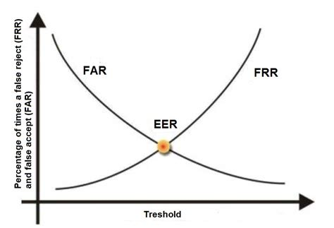

### Single Sign-On (SSO)
Goal: authenticate a user seamlessly across multiple domains using an identity provider. The advantage from the user point of view is obvious: he only needs to authenticate once and will be logged in all every service. The mechanism basically works like this:
- for the first login, the user is redirected to the identity provider
- log in to the identity provider
- the identity provider confirms to the website the identity of the user
- in all subsequent logins:
  - the website contacts the identity provider
  - since the user already logged in, the identity provider confirms the user identity to the website
  - the website logs the user in

Some protocols that implements this are OAuth2 and shibboleth. Many services allow to use this method (e.g. log in with Google/Facebook).

NOTE: there can be privacy concerns if the identity provider is someone like Facebook for example because this would allow to track the user activity across the websites that he visits that have Facebook integrations (e.g. like button) for advertisement purposes.

This approach present more challenges than the traditional approach:
- single point of failure
- single point of trust
- difficult to get it right, complex flow to follow

## Introduction to software security
Good software engineering means meeting the requirements:  
FUNCTIONAL:
- software must do what it is supposed to  

NON FUNCTIONAL:
- usability
- safety
- security

Creating inherently secure application is hard and often is a skill that programmers lack because they were not taught about it. An unmet specification is a bug, an unmet *security* specification leads to a vulnerability. 

In the early 2000s reporting vulnerabilities to company was not a good experience since they often [treated with hostility](https://marc.info/?l=vuln-dev&m=95602682515862&w=2) or threatened with lawsuits. So the only way to receive attention was to publish the vulnerability in the wild and force the vendor to fix it in order not to have it used against its users. This is what we call *full disclosure*.  
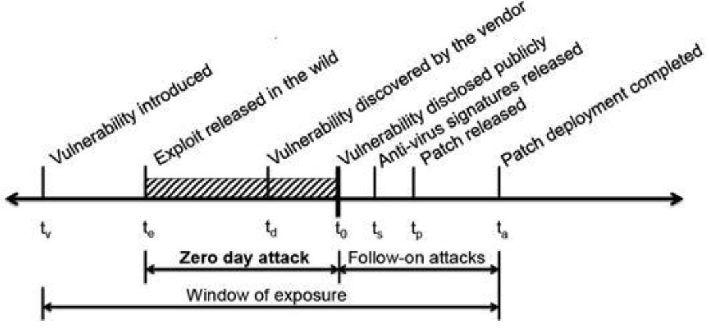  
Of course `te`, `td` and `t0` can happen in different order. Anyways the objective is to minimize the window of exposure, ideally:
- the vendor finds the vulnerability
- the vendor patches the vulnerability
- vulnerability disclosed

This is why nowadays companies use *bug bounty* programs to encourage hackers and researchers to share the vulnerabilities that they find in order to have them patched as quickly as possible (*coordinated disclosure*). Big companies often have an internal group dedicated to finding vulnerabilities in their products.

## Buffer overflows
The concepts here are shared basically across all architectures and OSes. We will consider a 32 bit x86 architecture. See [appendix](#Appendix:-x86-assembly-crash-course) for information about x86 stack and calling conventions

Let's start with an example:  
```C
[...]
int foo(int a, int b)
{
  int c = 14;
  char buf[8];
  gets(buf);  //careful here
  c = (a + b) * c;
  return c;
}

void main(int argc, char *argv[]) 
{
  [...]
  foo(5, 6);
}

```
What happens if we insert more than 8 characters into the buffer `buf`?  

```bash
$ ./vulnerable_executable
ABCDEFGHIJKLMNOPQRSTUV
```
Look at the stack to see what happens (high addresses at the top).

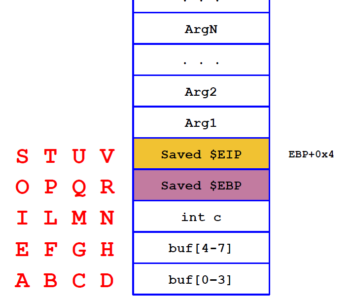

The saved EIP that was on the stack has been rewritten because the input was longer than the length of the buffer and there were no checks on its size or the number of chars read. This caused the buffer to *overflow* and overwrite what was on the stack. What happens now that the return address has been corrupted?

```bash
$ ./vulnerable_executable
ABCDEFGHIJKLMNOPQRSTUV
Segmentation fault
```
The segmentation fault happens because "STUV" is not a valid address to jump to so the OS kills the program.  
We can exploit this vulnerability to hijack the control flow of the program by overwriting the saved EIP (sEIP for short) with another address that points to some code that we wrote. How to do this?
- we need to jump to a valid memory address
- there needs to be valid code at that address

The basic method that we will see is *stack smashing*, we place the code that we want to run directly inside of the buffer and rewrite the return address with the address of the buffer itself.

### Stack smashing
How do we get the address of the buffer?  
We cannot get it precisely but we can estimate it by reading the value of ESP from a debugger. That value may differ of some words from the real value because of the presence of the debugger so we have a problem of precision: to have code executed we need to jump in the exact byte.  
The solution to this is to put before our code a so called *NOP sled*, a sequence of NOP instruction where we can jump and "slide" towards our code. This does not require byte-precision since the NOP instruction is a single byte so no matter where in the word we jump it will always be decoded correctly.

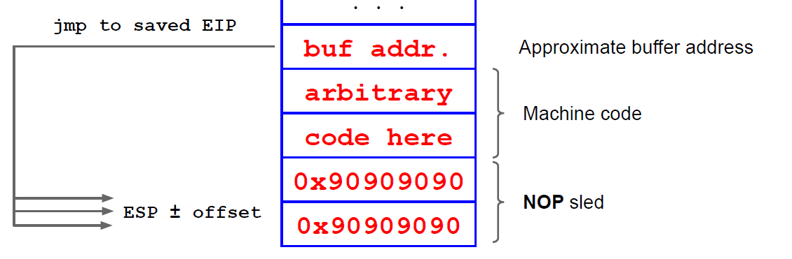

Now we need to decide what to put on the buffer to be executed. In this example we try to open a shell (which is why historically it is called shellcode) and close the program. In general we can put code to do [anything](http://shell-storm.org/shellcode/).  
To do this we use the system call `execve` that we will invoke using an interrupt (`int 0x80` on Linux) after preparing its parameters. To obtain the assembly for the shellcode we first write the program in C and compile it. Then we disassemble it and pick the relevant parts. What we want to execute is this:

```C
int main() 
{
  char* hack[2];
  hack[0] = "bin/sh"; //the name of the program we want to open
  hack[1] = NULL; //the parameters to pass to the shell
  execve(hack[0], &hack, &hack[1]); //system call
}
```

Once compiled, if we inspect the result we find something like this:  
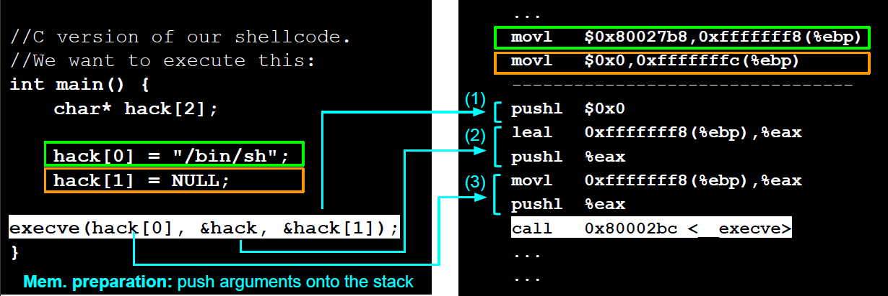  

We need to prepare the stack properly for the exploit to work:
- put somewhere in memory the string `/bin/sh` terminated with a `\0`
- address of that string somewhere in memory, the "argv[0]" to pass
- all of this followed by a `NULL` to pass the arguments (we do not want to pass arguments)

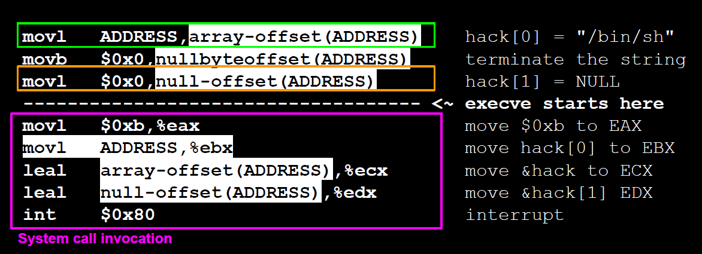

Everything is parametrized w.r.t. ADDRESS, that is where we put our string in memory. In this case though we need to know it exactly we cannot take a guess. We can use a trick called *jump and call*. Remember at this point we are already executing code so we can have the machine to tell the address by doing:
- put a `call` instruction before our string in memory. The `call` pushes on the stack the address of the next instruction, that is the position of our string.
- at the beginning of the shellcode, jump to our call using a relative offset. We can compute it precisely because we know how long the shellcode is.
- after thet jump we can pop the address

```C
jmp offset-to-call  //jump to the call
pop esi  //pops the address of "/bin/sh"
[shellcode]
call offset-to-pop  //calls to pop
.string "/bin/sh"
```

Now we have the shellcode and we are able to execute it. There is still a small problem because there are some 0 bytes in our code. This is not a problem per se, the issue is that we are injecting the code using a string manipulation function of C so when it reaches a 0 byte it interprets it as `\0` and terminates reading.  
We need to rewrite the shellcode in an equivalent way but avoiding putting in bytes that are all 0. Fortunately this is not particularly difficult, we can use some tricks:
- use some `jmp short` instead of `jmp`
- if we need to write some 0, do this by xoring something with itself, like `xor eax, eax     mov [esi+7], eax` that puts 0 in eax and then puts it at esi+7

The idea is that we can almost always write equivalent code but without 0, so it is just something to look for not a real issue.  
The resulting shellcode is:

```C
char shellcode[] =
"\xeb\x1f\x5e\x89\x76\x08\x31\xc0\x88\x46\x07\x89\x46\x0c\xb0\x0b"
"\x89\xf3\x8d\x4e\x08\x8d\x56\x0c\xcd\x80\x31\xdb\x89\xd8\x40\xcd"
"\x80\xe8\xdc\xff\xff\xff/bin/sh";
```

Now we can put the nop sled and the guessed address and give this in input to our program. The code is portable, it doesn't need anything except to guess the correct address to jump to.

Just one note: to actually input it to the program we need to write the actual hexadecimal values (that could be non printable characters). To do so we can use a helper program for example:

```bash
echo "our_shellcode" | ./vulnerable_executable
```
or
```bash
python -c "print 'our_shellcode'" | ./vulnerable_executable
```

### Alternative techniques
This is just a schematic list, not treated in this course
- ENVIRONMENT VARIABLES  
We can put our code in environmental variables and have it loaded on launch.  Then we can overwrite the return address with the address of the environment variable we set.
  - Advantages
    - easy to implement because we are not constrained by the space
    - easy to target because we can know the exact address
  - Disadvantages:
    - we can only exploit if we have access to the machine and set the env
    - a wise program may wipe env. variables that he does not need
    - memory must be marked as executable (more on this in [mitigation section](#mitigations))
- BUILT-IN, EXISTING FUNCTIONS  
Point the return address to some code that is already present in memory like other functions or some library function.
  - Advantages:
    - works remotely and reliably
    - no need for executable stack
  - Disadvantages:
    - need to prepare the stack carefully
    - more difficult to do properly

There can also be practical problems that make the exploitation difficult or impossible, for example the buffer could be too small to fit all of our shellcode + NOP sled.

### Mitigations
We can implement some defense at different levels:

#### Source code level
- use languages with memory management like Java
- use safer libraries that check the boundaries of buffers (`strncpy`, `strncat`, etc allow to specify the maximum length to read)
- educate developers not to introduce such vulnerabilities
- use tools to find vulnerabilities in the source

#### Compiler level
- warnings about unsafe behaviour
- randomization of the ordering of stack variables
- embed stack protection measures

The last one is the most successful in stopping these attacks and is based on the concept of *canary*. The basic idea is:
- between the local variables and the saved registers sEBP and sEIP, put a canary word of random data chosen at each execution
- before returning, check that the canary is still the same.  
The canary can also be xored with those values to ensure they are not modified by means other than a simple buffer overflow.

#### OS level
- mark the stack as non executable. Today this is widely supported at a hw level thanks to the [NX bit](https://en.wikipedia.org/wiki/NX_bit). Can be bypassed by some techniques that rely on built-in function or code that is already present (return oriented programming).
- use Address Space Layout Randomization (ASLR) that relocates the stack and other section of the code at the start of the program by a different amount each time. With offset in the order of some MBs it's impossible to correctly guess the address to jump to.

## Format string bugs
Format strings are a way to specify to a print function how a string should be formatted. They are present in basically any programming language.  
The basic mechanism is to specify which items to substitute in the string using placeholders with specific meaning and passing to the print function the values to put. Because of this print function are variadic functions, they can accept in input an indefinite number of arguments.  
Example:
```C
void main()
{
  int i = 10;
  printf("%x, %d", i , i); //"%x, %d" is the format string
}
```
When executed this gives as output:
```bash
$ ./format_string_example
a, 10   #%x means hexadecimal, %d is integer
```
How can we use this mechanism to make the program do something else? If the format string is not specified then funny things can happen:
```C
void test(char* arg)
{
  char buf[256];
  snprintf(buf, 250, arg);
  printf("buffer: %s", buf);
}

int main(int argc, char* argv[])
{
  test(argv[1]); //pass the first parameter received from command line
  return 0;
}
```
If we execute this and input a format string to it
```bash
$ ./vulnerable_format_string "%x %x %x"
buffer: b7ff0ae0 66663762 30656130
```
What happened here?  
The function `snprintf` is a formatted print on a string. Since the argument that was passed was `"%x %x %x"` it interprets it as a format string and looks for the parameters that should correspond to each `%x` on the stack. But no parameters were passed, so the function picks the value that it finds there where it expected to find parameters. There is an **information leakage** from the stack.  
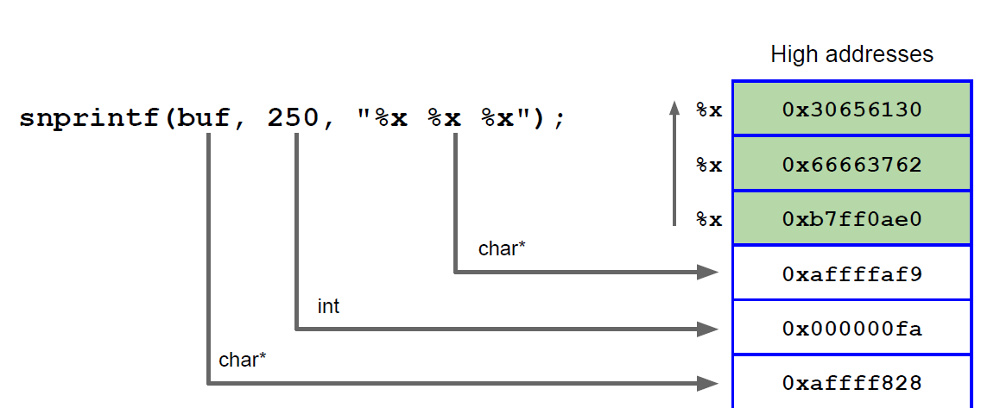  
Note that the format string itself is also on the stack because it was passed as a parameter. This means that if we get the correct offset we can read it too.  
We can choose precisely how many words to go back in the stack because we can specify in the format string which parameter to place in a certain position using the syntax:  
`%N$x  //read the Nth parameter and interpret it as hex`

FIRST RESULT: we can read the stack and we can read what we put on the stack at an arbitrary offset.

The second thing is that there also is the possibility to write to a specified position by using a special placeholder in the format string:  
`%n  //write in the address pointed by the corresponding argument the number of characters written so far`  
Example:  
```C
int i = 0;
prinft("hello%n", &i);
//now i = 5
```

We can exploit this to change some memory cells (for example a return address...):
- place the address of the cell that we want to change (*target*) on the stack in a string
- find it using for example `%x` (using the trick to go up for whatever we want)
- once found, replace the corresponding `%x` with `%n`

NOTE: as seen before, to write hexadecimal character we can use a helper program like having python to print them for us:
```bash
./vulnerable_format_string "`python -c 'print "\xcc\xf6\xff\xbf%2$n"'`"
```

We have now two issues:
- how do we find the address to modify?
- how do we write an arbitrary number to that address?

For the first issue, we assume that we have a target address, more on this [later](#A-word-on-the-target-address).

For the second we can use properties of the formatted printing. In fact, we can specify a certain padding to the amount of characters that we want to write:  
`%50c  //prints a char using 50 spaces --> counts as 50 chars`  
The only problem with this approach is that in order to overwrite an address with another address (32 bit) we would need billions of chars of padding, which is not feasible because we are probably going to saturate the memory or crash the program (remember that the format string is expanded in memory somewhere before being printed).

We can overcome this issue by dividing the single 32 bit write in two separate 16 bits writes using only one format string. What we need is:
- the two target addresses, which are two bytes apart
- the displacement on the stack of these two target (let's call them `pos` and `pos+1` since we will place them in two adjacent words) . We can find these values by inspecting the stack using `%$Nx` incrementing `N` until we read our address (can be done by a script). 
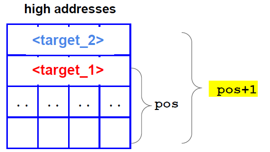
- do some math to compute what to put in the padding values

The structure of our format string will be something like this:  
`<target><target+2>%<lower_value>c%pos$n<higher_value>c%pos+1$n`  
Where:
- `target` and `target+2` are the two position in which we are going to write
- `pos` and `pos+1` are the displacements
- `lower_value` and `higher_value` are the two 16 bits value that we will compose to make to whole 32 bit address

How do we compute those value? It is not as simple as dividing the 32 bit in two 16 bit halves and write them independently because we write them using %n that is only able to write the total number of characters written so far.  
Suppose that we want to write the value `0x45434241` at the address `0xbffff6cc`. What we have to do is:
- separate in half and convert to decimal  
  - `0x4543` -> 17731
  - `0x4241` -> 16961
- since the value written by `%n` can only increment, we need to first write the smaller value and then bigger one. So the two writes will be done as follow:
  - first we write 16961 - 8, where 8 is the number of bytes written so far (the two target addresses) `%16953c`
  -  second we need to write the remaining chars to get to 17731 --> 17731 - 16961 = 770  `%770c` or `%00770c` to maintain the same structure (leading 0s are ignored)
- the two target addresses are
  - `0xbffff6cc`
  - `0xbffff6cc + 2 = 0xbffff6ce`

So our format string becomes:  
`\xcc\xf6\xff\xbf\xce\xf6\xff\xbf%16953c%pos$hn%00770c%pos+1$hn`  
NOTE: we used `%hn` instead of `%n` because we are writing 16 bits instead of 32 and we do not want to overwrite the two following bytes with 0s.

SECOND RESULT: we can write an arbitrary 32 bit value at an arbitrary address of the program that we are exploiting.

This method works in general, we only need to be careful about the displacements and the order of the writes, the general structure of the string to write a 32 bit value is:  
`<target><target+2>%<lower_part-len(printed)>c%pos$n<higher_part-low_part>c%pos+1$n`  
We may have to swap the two targets if the two writes needs to be swapped (e.g. i want to write a value where the first half is smaller than the second half like `0x08049698`).

### A word on the target address
So far we have assumed that we had a target address to write to, but we did not talk about how to find it. It could be any address in the memory of the program that we are exploiting, for example:
- saved EIP of a function to change the control flow of the program
- Global Offset Table (GOT)
- function pointers
- exception handlers

### A word on countermeasures
Memory protection seen in the buffer overflow section can be applied here to help preventing the exploitation by making it difficult to find the target address (ASLR) or impossible to modify return addresses without being noticed (XOR canary). Also compilers warns when we use a format string without fixing the format string itself.

### Ingredients for a format string bug
- have a variadic function
  - variable number of parameters
  - resolved at runtime
- placeholders to read/write to arbitrary locations
- the ability to control those placeholders

## Web applications vulnerabilities
Web applications are the current paradigm for delivering software. The basic structure of a web app is the following:  
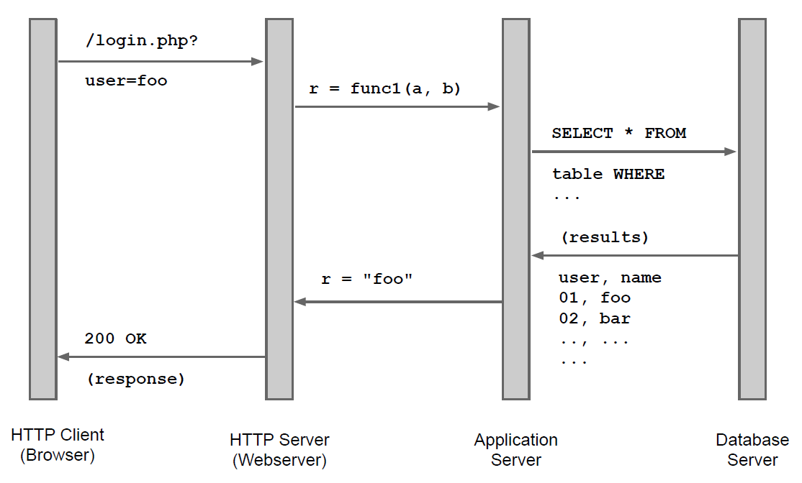  
This is a general scheme, some parts may overlap (e.g. web server and database on same machine).  
There are things that we need to be careful about when developing a web app:
- often they are exposed to the public internet
- built on top of HTTP that is stateless:
  - need to emulate a "state" on top of it
  - implement authentication
- the HTTP client is by definition **not trustworthy** but it is an active part in the application flow

For the last reason, we need to carefully filter and validate what comes from the client (cannot validate input on the client side). The problem is that often developers see the client as a cooperative part of the application and may overlook some things (e.g. that the request comes from the correct page, it could be crafted by someone).

How do we filter? There are basically 3 approaches:
- whitelisting: only allow through what we expect
- blacklist: discard known-bad stuff
- escaping: transform potentially harmful characters into something equivalent but not dangerous (e.g. the "<" character maybe interpreted as the start of an HTML tag, substitute with &lt\;)

The general rule is to go with whitelisting if possible because it is easier and safer, then proceed to blacklist/escaping if needed.

Example: filtering a phone number.  
- start by designing a whitelist:
  - numbers 0-9 and some symbols like "(", ")", "+", "-"
    - e.g. +39123456789, 481-5784-9842, ... 
- do we need to blacklist something?
  - probably not, it depends on the backend. If some of these characters may be misinterpreted by the backend we need either to remove them or escape them.

### Cross site scripting (XSS)
Vulnerability by means of which client-side code can be injected into a page (e.g. javascript). There are three types:
- Stored XSS
- Reflected XSS
- DOM-based XSS

#### Stored XSS
The attacker input is stored on the target server's database, for example in a forum message or in a comment. 
Other people that visit the same page will load the malicious code from the server and if there are no measures to make the data safe to render in the browser the malicious code will execute.

Example:
- write a comment on a page.
```html
<script>alert('XSS');</script>
```
- the comment is stored in the database of the server.
- when other users load the comment their browser will interpret it as html code and execute it.

#### Reflected XSS
The attacker input is returned by the web app to the users in a response. Since the response includes the malicious input it will execute on the victim's browser.  
The difference from before is that the malicious code is not stored on the server, it simply bounces back in a response because the page includes elements constructed from the use input.

Example:  
Source code server side  
```php
<?php
$var = $HTTP['variable_name']; //retrieve content from request's variable
echo $var; //print variable in the response
?>
```
An attacker can craft a malicious link to perform the request and inject the code  
`http://example.com/?variable_name=<script>alert('XSS');</script>`  
When the victim clicks on this link the script will execute.

#### DOM-based XSS
The malicious payload never leaves the browser, so the server is not able to see those attacks (although it's still the developer's fault for not implementing the page correctly).  
The script is executed directly client side exploiting some scripts that modify the DOM environment.

Example:
Page source code contains this  
```html
....
<script>
document.write("<b>Current URL</b> : " + document.baseURI);
</script>
....
```  
The attacker can craft a link using the page anchors used to navigate the page:  
`http://www.example.com/test.html#<script>alert('XSS);</script>`  
The script in the page will pick what comes after the `#` and write it in the page when it's loaded allowing the malicious code to execute.

#### Dangers of XSS
It is true that client-side code executed in the browser is sandboxed and cannot do anything to directly harm the machine (except for possible vulnerabilities in the browser javascript engine), but a script in a page can tamper with data and cookies saved for that domain:
- cookie theft
- session hijacking
- manipulation of transaction (e.g. substitute form fields)
- drive-by downloads

XSS effectively bypasses the Same-Origin Policy (SOP), where client-side code loaded from a certain origin can only access and modify elements from that same origin (e.g. javascript from google.com can only access elements created by google.com).

#### Protecting against XSS
How do we filter user data in order to make it harmless? Consider the example of comments on a page.  
As we said, the first thing is to design a whitelist for the characters that we want to allow:
- allow alpahnumeric characters a-zA-Z0-9 and punctuation symbols ".", ",", "!", "?", "(", ")", " ", ...

This basically solves the problem because with this set of characters is not possible to inject javascript. But this also limits what a user could write. What if we wanted to allow all characters, in particular "<" and ">".  
Adding this two characters complicates things because it is now possible to write html tags, so we need to make sure that those are not misinterpreted as actual code.  
We can start to blacklist stuff that may be misinterpreted, but things get out of control fast:
- blacklisting `<script>` is not enough
  - similar attributes can contain javascript code `<iframe>`, `<applet>`, ...
  - event handlers inside other tags e.g. ``, there is a long list of those
- ok, blacklist every single one of them
  - need to keep up with the evolution of html and different browsers support/implementation
  - there is still more
- we can put `javascript` in a URL schema e.g. `<iframe src=javascript:alert('oh no');>`
- javascript can be written divided on two lines
  - the browser will strip `CR` and `LF` but our blacklist will fail
- even if we account for this, null entities can be added in the middle on the word and the script will execute anyways e.g. `java&#09;script:code_here`
- those entities can be written in many ways
  - add zeroes `<IFRAME SRC=javasc&#000010;ript:alert('JavaScript Executed');>`
  - ...
- do i have to continue?

TL;DR blacklisting is not a good approach to this.

With escaping we are luckier because it is a bit more effective, for instance we can make these substitutions
- < -> &lt\;
- \> -> &gt\;
- & -> &amp\;

The definitive solution is to use Content Security Policy (CSP). Basically we define *a priori* which part of the page can contain code and which are not to be interpreted as code, from where it is allowed to load scripts or send form actions, etc.

The problems at the moment with this approach are that:
- implementation is up to the browser
- policies needs to be written and update manually for each page and may slow down development

### SQL injection
Code injection technique used to modify or retrieve data from SQL databases.  
Consider a web app with a simple login page:  
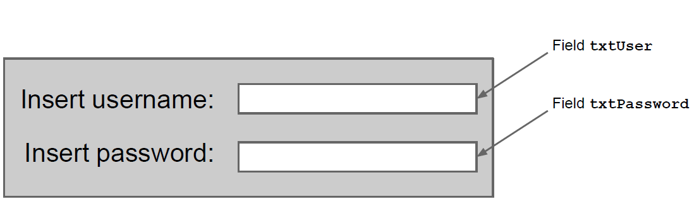  
Suppose that the backend code, in order to check if the user exists and the password is correct, does somthing like this:  
```java
public void onLogon(Field txtUser, Field txtPassword) {
  SqlCommand cmd = new SqlCommand(String.Format("SELECT * FROM Users 
                                    WHERE username='{0}'
                                    AND password='{1}';",
                                txtUser.Text, txtPassword.Text));
SqlDataReader reader = cmd.ExecuteReader();
}
```

Looking at the query we can see that it accepts user input as is and uses it to build the query --> the user can modify the structure of the query!  
For example, if the user puts int the `txtUser` field field something like `username'; --` when the query is build it will be like:  
`SELECT * FROM Users WHERE username='username'; --'AND password='not_relevant';`  
This will execute only up until the semicolon because `--` in SQL generally means comment (there can be different syntax for different DBMSs, like `#` for MySql). The result is that the user is logged in as `username` without knowing the password.  
Note that this procedure can be done for every existing user --> an attacker can log in pretending to be whoever he wants, provided that he knows its username.

There are other things that an attacker can do:
- display the content of the table e.g. `username OR 1=1;--` will return true for every user
- perform other queries using the `UNION` statement, for example:  
`SELECT name, phone, address FROM Users WHERE Id=‘’ UNION ALL SELECT name creditCardNumber,CCV2 from CreditCardTable;--’;`  
This will show the results from another table! It works provided that the fields that we are trying to extract are the same number and type as the original query.
- tamper with `INSERT INTO` to modify tables.
- also we can perform *blind injections* when we are not able to retrieve directly the data. They can always return some information that we can use to infer data (e.g. the page shows different error message based on what was returned)

Also in this case we need to filter our input in. In this case is the `'` character that causes problems. How do we filter?
- first, as always, design a whitelist
  - alphanumeric a-zA-Z0-9 and "." for the username
  - we don't really want to filter a password to avoid reducing the keyspace, we can rely on escaping (note that this is not an issue if the passwords are stored properly because they are going to be hashed before putting them in the query)
- what can we blacklist?
  - `;--` for sure
  - `AND`, `OR`? we can but those can be rewritten in many equivalent ways (remember `<script>`?)

#### SQL injection prevention
- properly sanitize input
- use **prepared statements** instead of building queries by string concatenation (pls do this, ty) if the language allows (almost all do), like
```php
$stmt = $db->prepare(SELECT * FROM users WHERE username = ? AND password = ?” )
$stmt -> execute(array($username,$psw));
```
- limit query privileges, not all queries needs to be run with administrator rights. This limits the damage in case a vulnerability is found.
- do not use table name as field name to avoid revealing information

### Recap: XSS and SQLI
These vulnerabilities are there because we have conflicting requirements:
- functional requirement: mix code and data (e.g. comments on a page, use input to perform queries)
- security requirement: never mix code and data!

So if some routine inadvertently reacts to data treating it as some control sequence we have a vulnerability.

### Other possible vulnerabilities

- Information leakages
  - too detailed error messages
  - debug traces in production website -> the attacker can infer what backend we have
  - side-channels, for example distinguishing between "user not found" and "wrong password", reveal more information than what they should.  
All of these may not translate directly into an attack, but they give potential attackers more information that they can use.
- URL parameter tampering  
If the parameters in the URL are trusted by the application, they can be altered to receive data that we weren't supposed to receive (never trust user input).
- Path traversal  
An attacker is able to navigate in the folders through the URL.  
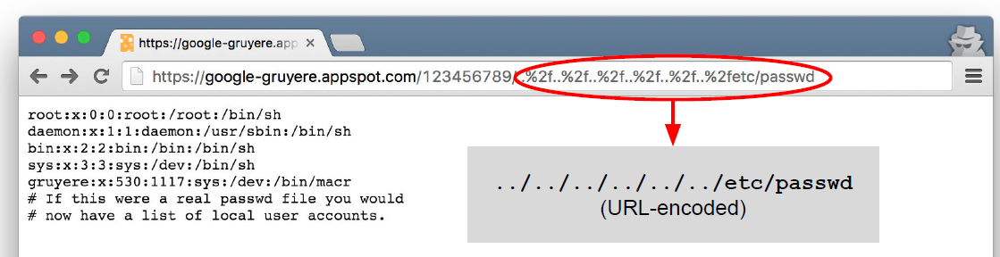  

### Password security and recovery schemes
As said before, never store passwords in plain text. Every application currently on the internet should store password by salting and hashing.  
Password reset schemes also need attention because they are basically alternative ways to log in and they should be properly secured:
- send to verified email link to reset password
- (WEAK) send temporary password
- (WEAK) ask security question, often easy to guess. It is fine to use them as a sort of "captcha" to block password reset request from others.

We also need to protect against possible bruteforcing attacks on the password:
- naive approach --> block after `N` attempts. This has two major problem
  - the attacker can do *reverse bruteforcing*, instead of trying all attempts on one account he can try `N-1` attempts on all accounts
  - the attacker can exploit this to lock the victim out of his account
- block IPs behind many failed attempts
  - not a good idea because it can be exploited for DoS
  - due to NAT and proxies, many different users may be behind a certain IP

Compromise solution:  
do not limit the number of attempts per account or IP but "throttle" them using captchas to slow down the attacker and prevent automated requests while alerting the user of the failed attempts.

### Cookies
Solution developed to make HTTP somewhat stateful. The basic idea is to have the web server store a small text file (containing an id or some preferences settings) on the browser of the user that visited the website in order to recognize it later.  
This idea was (and is) also abused to track a specific user across website (for instance, for advertisement purposed).  
Cookies are also used to store sessions for the users in order not to have them log in each time. This poses other problems because it can lead to sessions being stolen or created if the mechanism that builds the random tokens is predictable.

There are also issues with sessions that each developer needs to address:
- what to do in case of multiple concurrent sessions? (different tabs for example)
- when to invalidate sessions?
- how to keep track and store them on the server?
- how to handle an expired session?

### Cross-Site Request Forgery (CSRF)
Attack that forces the user to execute unwanted actions on a web application in which he is currently authenticated using ambient credentials (e.g. cookies). See [here](https://owasp.org/www-community/attacks/csrf) for detailed info.  

Concepts:
- cookies are used to manage sessions
- all request originating from the browser carry the associated cookies --> cookies are ambient credentials: sent automatically at each request.
- malicious request are routed to the web application through the victim's browser (along with its credentials that are stored in the cookies).
- the web app cannot distinguish if the request came from the victim or it was forced by someone else

This can have very negative impact, for example the request can be sent to the home banking system to transfer some money (if the user is logged in).  

How are these attacks performed?
- create a malicious web page
- insert a form in the page that sends the request to the target website (e.g. bank website)
- when the user visit the malicious website the request is sent
- if the user was logged in then the request will go through as legitimate since its cookies were sent along with the request by the browser

MITIGATIONS  
Use random tokens associated with each request and do not store them in cookies:
- the web page before sending the form inserts a random token, regenerated at each request
- when the user fills in the form, check that the random token is still there
- an attacker needs to guess the token to have the request go through (that's why we need it to be random)

Example:  
the page that arrives on the browser should be something like:  
```html
<form class="form-signin" method="post">
<h3 class="form-signin-heading">Transfer money</h3>
[...]
<input type="number" id="inputAmount" name="amt" class="form-control"
placeholder="Amount" required>
<input type="hidden" value="9GiKZU6HoR" name="csrf_token">
<button class="btn btn-lg btn-primary btn-block" type="submit">Confirm</button>
</form>
```  
The CSRF-token is the value that needs to be random and changed at each request.

Another mitigation is to use Same-Site Cookies. Specify in the cookie that it should not be sent along a request if the request was generated from a different website than the one that set the cookie.

## Network protocol attacks
We can distinguish 3 main types of attacks:
- Denial of Service (DoS): make a service unavailable (against availability)
- Sniffing: abusive reading of network packets (against confidentiality)
- Spoofing: forging of network packets (against integrity and authenticity)

### Denial of service (DoS)
There are two sub-types for this attack:
- killer-packets: malicious packets crafted in specifically to make the application/OS that reads them to crash or become unresponsive.
- flooding: sending tons of requests to choke the connection to the service.

Some examples from the past of killer packets are:
- ping of death (1997)  
Sending a malformed ICMP echo request that exceeds the maximum legal size. The normal size would be 56 bytes, but the maximum theoretical size of a packet is 65535 bytes. However no computer system was designed to handle such huge packet. The attack was very simple:
  - send large ping `ping -s 65527`
  - when the target machine tries to build the response it will include the content of the request
  - adding the header will exceed the maximum size causing a buffer overflow
  - the machine would crash
- teardrop  
Fragmented packets with overlapping offsets that can have the kernel crash when reassembled.
- land attack  
Windows 95 bug, sending a packet with source IP = destination IP and the SYN flag set to the target machine would lock up the entire TCP/IP stack. This was fixed but reappeared later in windows XP SP2.

These killer packets attacks work because:
- incomplete protocol specifications, do not say how to handle special cases
- programmers tested against reasonable cases

It was actually considered good practice not to be too strict in accepting packets that were not strictly formatted to increase intercompatibility between different TCP/IP stacks. See [here](https://en.wikipedia.org/wiki/Robustness_principle).  
>"be conservative in what you do, be liberal in what you accept from others"    Postel

The second category of DoS attacks is flooding. This cannot really be avoided, if the attacker has more bandwidth than the server he is trying to attack it will become unreachable.  
Where is the security problem here, if it cannot be avoided? If there is a way for the attacker to multiply his effort in doing the attack, e.g. the attacker uses `x` amount of resources but consumes `Nx` resources on the server. We want to take away the possibility of having that multiplier.

Example: SYN flood  
Exploits the three way handshake of TCP. The idea is:
- attacker: sends a lot of SYN packets with spoofed source IP and never acks them
  - resources used: bandwidth
- server: needs to reply with SYN-ACK and store in a queue all pending connections
  - resources used: bandwidth + memory

Once the queue to store half opened connections is full, other requests from legitimate users are dropped. The multiplier here is that the server also needs to use memory to store the connections and this becomes the limiting factor.  
The problem here, as we said before, is that this attack cannot really be avoided because it is exactly how TCP is supposed to work. We can only try to mitigate it by taking away the multiplier (store connections in memory).

Mitigation: [SYN-COOKIES](https://en.wikipedia.org/wiki/SYN_cookies)  
The information about the half open connection is not stored but is encoded in the sequence number sent back in the SYN-ACK response. Once the server receives the ACK it is able to reconstruct to which connection it belonged, avoiding the use of a queue.

#### Distributed DoS (DDoS)
In this case the attacker can control a large number of machines (e.g. a botnet) and have them send requests to a target server to consume its bandwidth. The multiplier is in those machines that the attacker controls, sending one packet/command will be multiplied by the number of machines.

Example: Smurf  
The attacker sends a broadcast ping to a network using as source address the spoofed IP address of the target. All the machine will reply to the ping flooding the target server. If there is a sufficient number of machines doing this the server bandwidth will be saturated and it would become unreachable.  
Also in this case we can see that there is nothing wrong with this behaviour, it is the expected behaviour of ping packets.

Mitigation:  
Since there is no reason to ping the broadcast address of a network from outside that network it would be better to configure routers to drop broadcast packets from the outside. Basically all routers are configured like this by default.

NOTE: the victim cannot do anything to prevent this, the misconfigured routers are the ones that need to be fixed. This is a *public health problem*: the misconfigured routers do not strictly need to update the configuration because the attack is not impacting them, there is no return in doing this, but their behaviour may put others in danger.

Many protocols on the internet have characteristics that make them suitable for DoS and DDoS attacks (they have some built in multiplier):
- DNS
- NTP
- NetBIOS
- ...

We cannot really get rid of these protocols or deeply changing them right away since many are founding components of the internet. The main takeaway here is that flooding attacks cannot be eliminated completely.

### Sniffing and spoofing
Often used in combination, here some examples.

#### ARP spoofing  
Spoof the MAC address of an ARP reply. Since there is no check, the machine who made the ARP request will trust the first answer that comes, also poisoning the ARP cache with the address of the attacker. Now the attacker can use this to pretend being someone else.  
Possible mitigations are:
- include a random nonce in each request
- anomaly detection: if someone is constantly sending out ARP replies is weird.
- address conflict: the correct reply will eventually reach the host that could notice the conflict and alert the user.  

Why are those measures not taken?
- simplicity is key since ARP is a basic functionality in every network communication
- local network is supposed to be safe enough
- historical reasons (different scenarios, different trade-offs between security and costs)

#### MAC flooding
Fill the [CAM table](https://en.wikipedia.org/wiki/Forwarding_information_base) of switches by sending tons of spoofed packets. The objective is to make them behave as hubs and broadcast every packet. Used to be able to read packets in different sections of the network.  
Mitigation:  
Port security, tell the switch roughly how many hosts are supposed to be connected to some port and refuse to save more addresses.

#### Spanning Tree Protocol (SPT) abuse
The [BPDU](https://en.wikipedia.org/wiki/Bridge_Protocol_Data_Unit) packets used by switches to build the spanning tree are not authenticated for intercompatibility reasons and so they can be forged or manipulated to change the shape of the tree. This can allow an attacker to redirect packets to section of the network that he can listen to.

#### IP address spoofing
Since the source IP of a packet is not authenticated it can be modified by an attacker:
- UDP/ICMP: easy because there is no concept of connection and each packet is independent from the previous ones. The attacker only needs a way to see the replies because they will be sent to the spoofed host. If it is not possible then it's called *blind spoofing*
- TCP (blind): more complex because it involves guessing the sequence numbers in order to complete the handshake blindly (demonstrated to be possible with wrong implementation of the randomness of sequence number).
- TCP hijacking: if the attacker can sniff the packets he can take over a conversation by:
  - disrupting one of the hosts connection
  - replying to the other using the correct sequence number
  - the victim replies to the attacker  
  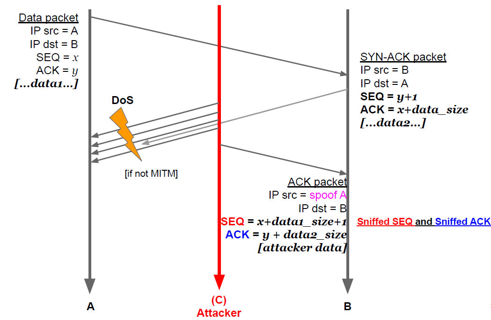

#### Man in the middle (MITM)
Broad category of attacks where the attacker is able to impersonate the server w.r.t. the client and vice versa. Must always be aware of this possibility (e.g. what happens if the attacker is able to ARP spoof the address of the default gateway?).  
We can have two types: half and full duplex.  
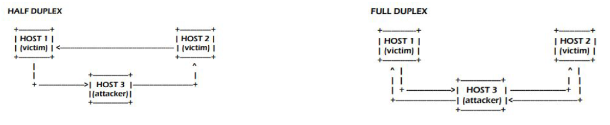  

#### DNS cache poisoning
The objective is to poison the cache of a non authoritative name server to have a symbolic name associated with an IP chosen by the attacker.  
The basic mechanism is:
- attacker makes a recursive query to the victim's DNS server
- the victim DNS server (the non authoritative one) contacts the authoritative server
- the attacker impersonates the authoritative server and replies with the address that he wants
  - needs to sniff the query id somehow
  - needs to reply first
- the victim trusts the answer and stores it in the DNS cache (*poisoned*)

From now on all client asking to resolve DNS to that compromised server will be redirected to the attacker.

The query id can be sniffed or guessed if the mechanism that generates it is predictable (2008 Kaminsky).

#### DHCP poisoning
DHCP is another unauthenticated protocol since it needs to work without any configuration. The attacker can spoof the DHCP answer to manipulate the information sent to the client:
- IP address assigned
- DNS server
- default gateway

Of course the attacker needs to be on the local network and reply first.

#### ICMP redirect
There is a message in ICMP called *redirect* that is used by routers to communicate to hosts the existence of a better route for a certain destination and have them update their routing table with the new gateway for that route.  
An attacker can forge those messages and:
- redirect the host to another malicious gateway
- perform a denial of service attack
- establishing an half duplex MITM

Also in this case the attacker needs to be on the same network. Modern OS ignore by default ICMP redirect messages.

#### Route mangling
Similar concept of altering the spanning tree but for routers. Attacker can advertise better routes for certain traffic and having it redirected to those routes. Can also happen by accident if some service provider routers are configured incorrectly (e.g. advertise very cheap routes). [More here](https://en.wikipedia.org/wiki/BGP_hijacking).

#### Conclusions
- certain attacks exploit wrong implementation of network protocols
- denial of service attacks are always possible if the attacker has enough bandwidth
- network attacks can happen at different layers
- they are made possible by the lack of strong authentication (often because it is not possible to implement it if we want the protocol to work in a convenient way)

## Secure network architectures

### Firewall
Network access control system that verifies all the packets flowing through it (and **only** the packets flowing through it). Single enforcement point between a screened network and outside networks.

As the firewalls in a building are designed to partition it and delay the fire spreading, a computer firewall is not a "wall of fire" that keeps intruders out but it is designed to partition the network by specifying rules about what can go through and what can't.  
An attacker can go through a firewall if he finds a way to do what it wants while respecting its rules. Also, since it checks only the traffic that goes through it, a firewall can be circumvented if there are alternative routes:
- attacker already inside the network
- alternative connection to the outside that don't go through firewall (e.g. 4g connection while also connected to the network)  
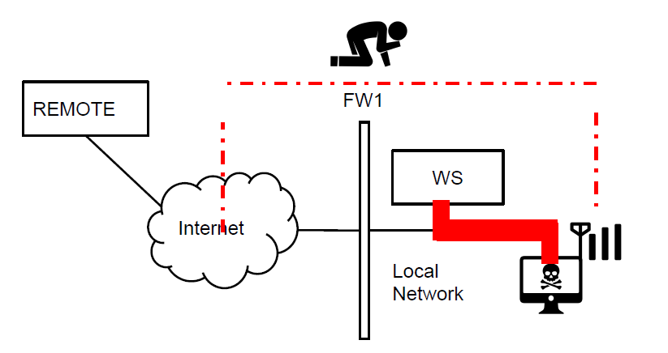  

The right approach to build the rules of a firewall is *default deny*, negate everything and allow only specific things to go through (basically a whitelisting approach).  
There are different types of firewall:
- Network layer firewalls
  - packet filters
  - stateful packet filters
- Application layer firewalls
  - circuit level firewalls
  - application proxies

#### Packet filters
Only look at IP source/destination, the TCP ports and the protocol type. They are stateless and therefore not able to track TCP connections, they apply the rule on a per-packet basis.  
We can specify very simple rules, for example:
- allow this IP/port to connect to the inside
- allow connections only to some outside addresses

The main issue of these packets is that they require the rules to be written "in pairs":  
`allow from any:any to web_server:80`  
need the "mirror" rule to allow the web server to reply  
`allow from web_server:80 to any:any`  
This makes it easy to bypass: i can send packets outside by spoofing the source address and port as `web_server:80`.

#### Stateful packet filters
Overcome the limitation of the previous type by keeping track of the connections. When we say "firewall" this is typically what we mean.  
The response rule is implicit in this:  
`allow from any:any to web_server:80`  
The firewall will allow through all (and only) the responses of the server that were generated by an outside connection.

Advantages:
- better expressiveness
- deeper inspection: can have rules about content
- can handle NAT (even if it requires some application layer inspection, like for example in FTP that may include IP addresses in the application messages --> need to change to pass through a NAT)

Disadvantages:
- performance is limited also by the number of concurrent connection

#### Circuit level firewalls
Basically a proxy at TCP level. Relay TCP connections by having the clients connecting to the firewall. The main problem is that these are not transparent to the application and because of this are basically non-existent nowadays.  
An example of a protocol that does this is SOCKS5.

#### Application proxies
These are also non transparent, need to configure the traffic to connect to the proxy. Each protocol needs its own proxy but the most widely used is an HTTP proxy (also because many web app run on HTTP), also called *web proxy*.  
Usage:
- can authenticate users
- application filtering
- logging
- content inspection (even if encrypted if the administrator configure the clients with a certificate)
- expose a subset of the protocol to protect clients (and servers, in this case is called *reverse proxy*)

### Architectures for secure networks
The "castle" approach that assumes that what is inside is good and what is outside is bad does not work really well:
- attackers can be inside the network
- internal resources need to be accessed from remote users  

The general idea to solve this is to split the network in multiple zones by further separating what can be accessed from the outside and what is used only inside. We call the zone that can be accessed from remote *demilitarized zone* (DMZ). Its goal is to:
- host publicly accessible servers
- not host sensitive data (or minimize the amount)
- assume they are as exposed as the internet  

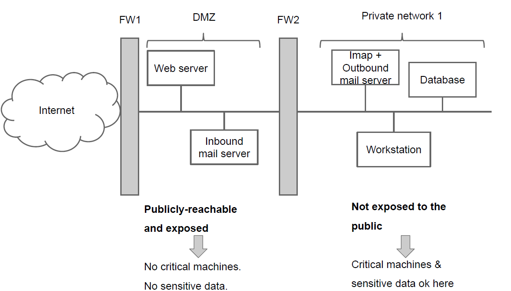  

Of course this does not protect against everything.  
Example:  
the application on the web server is vulnerable to SQL injection and an attacker is able to pull the data from the database in the private zone. The firewall can't do (almost) anything about it because the connection from the web server to the database is allowed.

More complex separation can be put in place to further divide portions of the network and control traffic between those.

#### Virtual Private Network (VPN)
Solve the problem of outsiders that need to connect to the internal network without having dedicated, protected lines. They need to ensure that the CIA properties are met when data is transmitted on a public network.

To do this an encrypted overlay connection is built on top of the public network.  
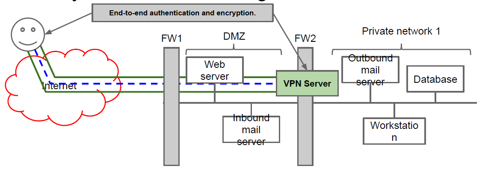  

A VPN can be configured in two different modes:
- FULL TUNNELLING
  - every packet goes through the tunnel
  - allows to have a single point of control and application of all the security policies as if the client was inside the corporate network
  - can be inefficient since unrelated traffic will have to go through (e.g. watches netflix in the evening)
- SPLIT TUNNELLING
  - only the traffic directed to the corporate network goes through the VPN, traffic directed to the internet goes outside the VPN.
  - more efficient: only the needed traffic arrives.
  - less control: can bypass firewall rules (similar of the example of 4g connection before)

Technologies:
- PPTP: Point-to-Point Tunnelling Protocol  
Microsoft proprietary protocol, variant of PPP.
- VPN over TLS  
Implemented in many protocols like OpenVPN.
- Wireguard
- IPSEC  
Implements security and authentication directly at an IP level.

## Network security protocols
Try to solve the issue of securing remote connections:
- problems of remoteness (in general not only over internet)
  - trust factor between parties
  - use of sensitive data (e.g. payment info)
  - not atomicity of transaction
- internet specific problem
  - authentication
  - confidentiality
- needs to be transparent or no one will use them

### SSL/TLS
SSL, Secure Socket Layer, originally developed by Netscape for securing communication by using a layer of encryption at the transport level. Standardized later by the IETF with the name of TLS, Transport Layer Security. The current version is 1.3 (1.2 can still be used, below is insecure).

TLS enforces:
- confidentiality and integrity of communication
- the authentication of the server
- [optional] the authentication of the user  

TLS uses a combination of symmetric (encrypt messages) and asymmetric encryption (key exchange) for performance reason.

The TLS handshake works like this:
- client sends the cipher suites that it supports and some random data  
This allows TLS to be flexible w.r.t. the cipher to use (the protocol specifies a minimal set of ciphers that everyone should implement).
- the server chooses the cipher to use and sends its certificate + some other random data
- client checks the certificate. If it matches, the client chooses a *pre-master secret* and sends it to the server by encrypting it with its public key. Optionally the client can now send his certificate to authenticate itself (rarely happens).
- the shared secret is computed by combining the random data exchanged before (known publicly) and the pre-master key (only known to client and server). The specific method used depends on the selected cipher.

The random data is used to avoid [replay attacks](https://en.wikipedia.org/wiki/Replay_attack) and is very typical in all communication security protocols.

#### TLS and MITM
Is TLS resilient to MITM?
- can see messages but does not have the key to decrypt them
- an attacker can send a fake certificate, but the verification process in the client should prevent this (need to compromise CA and build a fake certificate)

So yes, TLS is resilient to MITM attack by design, assuming that there is no misconfiguration (e.g. accepting fake certificates).

#### Advantages and disadvantages
Advantages:
- protects transmission confidentiality and integrity
- ensure authentication of server and optionally the client

Disadvantages:
- no protection before and after the transaction, only protects communication
  - trojan on clients can gets data
  - compromised server can leak data
  - dishonest merchant can use payment info to overcharge
- relies on the PKI infrastructure
- not foolproof (e.g. client accepts certificate from random CA)

#### Extension to compensate PKI limitations
- [HSTS](https://en.wikipedia.org/wiki/HTTP_Strict_Transport_Security), HTTP Strict Transport Security  
Defend against *SSL stripping* by forcing the connection to happen only over HTTPS, not allowing plain HTTP connections to not trusted websites.
- Certificate pinning [DEPRECATED]  
Website can specify which CAs are trusted to verify the certificate.
- Certificate transparency  
CA send logs of every issued certificate and browser can refuse to accept certificates that have not been logged, even if it is valid. Defend against certificate misissuance. Owners of websites can also check if certificates are issued for something they manage. [Example](https://crt.sh).

### SET
Joint effort of VISA and Mastercard developed to protect transactions.  
Approach:
- cardholder only sends to the merchant only the order information
- payment information are sent only to payment gateway  

All of this while still assuring that both parties can verify the data and protecting against overcharging on the merchant side.  
SPOILER: SET has failed, even if technically is more secure than paying over TLS, we will see why.

The mechanism used is called *dual signature*:
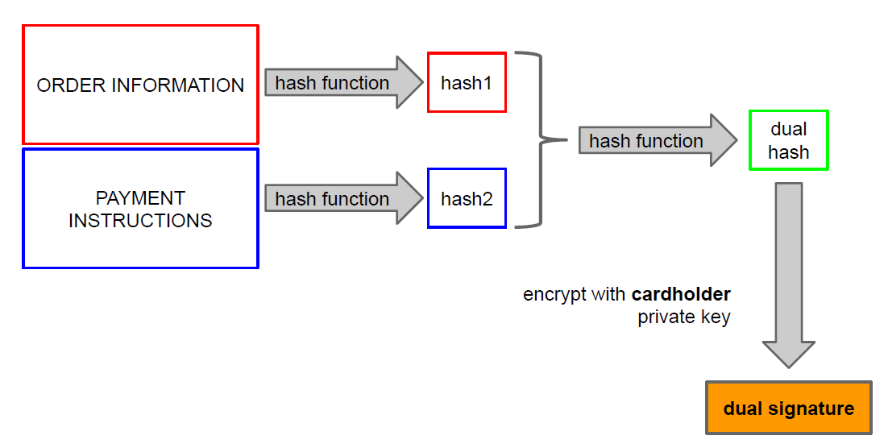  
This way we can divide order information and payment information and send those only to the payment gateway. The verification process works as follows:  
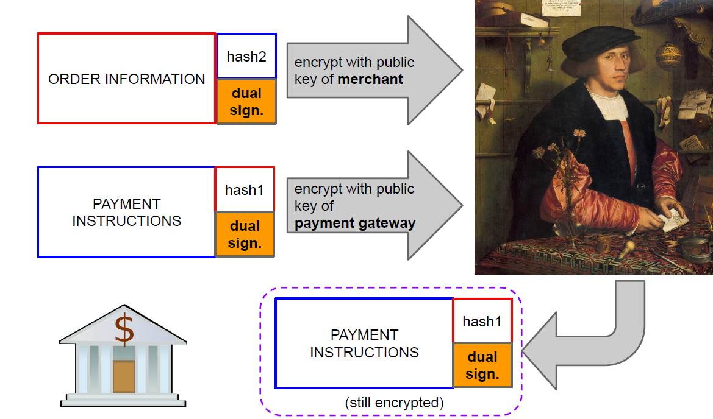  

Why did this fail?  
Need to send every cardholder a pair of public/private key (not transparent). If we put this side by side with paying over TLS people will always choose this because is more convenient.

Nowadays the approach used to make transactions more secure is to have the customer redirected to his bank website to perform the payment and then the bank confirms the payment to the merchant.

## Malicious software
Malicious software (malware) is code intentionally written to violate a security policy. There are different types of malware:
- VIRUS: self-replicate by infecting other files or programs but it is not a standalone program by itself.
- WORMS: programs that self-propagate by exploiting vulnerabilities or social engineering.
- TROJAN: apparently benign program that hide a malicious program or functionality and allow remote control.
- RANSOMWARE: encrypts data on the computer of the victim and asks for a ransom to have the key to decrypt it.

Theoretical result:  
it is not possible to build a program detects if a virus can propagate or not.  
This means that anti-malware software need to use a blacklisting approach, they cannot (always, there are some heuristics to do it) detect directly but need to block known malware samples.

### Malware lifecycle
Reproduce, infect, stay hidden, run payload.  
Many malware nowadays do not self-propagate but are diffused via e-mail or drive-by download in order to remain hidden. Malware wants to remain hidden because it is often used to create botnets.

#### Infection techniques
Viruses can be divided on the basis of their infection technique:
- boot viruses: infect the boot sectors of disks by overwriting the MBR. This allows to load the virus in memory before the OS.
- file infectors
  - overwrite program
  - parasitic virus: change entry point
  - cavity virus: inject code in unused sections of the program
- macro viruses: use macro functionality of documents to execute code. These are very effective because we share documents every day and are also very difficult to remove because the virus remains in the document and it is sufficient that a single infected copy of the document remains around to restart the infection when it's opened.

Worms use many different approaches to diffuse:
- email, also once a machine is infected send the worm to all contacts of the victims.
- social networks, modern variation of the diffusion via email
- mass scanners: diffuse by sending the worm to random IP addresses. This approach became more and more effective the more the internet became "crowded" (nowadays basically every IPv4 address will find something). Optimization are used to speed up the diffusion:
  - preload some target addresses to infect
  - check first for close by addresses
  - divide the scanning space among all copies
- UDP based worms ([SLAMMER](https://en.wikipedia.org/wiki/SQL_Slammer)) can propagate very fast and saturate bandwidth.

Worms often exploit many vulnerabilities to diffuse and modern ones are completely memory resident, they do not store anything on the disk.

How do we protect against worms?  
- patch the vulnerabilities that the worms use since worms often used known vulnerabilities --> need to patch fast
- update quickly antivirus signatures for new worms
- anomaly detection, try to detect anomalous behaviour in a network, maybe used to trigger automatic signature generation  

However since the mid 2000s we saw a decline in the use of worms that rapidly diffuse, even if they are still possible (there have been "wormable" vulnerabilities even after), so why did those attack stop?  
- lack of motivation, cybercriminal need the internet infrastructure to work in order to carry out their activities (the main driver shifted more and more toward monetary gain)
- cyberterrorism does not have the same psychological impact as real attacks  

#### Botnets
Born in order to manage IRC chats, often placed to compromised machines that were connected permanently to the internet. With time the role exchanged and the IRC chat was used to send commands to the bots on the compromised machines.  
These *botnets* can be used to carry out DDoS attacks.  

Example of a bot functionalities ([Phatbot](https://en.wikipedia.org/wiki/Agobot)):  
- harvest contacts
- get key presses
- account info
- take screenshots
- sniff network traffic
- download file
- run commands
- ...

Threats posed by botnets:  
- for the infected host
  - information theft
  - identity theft
  - financial data
- for the whole internet
  - spamming
  - DDoS
  - support infrastructure for other illegal activities

### Anti-malware
- signature based detection
  - database of known malware samples to check against
  - often use wildcards or regex
- heuristics
  - code execution starts from the last section
  - incorrect header size
  - suspicious section names
  - patched import address table
- behavioural detection
  - write to boot record
  - reduces some security settings

ANALYSIS
We have two main ways of analysing malware:
- static: disassemble and decompile the executable and analyze the code directly
  - allow to check the whole code (dormant code)
  - obfuscation techniques makes this difficult
- dynamic: let it run in a sandbox and observe its behaviour
  - defeat the obfuscation
  - enables automation of analysis
  - some techniques allow to detect the sandbox and the malware will not run

Not everything needs an antivirus. Systems that do not need to do general computing can resort to whitelisting: only designed code can run on the device (e.g. Apple devices). The compromise is to use whitelisting for OS components.

### Virus obfuscation techniques
Try to hide malware in order to make it difficult to detect.

- entry point obfuscation: hijack control of the program later.
- polymorphism: change layout of the malware at every infection by encrypting it with a different key. Then a decryption engine will decrypt and execute it (anti-malware can look for this engine).
- metamorphism: create different versions of the code that looks different but have the same behaviour.
  - insert nops
  - reorder sections
  - insert useless instructions
- event triggered: do not do anything until it receives a command from its C&C server.
- anti-sandbox
  - dormant period in which they don't do anything 
  - try to evade the sandbox
- packing: similar to polymorphism but more advanced.  
Encrypt the malware and use a decryption routine to run the malware. This routine also checks for debuggers or if it is a virtual environment. If it detects some analysis technique it will not unpack the malware.

### Rootkits
Enable privileged access to a machine while staying hidden from the sysadmin. There are two categories:
- user level
  - swap some utilities with compromised version that hide the presence of the rootkit.
  - easier to build but also to detect.  
  We can use cross-layer examination -> look for mismatch in the data reported at different level.  
  Example: search for a file. Use ls, ask the kernel, check the drive itself. If the information does not match we can determine if some utility is lying to us.
- kernel space
  - make the kernel itself lie to make it impossible to detect (from that machine, i would need to analyze it in another machine).
  - very difficult to build, uses drivers (windows) or kernel modules (linux), but it works only with monolithic kernels.
  - example: syscall hijacking --> intercept system calls and redirect them to compromised versions.
    - change the function directly
    - filter their output (easier)
  
#### Recognize rootkits
- intuition of the sysadmin
- post-mortem on a different system
- cross-layers examination
- use a trusted computing base. The typical way to do it is called *tripwire*: store hashes of the executables on a server or some non-writable media and check against the executables that you have.

#### BIOS level rootkits
There are very advanced techniques that theoretically can allow an attacker to put its rootkit in the bios itself or in the firmware of other components (like video cards or network interfaces). It is even possible to use pieces of codes that are already in the BIOS and doesn't need to change anything except for some specific memory location (Brossard's Rakshasa). There are also rootkits that act as hypervisors. 

All these rootkits are basically undetectable and impossible to remove, the only way to do it is to change hw.  
The point is that for the vast majority of people this is outside the threat model. We cannot be absolutely certain that a machine has not been trojanized (although in many cases it probably isn't).

## Appendix: x86 assembly crash course
Basics for the x86 architecture that we will use. The architecture was born in 1976 for 16 bits and was later expanded to 32 bit (1985) and 64 bits (2003). It's a CISC design and has variable length instructions. It is present basically in every desktop/laptop and server in the world.

### Registers
- general purpose EAX, EBX, ECX, EDX  
They can also be referenced partly in 8 bit or 16 bit  

- for string functions: ESI, EDI
- base pointer EBP
- stack pointer ESP
- instruction pointer EIP, can't be accessed directly
- program status and control EFLAGS, each bit has a specific meaning and is used to signal some condition (e.g. overflow, carry, parity,...)

### Syntax
There are two main types of syntax:
- intel
- AT&T

For example: 
- move the value 0 to register EAX (basically EAX = 0).
  - intel `mov eax , 0h`
  - AT&T `mov $0x0, %eax`
- move the value 0 to the address contained in EBX + 4.
  - intel `mov DWORD PTR [ebx+4h],0h` (DWORD PTR is optional)
  - AT&T `movl $0x0,0x4(%ebx)`

We have different operations:
- mov to move data
- arithmetics: add, sub, mul, div, cmp, test
- control flow: jmp, j (can be to an absolute address or using and offset)
- nop: no operation, does nothing opcode: `0x90`
- interrupt: int, call, sysenter

### Endianness
Convention that specify in which order the bytes of a data word are lined up sequentially in memory. There are two main types:
- LITTLE ENDIAN, the least significant
byte is stored in the smallest address.  
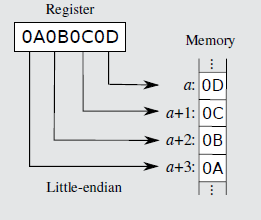
- BIG ENDIAN, the most significant
byte of the word is stored in the
smallest address.  
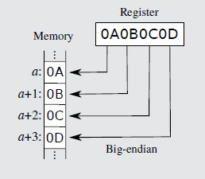  

x86 is little endian.

### Program layout
How the different sections of the binary are mapped into memory. We will deal with ELF binaries. The main sections are
- .text, contains the executable code
- .data, contains initialized data
- .bss, contains allocated but uninitialized data, zeroed at the beginning.

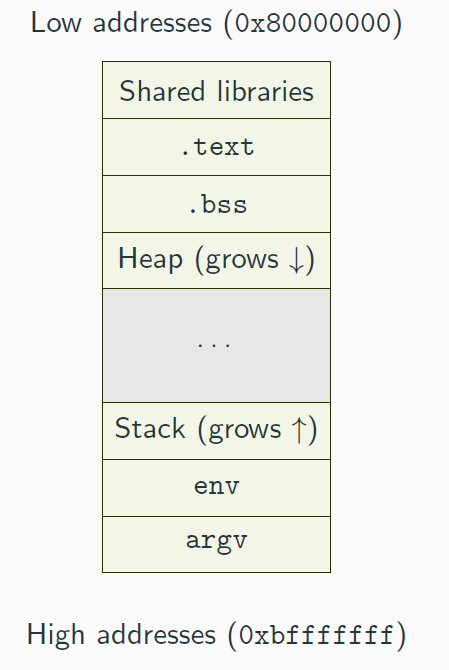  
Stack and Heap are dynamically allocated during the execution of the program:
- stack contains the frames of the functions as well as local variables
- heap contains dynamically allocated data (e.g. malloc)

### Stack
LIFO data structure used to manage function calls and local variables. The register ESP always points at the top of the stack while EBP points at the base of the current frame (function invocation).

INSTRUCTIONS:
- push, decreases ESP and places the value passed at the top of the stack (example `push EAX`, `push 0h`)
- pop, copy to the specified register the value at the top of the stack and increases ESP (example `pop EBP`)

The important thing to remember is that the stack grows from high addresses to low addresses so increasing ESP actually means reducing the stack and vice versa. Variables on the stack are instead allocated from low to high address (e.g. a 64 char string will start at a low address and end in a high address).

### Functions
At assembly level they are managed using two instructions:
- call, pushes EIP on the stack and jumps to the specified function
- ret, pops EIP from the stack

We call stack frame the area on the stack allocated to a specific function.

#### Entering a function
We need to setup the stack frame:
- `push EBP`  to save the current function base pointer
- `mov EBP, ESP`  to change frame

To exit a function we do the opposite:
- `move ESP, EBP`  move stack pointer to where we saved the previous EBP
- `pop EBP `  restore caller's frame

But how do we pass parameters to the function? How do we preserve registers across function calls? We need calling conventions (ABI, Application Binary Interface)

#### _cdecl calling convention
- ARGUMENTS: passed by the caller by placing them on the stack, right to left order
- CLEANUP: caller removes the parameters after the function completes
- RETURN VALUE: put by the callee in EAX
- CALLER SAVED REGISTERS: EAX, ECX, EDX  

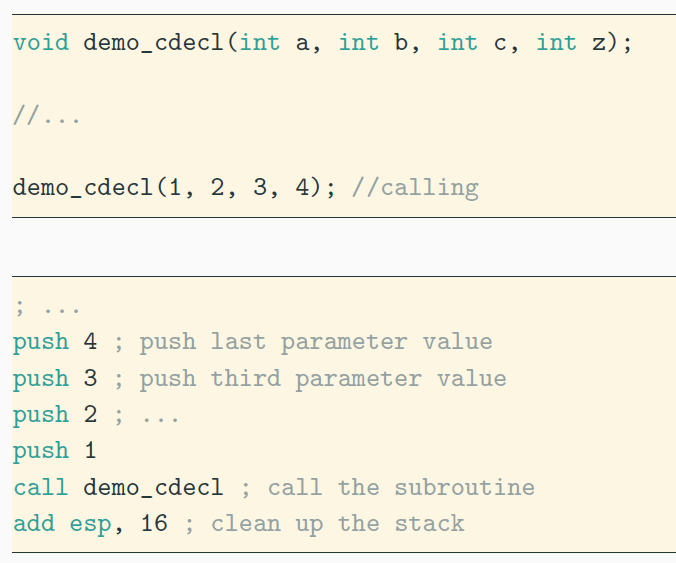

### Tools
- objdump: display information about a binary
  - `-d` to disassemble
  - `-M intel` display assembly with intel syntax
- gdb: debugger, can inspect code at runtime and disassemble it
  - useful extension: pwndbg
