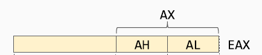

# Computer Security

## Basic concepts
Security requirements: CIA paradigm
- Confidentiality: information can only be accessed by thos who are authorized
- Integrity: information can only be modified by authorized entities and only in the way such entities are entitled to modify them
- Availability: information must be available to all the parties that have the right to access it, within specified time constraint

Starting from here we can see that "A" conflicts with "C" and "I" and this is what makes security hard. I cannot encrypt the data and store them at the bottom of the ocean and call that secure, there are business requirements and time requirements that need to be satisfied that have become stricter and stricter over time.

### Definitions
- Vulnerability: a "shortcut" through the security process that undermines our assumptions that can potentially allow to violate the CIA paradigm.
- Exploit: a specific way to use one or more vulnerabilities to accomplish a specific objective that violates the constraint

There can be a vulnerability without having a working exploit.  
Also some vulnerabilities cannot be completely removed because it would be too inconvenient (impacting usability) or because they are too embedded in the system (hw vulnerabilites like spectre and meltdown). In those case we can only mitigate the vulnerability, we try to make it more difficult to exploit.

Security != protection -> it depends on the threat model we are defending against. We can only make comparisons in the same environment for the same type of threat.

- Threat modeling: defining what **assets** we are protecting against what **threats**
  - Assets: valuable things (yes, things, it can be anything: hw, sw, data, reputation,...) that we want to protect
  - Threats: who and in which ways can damage our assets
- Attack: *intentional* use of one or more exploits to violate the CIA properties of a target system
- Threat agent: whoever is carrying out the attack, also known as attacker

IMPORTANT NOTE:  
attacker != hacker  
an hacker is just someone with advanced understanding of computers and networks while an attakcer seeks to do damage and it's not necessarily knowledgable (see "cybercrime as a service" in DFC course)

- Risks: Evaluation of the probability of something bad happening to our assets and the damage that it would cause.

RISK = ASSETS x VULNERABILITIES x THREATS

The objective of security is to balance the reduction of the vulnerabilities and the damage containment versus the cost that this will bring to the organization (both direct like, management, operational and equipment and indirect like slower performance, less usability, less privacy).

ANOTHER NOTE:  
more money does not imply more security, we need to configure it appropriately and make sure that our users will not have to leave password on sticky notes under the monitor!

### Trust
We need to define boundaries, some part of the system that will be assumed to be secure (*trusted elements*). Those boundaries change depending on the threat model and on how much trouble/cost are we willing to go through to check everything. Examples of trusted elements for normal users can be the hw of the machine we are using or the operating system that is running. If you are a high profile target (like NSA) maybe you also want also to check those.  
Of course if an attacker is able to compromise something in our trusted elements then all our security assumptions will fall.

## Cryptography
Principles:
- encryption mechanism is known to the attacker
- we want to ensure forward secrecy (cannot read previous messages even if the key is broken in the future)
- key needs to be long enough to avoid bruteforcing

KERCKHOFFS'S PRINCIPLE:  
The security of the crypto system relies only on the secrecy of the key and never on the secrecy of the algorithm.

### Perfect cipher
A perfect cipher is a cipher in which an attacker doesn't gain any more knowledge about the message when he sees the ciphertext:
- `P(M=m)` probability that the message sent is `m`
- `P(M=m|C=c)` probability that the message sent is `m` given that the ciphertext is `c`

In a perfect cipher we have that:  
`P(M=m) = P(M=m|C=c)`  
In order to achieve this we need to have a key that is at least as large as the message. This immedialtely highlights the impracticality of such ciphers even if they are practically possible: i need to share a key as long as the message before starting the communication ([One Time Pad](https://en.wikipedia.org/wiki/One-time_pad)).

### Breaking ciphers
A real world cipher is not perfect and we say that a cipher is broken when there exists a faster way to break it than bruteforcing. There are different types of attacks:
- ciphertext attacks: the attacker only has the ciphertext.
- known plaintext attacks: the attacker has a set of pairs of corresponding plaintext-ciphertext.
- chosen plaintext attacks: the attacker can choose plaintexts and obtain the respective ciphertext.  

We cannot prove that a certain cipher is not broken, we can only find out if it is broken by trying to break it. This is why it is important in cryptogrphy to always use well known and tested techniques that have been around for some time and not trying to reinvent the wheel.

### Symmetric encryption
A type of encryption that uses the same key for ecnrypting and decrypting the message. The key needs to be exchanged securely by the two parties.

Symmetric ciphers are based on two principles (see [confusion and diffusion](https://en.wikipedia.org/wiki/Confusion_and_diffusion)):
- substitution: replace each byte with another one, provides confusion
  - monoalphabetic: fixed transformation table
  - polyalphabetic: transformation table depends on the position
- transposition: swaps bytes with one another, provides diffusion

Moder ciphers use a mix of both techniques repeated for many *rounds* and ties them to the bit of the key. The length of the key plays a big role in the security of the cipher because a key that is too short can be bruteforced:
- DES key -> 56 bits -> 2^56 combination -> can be bruteforced on modern hw with little time and effort.
- AES key -> 128 bits -> 2^128 combination -> cannot be bruteforced even by supercomputers, it will take millions of years and we can always extend it to 256 bits.

Of course since it is not feasible to attack directly the key or the cipher a threat actor will find some other, easier ways to break into the system ([like this...](https://en.wikipedia.org/wiki/Rubber-hose_cryptanalysis) [;)](https://xkcd.com/538/))

### Asymmetric encryption
The concept is: we have a cipher that uses two keys, one foe encrypting and one for decrypting. Thos keys can be retrieved from each other and are generated using a one way mathematical function (we will not go into the details).  
The advantage over symmetric encryption is that we can exchange the key to encrypt messages directly on the internet (public key) and keep the decryption key secret (private key).  
But this arise a new problem: how can i be sure that the key i am using to encrypt a message belongs to the one i want to send the message to? See PKI after.

DIFFIE-HELLMAN KEY EXCHANGE  
Not an asymmetric cipher but uses the principles behind those to have two entities agree on a shared secret over an insecure channel.  
The one-way function used here is the discrete logarithm:
- easy to compute `y = a^x mod p`
- difficult to compute `x = log(y)`

How does the exchange work? Suppose that we have two entities A and B that want to have a shared secret (for mathematical details [see here](https://en.wikipedia.org/wiki/Diffie–Hellman_key_exchange)):
- A and B agree on a large prime number `p` and the base `a` that they are going to use (public information)
- both of them then choose a secret number, A chooses `x` and B chooses `y` and keeps them private
- A computes `a^x mod p`
- B computes `a^y mod p`
- they exchange what they have computed, now they both have `a^x` and `a^y` (each without knowing the number chosen by the other)
- A computes `(a^y)^x = a^xy (always mod p)`
- B similarly computes `(a^x)^y = a^yx`
- since `a^xy = a^yx` they now have a shared secret.

An attacker listening on the channel cannot compute `a^xy` without knowing one of the two secrets `x` or `y` and he cannot get them from `a^x` or `a^y` since it is not feasible to compute the logarithm.

### Hash functions
Funciton `H` that maps an input `x` of arbitrary length to a fixed length output `h`. Since the dimension of the output space is lower than the one of the input there are going to be *collisions*: two (or more) inputs mapped onto the same output.  
For cryptogrphic applications we want to limit as much as possible the probability of this happening, in particular it must be computationally unfeasible to:
1. find and input `x` such that `H(x) = h'`. I don't want to be possible that i can generate a input `x` to obtain a specific hash `h'`. This is called preimage attack resistance.
2. given `x`, find an input `y != x` such that `H(x) = H(y)`. This is called second preimage attack resistance.
3. find a couple of inputs `x` and `y` such that `H(x) = H(y)`. This is called collision resistance.

NOTE: 1 implies 2 but not viceversa.

A hash function is broken if a collision can be found faster than bruteforcing, that means (`n` is the hash length):
- for 1 and 2 choosing at random: collision once in `2^n-1`
- for 3 always at random: collision once in `2^n/2`

Why do we want hash functions?  
They can be used to ensure integrity of files (compute hash at source and destination and compare them to see if they are the same, if not the file is corrupted/modified) and in general they provide a unique "signature" to a certain file that uniquely identifies it.  
The most used hash functions are the one in the SHA family:
- use SHA-2 or better SHA-3. SHA-1 is considered broken
- DO NOT use MD5 pls

### Digital signature
Aims at solving the problem of authenticating a certain message, that is guaranteeing that it comes from a certain person.  
This is achieved using the same asymmetric encryption algorithms but with public and private key's roles are swapped:
- the (hash of the) message is encrypted with the private key, only the one who possess that is able to produce it. This is what we call *signature*
- the signature can be verified by anyone that possess the public key:
  - decrypt the (hash of the) message with the public key
  - compare the (hash of the) message with the one received
  - if they are the same then the content of the message was signed by the one who sent it

The digital signature is stronger than a handwritten signature because it is tied to the content of the message, so a message that has been signed cannot be modified without also altering the resulting signature and the signature itself cannot be copied and pasted on a different document.  
We need to ensure WYSIWYS "What You See Is What You Sign"!  
For examples it is not good to sign documents that can contain macros that modifies the **displayed** content of file because this will allow the content to change without changing the signature.

### Public key infrastructure (PKI)
We need a system to correctly associate each public key with its respective owner in order to be sure to use the correct key for sending messages.  
This is achieved using *certificates* issued by *certification authorities* (CA). A CA is a **trusted** third party that digitally signs a certificate that binds an identity to a public key (see [X.509](https://en.wikipedia.org/wiki/X.509)).  
The idea behind the mechanism is similar to how a government issues identity documents to his citizens. As long as i trust the state that released the document i can trust the content of the document.  
In certificates we can check which CA has signed the certificate and decide to trust it or not. But how can we verifiy the CA key? It's signed by another CA! Then this CA can be recursively verified until we reach the a ROOT CA, a CA that signed it's own certificate (basically saying "i am myself").  
This root CA is a trusted element of the infrastructure. There exists many root CAs and most of their certificates are bundler directly into the OSes and browsers that we use.

#### Certificate revocation
Since digital signature cannot be destryoed once they are issued we need ways to make a certificate invalid (for example if we discover that the private key of the CA has been leaked):
- Expiration dates on certificates, to ensure that eventually they will be removed.
- Certificate Revocation List (CRL) where all the revoked certificates are published, expired or not.

#### Verification steps for certificates
1. Does the signature validate the document? check hash
2. Is the public key the one on the certificate?
3. Is the certificate the one of the subject?
4. Is the certificate validated by a CA? validate recursively the entire chain of CAs
5. Is the root CA trusted?
6. Is the certificate in a CRL? (what if we are not online?)

All this process assumes that the root CA is a trusted element and all the intermediate CAs have not been compromised. If they are, there is no automatic way to tell.

## Authentication
Authentication is the act of proving that a certain entity is actually who it says to be. There are 3 main mechanism to perform authentication that involve using:
- something you KNOW (*to know factor*): pin, password
- something you HAVE (*to have factor*): door key, smart card
- something you ARE (*to be factor*): face, voice, fingerprints

We see briefly how they work and their advantages/disadvantages.

### To know factor
Each user know a secret that he needs to provide when he wants to log in.

Advantages:
- low cost
- ease of deployment
- low technical barrier

Disadvantages and mitigations against those:
- can be stolen --> change it frequently
- can be guessed --> make it not connected to the user
- can be cracked (bruteforced) --> ensure that it is long and complex enough to make it unfeasible

However those countermeasures have a cost, they impact on the usability and user experience. Also we cannot expect all user to remeber long and complex password (they are going to write on sticky notes and make it easier to be stolen).

#### Secure password exchange
- use mutual authentication to ensure that we are sending the information to the correct place
- use a challenge-response scheme
- random data with each request to avoid replay attacks

#### Secure password storage
If we have an archive of passwords we need to protect it against attackers that may want to stel it. First thing is to **never** store passwords in plain text. We always need to at least hash it using a strong cryptographic hash function and preferrably salt it with a random salt (see [salting](https://en.wikipedia.org/wiki/Password_salting)) to avoid the use of rainbow tables. Additionally we need to be careful in password recovery schemes not to leak secrets (we should not be able to if we only have hash). The most effective way is to send a link to log in the user on a verified email address and have him change the password immediately on login.

### To have factor
The user needs to have a specific object in order to authenticate.

Advantages:
- relatively low cost
- provides good security
- humans are less likely to hand out a key or leave it under the monitor like a password

Disadvantages and mitigations against those:
- harder to deploy --> none
- can be lost or stolen --> use toghether with another factor

Some examples of this are:
- OTP generators: small devices containing a secret key for the user that are given by the organization. The general approach is tu generate some numeric codes pseudorandomly using the secret key and the current time. Today we use a software version of these based on TOTP that are generally easier to deploy and manage.
- smart cards: a physical card containing a CPU and some non volatile memory that contains the private key of the user. When a smart card is connected to a reader it boots up and authenticates itself using a challenge-response mechanism. The advantage of using it is that the smart card can perform operations like signing without the private key ever leaving the card (can only be retrieved by physically destroying the card -> tamper evident)
- static OTP list: cheaper alternative for OTP that is also easier to implement, maybe used in a transition phase. Basically the OTP are printed on a card and the authentication system asks for a specific one each time. The drawback is that they can be stolen without the user noticing (e.g. take a photo).

### To be factor
Use some specific characteristics of the user to authenticate.

Advantages:
- high level of security (if implemented correctly...)
- no extra hw to carry around, no need to remember things

Disadvantages and mitigations against those:
- hard to deploy --> none
- non deterministic matching --> see FAR and FRR
- can sometimes be cloned --> none
- bio-characteristics change --> re-measure over time
- privacy sensitive --> secure the process
- consider user with disabilities --> need alternatives (weaker?)

### False Acceptance Rate (FAR) and False Rejection Rate (FRR)
- FAR is basically false positives. A user is accepted even if he was not the correct one. Represent a security problem.
- FRR represents the false negatives. A user is rejected even if he was the correct one. Impacts usability.

Since we cannot get rid of both at the same time we need to correctly balance between the two:
- High FAR -> Low FRR, good user experienc but not secure
- High FRR -> Low FAR, good security but usability nightmare  


### Single sign-on
Goal: authenticate seamlessly a user across multiple domains using and identity provider. The advantage from the user point of view is obvious: he only needs to authenticate once and will be logged in all every service. The mechanism basically works like this:
- for the first login, the user is redirected to the identity provider
- log in to the identity provider
- the identity provider confirm to the website the identiy of the user
- in all subsequent logins:
  - the website contacts the identiy provider
  - since the user already logged in, the identiy provider confirms the user identity to the website
  - the website logs the user in

Some protocols that implements this are OAuth2 and shibboleth. Many services allow to use this method (e.g. log in with Google/Facebook).

NOTE: there can be privacy concerns if the identity provider is someone like Facebook for example because this would allow to track the user activity across the websites that he visits that have Facebook integrations (e.g. like button) for advertisement purposes.

This approach present more challenges than the traditional approach:
- single point of failure
- single point of trust
- difficult to get it right, complex flow to follow

## Introduction to software security
Good software engineering means meeting the requirements:  
FUNCTIONAL:
- software must do what it is supposed to  

NON FUNCTIONAL:
- usability
- safety
- security

Creating inherently secure application is hard and often is a skill that programmers lack because they were not taught about it. An unmet specification is a bug, a unmet *security* specification leads to a vulnerability. 

In the early 2000s reporting vulnerabilites to company was not a good experience since they often [treated with hostility](https://marc.info/?l=vuln-dev&m=95602682515862&w=2) or threatened with lawsuits. So the only way to receive attention was to publish the vulnerability in the wild and force the vendor to fix it in order not to have it used against its user. This is what we call *full disclosure*.  
  
Of course `te`, `td` and `t0` can happen in different order. Anyways the objective is to minimize the windows of exposure, ideally:
- the vendor finds the vulnerability
- the vendor patches the vulnerability
- vulnerability disclosed

This is why nowadays companies use *bug bounty* programs to encourage hackers and researches to share the vulnerabilities that they find in order to have them patched as quickly as possible (*coordinated disclosure*). Big companies often have an internal group dedicated to finding vulnerabilities in their products.

## Buffer overflows
The concepts here are shared basically across all architectures and OSes. We will consider a 32 bit x86 architecture. See [appendix](#Appendix:-x86-assembly-crash-course) for information about x86 stack and calling conventions

Let's start with an example:  
```C
[...]
int foo()
{
  int c = 14;
  char buf[8];
  gets(buf);  //careful here
  c = (a + b) * c;
  return c;
}

void main(int argc, char *argv[]) 
{
  [...]
  foo(5, 6);
}

```
What happens if we insert more than 8 characters into the buffer `buf`?  

```bash
$ ./vulnerable_executable
ABCDEFGHIJKLMNOPQRSTUV
```
Look at the stack to see what happens (high addresses at the top).


The saved EIP that was on the stack has been rewritten because the input was longer than the length of the buffer and there were no checks on its size or the number of chars read. This caused the buffer to *overflow* and overwrite what was on the stack. What happens now that the return address has been corrupted?

```bash
$ ./vulnerable_executable
ABCDEFGHIJKLMNOPQRSTUV
Segmentation fault
```
The segmentation fault happens because "STUV" is not a valid address to jump to so the OS kills the program.  
We can exploit this vulnerability to hijack the control flow of the program by overwriting the saved EIP (sEIP for short) with another address that points to some code that we wrote. How to do this?
- we need to jump to a valid memory address
- there needs to be valid code at that address

The basic method that we will see is *stack smashing*, we place the code that we want to run directly inside of the buffer and rewrite the return address with the address of the buffer itself.

### Stack smashing
How do we get the address of the buffer?  
We cannot get it precisely but we can estimate it by reading the value of ESP from a debugger. That value may differ of some words from the real value because of the presence of the debugger so we have a problem of precision: to have code executed we need to jump in the exact byte.  
The solution to this is to put before our code a so called *NOP sled*, a sequence of NOP instruction where we can jump and "slide" towards our code. This does not require byte-precision since the NOP instruction is a single byte so no matter where in the word we jump it will always be decoded correctly.


Now we need to decide what to put on the buffer to be executed. In this example we try to open a shell (which is why historically it is called shellcode) and close the program. In general we can put code to do [anything](http://shell-storm.org/shellcode/).  
To do this we use tha system call `execve` that we will invoke using and interrupt (`int 0x80` on Linux) after preparing its parameters. To obtain the assembly for the shellcode we first write the program in C and compile it. Then we disassemble it and pick the relevant parts. What we want to execute is this:

```C
int main() 
{
  char* hack[2];
  hack[0] = "bin/sh"; //the name of the program we want to open
  hack[1] = NULL; //the parameters to pass to the shell
  execve(hack[0], &hack, &hack[1]); //system call
}
```

Once compiled, if we inspect the result we find something like this:  
  

We need to prepare the stack properly for the exploit to work:
- put somewhere in memory the string `/bin/sh` terminated with a `\0`
- address of that string somewhere in memory, the "argv[0]" to pass
- all of this followed by a `NULL` to pass the arguments (we do not want to pass arguments)


Everything is parametrized w.r.t. ADDRESS, that is where we put our string in memory. In this case though we need to know it exactly we cannot take a guess. We can use a trick called *jump and call*. Remember at this point we are already executing code so we can have the machine to tell the address by doing:
- put a `call` instruction before our string in memory. The `call` pushes on the stack the address of the next instruction, that is the position of our string.
- at the beginning of the shellcode, jump to our call using a relative offset. We can compute it precisely because we know how long the shellcode is.
- after thet jump we can pop the address

```C
jmp offset-to-call  //jump to the call
pop esi  //pops the address of "/bin/sh"
[shellcode]
call offset-to-pop  //calls to pop
.string "/bin/sh"
```

Now we have the shellcode and we are able to execute it. There is still a small problem because there are some 0 bytes in our code. This is not a problem per se, the issue is that we are injecting the code using a string manipulation function of C so when it reaches a 0 byte it interprets it as `\0` and terminates reading.  
We need to rewrite the shellcode in an equivalent way but avoiding putting in bytes that are all 0. Fortunately this is not particularly difficult, we can use some tricks:
- use some `jmp short` instead of `jmp`
- if we need to write some 0, do this by xoring something with itself, like `xor eax, eax     mov [esi+7], eax` that puts 0 in eax and then puts it at esi+7

The idea is that we can almost always equivalent code but without 0, so it is just something to look for not a real issue.  
The resulting shellcode is:

```C
char shellcode[] =
"\xeb\x1f\x5e\x89\x76\x08\x31\xc0\x88\x46\x07\x89\x46\x0c\xb0\x0b"
"\x89\xf3\x8d\x4e\x08\x8d\x56\x0c\xcd\x80\x31\xdb\x89\xd8\x40\xcd"
"\x80\xe8\xdc\xff\xff\xff/bin/sh";
```

Now we can put the nop sled and the guessed address and give this in input to our program. The code is portable, it doesn't need anything except to guess the correct address to jump to.

Just one note: to actually input it to the program we need to write the actual hexadecimal values (that could be non printable characters). To do so we can use a helper program for example:

```bash
echo "our_shellcode" | ./vulnerable_executable
```
or
```bash
python -c "print 'our_shellcode'" | ./vulnerable_executable
```

### Alternative techniques
This is just a schematic list, not treated in this course
- ENVIRONMENT VARIABLES  
We can put our code in environmentaò variables and have it loaded on launch.  Then we can overwrite the return address with the address of the environment varible we set.
  - Advantages
    - easy to implement beacuse we are not constrained by the space
    - easy to target because we can know the exact address
  - Disadvantages:
    - we can only exploit if we have access to the machine and set the env
    - a wise program may wipe env. variables that he does not need
    - memory must be marked as executable (more on this in [mitigation section](#mitigations))
- BUILT-IN, EXISTING FUNCITONS  
Point the return address to some code that is already present in memory like other function or some library function.
  - Advantages:
    - works remotely and reliably
    - no need for executable stack
  - Disadvantages:
    - need to prepare the stack carefully
    - more difficult to do properly

There can also be practical problem that make the exploitation difficult or impossible, for example the buffer could be too small to fit all of our shellcode + NOP sled.

### Mitigations
We can implement some defense at different levels:

#### Source code level
- use languages with memory management like Java
- use safer libraries that check the boundaries of buffers (`strncpy`, `strncat`, etc allow to specify the maximum length to read)
- educate developers not to introduce such vulnerabilities
- use tools to find vulnerabilities in the source

#### Compiler level
- warnings about unsafe behaviour
- randomization of the ordering of stack variables
- embed stack protection measures

The last one is the most successful in stopping these attacks and is based on the concept of *canary*. The basic idea is:
- between the local variables and the saved registers sEBP adn sEIP, put a canary word of random data chosen at each execution
- before returning, check that the canary is still the same.  
The canary can also be xored with those values to ensure they are not modified by means other than a simple buffer overflow.

#### OS level
- mark the stack as non executable. Today this is widely supported at a hw level thanks to the [NX bit](https://en.wikipedia.org/wiki/NX_bit). Can be bypassed by some technique that relies on built-in function or code that is already present (return oriented programming).
- use Address Space Layout Randomization (ASLR) that relocates the stack and other section of the code at the start of the program by a different amount each time. With offset in the order of some MBs makes it impossible to correctly guess the address to jump to.

## Format string bugs


## Web vulnerabilities


### Cross site scripting


### SQL injection


### Cross-site request forgery


## Network protocl attacks


## Secure network architectures


## Network security protocols


## Malicious software

## Appendix: x86 assembly crash course
Basics for the x86 architecture that we will use. The architecture was born in 1976 for 16 bits and was later expanded to 32 bit (1985) and 64 bits (2003). It's a CISC design and has variable length instructions. It is present basically in every desktop/laptop and server in the world.

### Registers
- general purpose EAX, EBX, ECX, EDX  
They can also be referenced partly in 8 bit or 16 bit  

- for string funcitons: ESI, EDI
- base pointer EBP
- stack pointer ESP
- instruction pointer EIP, can't be accessed directly
- program status and control EFLAGS, each bit has a specific meaning and is used to signal some condition (e.g. overflow, carry, parity,...)

### Syntax
There are two main types of syntax:
- intel
- AT&T

For example: 
- move the value 0 to register EAX (basically EAX = 0).
  - intel `mov eax , 0h`
  - AT&T `mov $0x0, %eax`
- move the value 0 to the address contained in EBX + 4.
  - intel `mov DWORD PTR [ebx+4h],0h` (DWORD PTR is optional)
  - AT&T `movl $0x0,0x4(%ebx)`

We have different operations:
- mov to move data
- arithmetics: add, sub, mul, div, cmp, test
- control flow: jmp, j (can be to an absolute address or using and offset)
- nop: no operation, does nothing opcode: `0x90`
- interrupt: int, call, sysenter

### Endianness
Convention that specify in which order the bytes of a data word are lined up sequentially in memory. There are two main types:
- LITTLE ENDIAN, the least significant
byte is stored in the smallest address.  

- BIG ENDIAN, the most significant
byte of the word is stored in the
smallest address.  
  

x86 is little endian.

### Program layout
How the different sections of the binary are mapped into memory. We will deal with ELF binaries. The main sections are
- .text, contains the executable code
- .data, contains initialized data
- .bss, contains allocated but uninitialized data, zeroed at the beginning.

  
Stack and Heap are dinamically allocated during the exectuion of the program:
- stack contains the frames of the functions as well as local variables
- heap contains dinamically allocated data (e.g. malloc)

### Stack
LIFO data structure used to manage function calls and local variables. The register ESP always points at the top of the stack while EBP points at the base of the current frame (function invocation).

INSTRUCTIONS:
- push, decreases ESP and places the value passed at the top of the stack (example `push EAX`, `push 0h`)
- pop, copy to the specified register the value at the top of the stack and increases ESP (example `pop EBP`)

The important thing to remember is that the stach grows from high addresses to low addresses so increasing ESP actually means reducing the stack and viceversa. Variables on the stack are instead allocated from low to high address (e.g. a 64 char string will start at a low address and end in a high address)

### Functions
At assembly level they are managed using two instructions:
- call, pushes EIP on the stack and jumps to the specified function
- ret, pops EIP from the stack

We call stack frame the area on the stack allocated to a specific function.

#### Entering a function
We need to setup the stack frame:
- `push EBP`  to save the current function base pointer
- `mov EBP, ESP`  to change frame

To exit a function we do the opposite:
- `move ESP, EBP`  move stack pointer to where we saved the previous EBP
- `pop EBP `  restore caller's frame

But how do we pass parameters to the function? How do we preserve registers across function calls? We need calling conventions (ABI, Application Binary Interface)

#### _cdecl calling convention
- ARGUMENTS: passed by the caller by placing them on the stack, right to left order
- CLEANUP: caller removes the parameters after the function completes
- RETURN VALUE: put by the callee in EAX
- CALLER SAVED REGISTERS: EAX, ECX, EDX  


### Tools
- objdump: display information about a binary
  - `-d` to disassemble
  - `-M intel` display assembly with intel syntax
- gdb: debugger, can inspect code at runtime and disassemble it
  - useful extension: pwndbg
