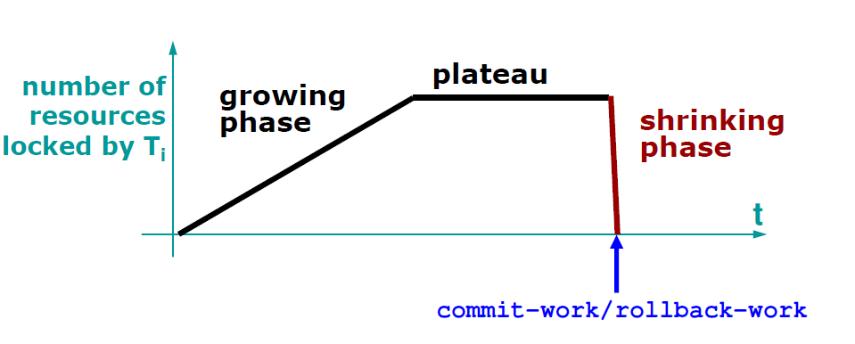
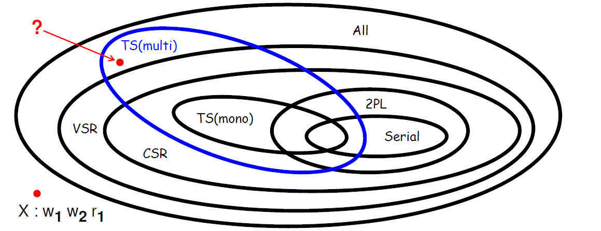

# Data Bases 2

## Transactions
Atomic unit of work performed by an application. Conceptually, each  transaction is encapsulated within:
- begin of transaction (BoT)
- end of transaction (EoT)  

At the end of the transaction only one of the following commands is executed:
- commit-work: save the changes to the database permanently
- rollback-work: discard changes  

This is done to guarantee the ACID properties:
- **Atomicity**: all or nothing semantics for transaction, it either completes or fails, no partial execution.
- **Consistency**: enforce integrity constraints on data, DBMS can automatically rollback transactions that do not satisfy these constraints.
- **Isolation**: the execution of transaction should not interfere with other concurrent transactions, the result must be the same as if the transactions were issued in order.
- **Durability**: the effect of committed transactions must be stored long term.

These properties are enforced by different modules of the DBMS:
- Atomicity and durability -> reliability manager
- Isolation -> concurrency control system
- Consistency -> integrity control system at query execution time  

  

## Concurrency control
How can we serve multiple concurrent transactions while maintaining the ACID properties?  
Serializing (i.e. execute one at a time) is not an option because it would create a bottleneck and lose performance. We want to serve the transactions concurrently. Concurrency can lead to have a series of *anomalies* if we are not careful in accessing the data.

### Anomalies
Explained using examples. Assume transactions occur concurrently without each of them knowing about the others and can interleave.

#### Lost update  
The update of a transaction is overwritten by another transaction. The sequence of operation to have this occur is:
- T1 reads data `x`
- T2 reads the same data `x`
- T1 and T2 both update the value of `x`
- T1 writes `x`
- T2 writes `x`  

The result is that the update made by T1 is overwritten by T2 because T2 read the same starting value as T1. Clearly this would not have happened if T1 and T2 happened in sequence (T1 and then T2) since T2 would have read the value of `x` written by T1 and update over it.

#### Dirty read
A transaction reads an uncommitted value written by another transaction that eventually rolls back. The sequence is:
- T1 updates the value of `x`
- T2 reads `x`
- T1 aborts, rollback the value of `x`
- T2 retains the value of `x` that it has read before but have been discarded
- T2 updates the value and writes it.  

The result is that the update made by T2 is wrong because it is based on a value that never happened in the database since it was rolled back.

#### Non-repeatable read
A transaction reads two times the same piece of data but it obtains a different value. The sequence is:
- T1 reads value of `x`
- T2 reads and update the value of `x`
- T1 reads again `x` <-- the value has changed even if T1 did not update it.

From the point of view of T1 the value of `x` has changed by itself because it did not make any modification itself.

#### Phantom update
Let's suppose that we have a constraint on some data, for example `A + B + C = 100`
- T1 reads `A` and `B`
- T2 reads `B` and `C`
- T2 updates them consistently with the constraint, for example `B = B + 10` and `C = C -10`
- T2 writes the updated values (constraint still holds)
- T1 reads `C`
- For T1 the constraint doesn't hold

The problem here is that T1 has both old and new data because it read only part of the data involved in the constraint. For T1 the sum is no longer 100 but the data in the database is still correct.

#### Phantom insert
Another transaction inserts a new record that changes the value of an aggregate operation.  
- T1 computes an aggregate operation on part of the data, for example computes the average value of a column
- T2 inserts a new record, adding a new value in the column read by T1
- T1 when it recomputes the same average will obtain a different result because there is a new record that previously wasn't there

#### Recap
Mnemonics to remember the anomalies
- Lost update: R1 R2 W1 W2
- Dirty read: R1 W1 R2 abort1 W2
- Non-repeatable read: R1 R2 W2 R1
- Phantom update: R1 R2 W2 R1
- Phantom insert: R1 insert2 R1

### Modeling concurrency
First, some definition and notation:
- operation: read or write on a specific piece of data
  - R1(x): transaction 1 read the value of `x`
  - W2(x): transaction 2 update value `x`
- schedule: sequence of operation performed by concurrent transactions such that the order of operations in each transaction is respected (i.e. possible interleavings fo different transactions).  
Example:
  - T1: R1(x) W1(x)
  - T2: R2(x) W2(x)
  - possible schedule: R1(x) R2(x) W1(x) W2(x)

How many schedules are possibles? A LOT, it's factorial w.r.t. the number of operation and transactions --> cannot enumerate them and pick the ones without anomalies.  
Only the serial schedules (excute the transactions in order T1, T2, ..., Tn) are already `n!`, but a serial schedule has very low throughput and high latency (all transactions need to wait).

GOAL: reject schedules that cause anomalies. The scheduler is the component that accepts or rejects operations requested by transactions.

#### Serializable schedule
Schedule that leaves the database in the same state as *some* serial schedule of the same transactions. This ensures correctness.  
In this simple model we have very strict assumptions:
- all transactions have committed (commit-projection)
- the schedule is evaluated *a posteriori*, after the operations have been performed when i can observe the whole sequence.


In order to understand when a schedule is serializable we need to define a notion of equivalence between schedules.

#### View serializability
Definitions:
- reads-from: Ri(x) reads from Wj(x) is a schedule S when
  - Wj(x) precedes Ri(x)
  - there aren't any other writes in between
- final write: Wi(x) is the final write in a schedule if it is the last write on item x  

Two schedules `S_i` and `S_j` are *view-equivalent* if they have:
- the same operations
- the same reads-from relations
- the same final writes  

A schedule is *view serializable* if it is view-equivalent to a serial schedule for the same transactions. The class of serializable schedules is called **VSR**.

NOTE: two serial (serializabile) schedules can leave the database in different states in the end. This is not the point, the point is to avoid anomalies.  

PROBLEM WITH VIEW SERIALIZABILITY  
Checking if two schedules are view equivalent is polynomial in time, but checking if a generic schedule is in VSR is an NP-complete problem because it requires to consider all reads from and final writes of serial schedules (combinatorial).  
What can we trade in order to get more performance? Accuracy, we can define a looser but easier to check model. This may leave out some good (i.e. that do not cause anomalies) schedules but makes the check feasible.

#### Conflict serializability
Two operations are in conflict if they address the same resource and at least one of them is a write:
- read-write conflict (r-w or w-r)
- write-write conflict (w-w)

Two schedules `S_i` and `S_j` are *conflict-equivalent* if:
- they contain the same operations
- for all conflicting operation pairs transactions occur in the same order

A schedule is *conflict serializable* if it is conflict-equivalent to a serial schedule. The class of serializable schedules is called **CSR** and we can prove that it is strictly included in VSR.

Theorem: `CSR ⊂ VSR`

How to test conflict serializability: build conflict graph
- one node for each transaction
- one arc from `T_i` to `T_j` if there is at least one conflict between an operation `o_i ∈ T_i` and `o_j ∈ T_j` and `o_i` precedes `o_j`

Theorem: a schedule is conflict serializable if the conflict graph is acyclic.

NOTE: the opposite is not true, if the graph contains a cycle we cannot conclude neither that is is CSR nor that it isn't.

Graphical recap:  
  

### Concurrency control in practice
CSR checking is efficent but it only works *a posteriori*. Real DBMS schedulers need to make decisions *online*, managing the requests as they arrive.  
We can use two approaches:
- pessimistic, lock based approaches, higher isolation
- optimistic, timestamps and versioning, higher throughput

#### Locking
A transaction is well formed w.r.t. locking if:
- read operations are preceded by a `R_LOCK` (shared lock) and followed by `UNLOCK`
- write operations are preceded by a `W_LOCK` (exclusive lock) and followed by `UNLOCK`  

Transactions that first read and then write can acquire an exclusive lock directly or acquire a shared lock and upgrade it later.

The objects in a database can have 3 states:
- `FREE`
- `R_LOCKED`
- `w_LOCKED`  

| REQUEST | FREE | R_LOCKED | W_LOCKED |
| -- | -- | -- | -- |
| R_LOCK | OK -> R_LOCKED | OK -> R_LOCKED* | NO -> W_LOCKED |
| W_LOCK | OK -> W_LOCKED | NO -> R_LOCKED | NO -> W_LOCKED |
| UNLOCK | ERROR | OK -> R_LOCKED/FREE* | OK -> FREE |  

NOTE: * multiple transactions can have a read lock on the same resource (it's a shared lock), the DBMS keeps track of how many transactions are sharing the lock.

Following this rules, some transactions will have to wait until the resources they need are free to use. The arrival sequence can be different from the schedule a posteriori because some transactions can be delayed.

##### Implementation: lock tables
Lock tables are hash tables that index the lockable items by hashing them.  
every node has a linked list with all the transactions that requested a lock for that resource, the lock mode (shared/exclusive) and the status (granted/pending). When a transaction ends it is removed from the list.

  

##### Locks and serializability
Is respecting locks enough to guarantee serializability? NO, some anomalies may still occur. This is caused by the fact that transactions may release locks early and reacquire it later.

Example:
- T1 locks resource `x` with a shared lock to read its value
- T1 releases the lock after the read
- T2 locks `x` with an exclusive lock
- T2 updates `x`
- T2 releases the lock
- T1 reacquires the shared lock on `x` to read it
- T1 finds that the value has changed --> non-repeatable read

#### 2PL
Aims at preventing non repeatable reads.  
A transaction cannot acquire more locks after it has released a lock. This simple rule not only prevents non-repeatable reads but also ensures serializability.  

  

Theorem: 2PL is strictly contained into CSR.  

  

What about other anomalies? The ones that cause problems are:
- phantom inserts because it requires to lock data in a "future-proof" way, not only the data that i am currently fetching. We will solve this issue using predicate locks.
- dirty reads because it requires to deal with aborts which so far we have not done in our model.

##### Strict 2PL
Releasing a lock before committing exposes uncommitted data. Other transactions can then read this data and use it and this leads to anomalies in case of abort. The solution is pretty simple.  
A transaction hold all its locks until the decision point (commit/rollback). This way nobody can read data that was not committed.



##### Predicate locks
To prevent phantom inserts we need, as said before, to "lock future data", that is block the insertion of data that would satisfy a previous query made by a transaction.  
Let's suppose that we have a table with two columns `A` and `B`  

| A | B |
| -- | -- |
| data | data |
| .. | .. |  

Transactions T1 updates the data with the following command (pseudocode):  
`T1: update B where A < 1`  
The concept of predicate lock disallow other transactions to insert, delete or update any record that satisfies the predicate `A < 1`. This prevents phantom inserts because no other transaction can modify the data that T1 is working with.

#### Isolation levels
DBMS in practice allow to specify so called *isolation levels* for the transactions. These specify what anomalies we allow in order to achieve more concurrency and performance.  
Not all transactions need to have the same isolation level, it can be set on a per-transaction basis.  
These levels do not affect write locks that are **always kept until the decision point** (strict 2PL on write locks), regardless off the isolation level. If this doesn't occur we cannot ensure rollback in case of aborts, jeopardizing consistency (dirty write).  
On the other hand we can have different levels for read locks:
- READ UNCOMMITTED, no read locks  
allowed anomalies: dirty reads, non-repeatable reads, phatom inserts, phantom updates
- READ COMMITTED, read locks but not 2PL  
allowed anomalies: non-repeatable reads, phantom inserts, phantom updates
- REPEATABLE READ, read locks with 2PL  
allowed anomalies: phantom inserts
- SERIALIZABLE, read locks with 2PL and predicate locks  
allowed anomalies: none (only advised for distributed transactions)

Recap table
| ISOLATION LEVEL | DIRTY READ | NON-REPEATABLE READ | PHANTOM UPDATE | PHANTOM INSERTS |
| -- | -- | -- | -- | -- |
| READ UNCOMMITTED | YES | YES | YES | YES |
| READ COMMITTED | NO | YES | YES | YES |
| REPEATABLE READ | NO | NO | NO | YES |
| SERIALIZABLE | NO | NO | NO | NO |  

#### Problems of locking: deadlocks and starvation
##### Deadlocks
Deadlocks happen when a transaction holds a lock that the another transaction needs and viceversa, blocking both transactions in a infinite wait. Of course more than two transactions can be involved in a deadlock, the idea is that there is a circular dependence between them (i.e. T1 waits for T2 that waits for T3 that waits for T1).  
There are different approaches to deal with deadlocks:
- timeouts: kill transactions that wait for longer than a certain threshold.  
Impractical approach because it is difficult to correctly balance the timeout, transactions may require very different time to execute even within the same application.
- prevention: killing transactions that could cause deadlocks.  
Transactions are assigned an ID as they arrive. The heuristic that is used is that an older transaction should not wait for a younger transaction. If this happens the younger transaction is killed and restarted. Also this approach is inefficient because waiting does not imply that there is a deadlock so this leads to a lot of unnecessary kills.
- detection: let deadlocks happen and resolve them when they occur.  
Build the *waits-for* graph to detect cycles of waits and choose a transaction to kill according to some policy. Works in local DBMS.

NOTE: detection in a distributed DBMS  
OBERMARK'S ALGORITHM  
Recontructs the whole dependency graph using only the view of a single node. Each node needs to exchange only minimal amount of information, node A sends info to node B only if:
- A contains a transaction `T_i` that is waited for from another transaction and waits for `T_j` on B
- `i < j` (or viceversa, it doesn't have a semantics) to ensure information is propagated only one way

The algorithm is executed periodically at each node and consists in:
- get graph info from previous nodes
- update local graph with information from remote nodes
- check if there are cycles
  - yes: kill one in the cycle following some policy
  - no: do nothing
- send update to other nodes

##### Deadlocks in practice
If i have `n` records, assuming uniform distribution for accessing:
- conflict probability is `O(1/n)`
- deadlock probability is `O(1/n^2)`

Still they do occur (once in a minute in a medium sized database) and long running transactions are more likely to deadlock.  
There are techniques to limit the frequency of deadlocks:
- update lock
- hierarchical lock

##### Update locks
Most deadlocks involves only 2 transaction and happen because they lock some resource in a shared way with the intention of upgrading it later.  
Update locks allow to state the intention of upgrading the lock later in order to prevent other transactions to express the same will.  
There are 3 possible lock request:
- SHARED LOCK (SL): express the intention to read only
- UPDATE LOCK (UL): express the intention to read and then upgrade to an exclusive lock later
- EXCLUSIVE LOCK (XL): express the intention to write

The interactions work as follows  
| REQUEST | SL | UL | XL |
| -- | -- | -- | -- |
| SHARED LOCK | YES | YES | NO |
| UPDATE LOCK | YES | **NO** | NO |
| EXCLUSIVE LOCK | NO | NO | NO |

Update locks are requested using the SQL statement SELECT FOR UPDATE.

##### Hierarchical locks
Locks can be specified with different granurality.  
Objectives:
- lock minimum amount of data
- recognize conflicts as soon as possible  

The idea that a transaction expresses the intention to lock a finer level of granularity (for instance: table -> page -> tuple -> field).  
In addition to SL and XL there are 3 more locks:
- ISL: intention to lock a sub-element of the current element in shared mode
- IXL: intention to lock a sub-element of the current element in exclusive mode
- SIXL: lock in shared mode with the intention to lock a sub-element in exclusive mode (basically SL + IXL)

The protocol to lock is the following:
- lock request starts from the root of the hierarchy and go down the levels
- locks are released in reverse order, going up in the hierarchy
- to request a lock on a given level the transaction must hold an equal or stricter lock at an higher level
- locks requests are granted following this decision table

| REQUEST | ISL | IXL | SL | SIXL | XL |
| -- | -- | -- | -- | -- | -- |
| ISL | YES | YES | YES | YES | NO |
| IXL | YES | YES | NO | NO | NO |
| SL | YES | NO | YES | NO | NO |
| SIXL | YES | NO | NO | NO | NO |
| XL | NO | NO | NO | NO | NO |

Very useful approach to avoid locking an entire table if i only need to act on a small subset of the records. Of course when i want to perform the action i have stateted my intention to perform i have to get an actual SL or XL.

NOTE: from the table we can see that intentional locks are always compatible with one another, onle when they are actualized there can be conflicts.

#### Timestamp-based approaches
A timestamp is a unique identifier that defines a total ordering of the events in a system. In a centralized system it is easy because all requests are on the same node, in a distributed system we can use the Lamport clocks to assign timestamps without a global clock.  
For each element `x` the scheduler keeps two timestamps:
- `RTM(x)` timestamp of the last transaction that read `x`
- `WTM(X)` timestamp of the last transaction that wrote `x`

The scheduler receives R/W requests with the timestamp `ts` of the transaction that issued it. The algorithm to grant access is the following:  

```python
read(x, ts):
  if ts < WTM(x):
    #reject and kill, the request is obsolete the value was updated
  else:
    #granted and update RTM if ts is more recent
    RTM(x) = max(RTM(x), ts)

write(x, ts):
  if ts < RTM(x) or ts < WTM(x):
    #reject and kill, someone younger already read the value or updated it
  else:
    #granted and update WTM
    WTM(x) = ts
```

The schedules produced by this algorithm belong to the TS class. How do these schedules relate to the other?
- 2PL: not comparable, there can be some schedules that are 2PL but not TS and viceversa.
- CSR: TS is strictly included in CSR

  

We can have some optimizations to the basic TS algorithm to avoid killing transactions unnecessarily. For example Thomas rule changes condition to kill a transaction in writing:

```python
write(x, ts):
  if ts < RTM(x):
    #kill, a younger transaction already read the value
  else if ts < WTM(x):
    #the write has already been overwritten, can be skipped without killing
  else:
    #granted and update WTM
    WTM(x) = ts
```

TS with Thomas rule is "bigger" than TS and sometimes can produce schedules that are not in CSR but still VSR.

NOTE: TS and dirty writes  
To prevent dirty reads a transaction that reads or writes and has a timestamp greater than WTM (`ts > WTM(x)` i.e. acceptable) must wait until the transaction that wrote that value has committed or aborted.

#### Multiversion concurrency control
IDEA: writes generate new copies (new versions) of data, a read request accesses the "right" value w.r.t. its timestamp.  
Each write generates a new copy with its own timestamp for the write. In the end there are N copies each with its WTM_N. Old copies needs to be discarded when all transaction that could access it have completed.  
With this mechanism the reads are always allowed (avoid killings) following the protocol:

```python
read(x, ts):
  #always accepted and update the RTM
  RTM(x) = ts
  if ts < WTM(x):
    #get latest value
  else:
    #get value k such that WTM_k(x) <= ts <= WTM_k+1(x)

write(x, ts):
  if ts < RTM(x):
    #reject the request
  else:
    #new version and set WTM
    WTM_n(x) = ts
```

This avoids the problem of killing long running transactions only because a newer and faster transaction has written some value in the database (which is a very common occurrence).

The drawback of this approach (denoted as TS-multi) is that it can generate some schedules that are not even in VSR, so some long running transaction may not get the most up to date value but a value that was current when they started (the older version). 



##### Snapshot isolation
The typical implementation of multiversion in DBMS. It does not use RTM but only WTMs for each version.  
Every transaction is assigned a timestamp and when it reads the DBMS gives it a value consistent with the timestamp (i.e. the value that there was when the transaction started).

Snapshot isolation does not guarantee serializability. For example:

T1: UPDATE Balls set Color=White where Color=Black  
T2: UPDATE Balls set Color=Black where Color=White

A serializable execution of these two transaction will leave all balls either white or black. Under snapshot isolation instead the result will be that the two colors have swapped. This anomaly is called **write skew**.

## Pshysical database structure
Databases must be stored on secondary (persistent) memory to achieve persistency.
To operate on data we need to transfer them to the main memory.  
I/O operation (IOP): moving a block from secondary memory to main memory (we assume page size = block size for simplicity).  
How long does it take to transfer a block depends on the technology of the storage. For large databases HDDs are still the predominant solution due to the higher cost of SSDs. For a mechanical hard drive the time to perform an IOP is given by:  
`T_iop = T_seek + T_rot + T_transfer`  
where:
- T_seek is the time to position the head (10-20 ms)
- T_rot is the time that the head needs to wait to have the correct sector under it (2-8 ms)
- T_transfer is the time to tranfer the data (<1 ms)

Since the cost of accessing the secondary memory is 4 orders of magnitude higher than the cost of accessing the main memory we consider as "cost" for a query the time needed to access the data on the disk (I/O bound application).

DBMS do not rely on the file system of the OS but directly manage the file organization, both the distribution of records between the blocks and the internal organization of the blocks.

### Physical access structures
Access methods: software modules that allow the system to access and manipulate data.  
Access methods have their own data structures to manage data, each table has:
- exactly one primary access structure
- optional secondary access structures  

  

Primary structures contain all the tuples and have the purpose to store data.  
Secondary strucutres are used to index the primary structure with the objective of speeding up the search of tuples in the primary structures.  
There are 3 main types of structures:  
| type | primary | secondary |
| -- | -- | -- |
| sequential | typical | not used |
| hash-based | frequent | frequent |
| tree-based | frequent | typical |

Definitions:
- block, physical component of files. The size of the block is fixed and decided by the file system.
- tuple, logical component of files. The size depends on how the database is defined and often has variable size.

Tuples are organized inside blocks in the following way:  

  

where:
- page dictionary contains pointers to each useful item contained in the page
- useful part contains the data
- checksum is used to detect corrupt data

The page dictionary and the useful part grow in opposite direction.  
We call **block factor** the number of tuples that can fit in a block

`B = floor(S_b / S_r)`

where:
- `S_b` is the block size
- `S_r` is the tuple size

The remaining space can be left empty or filled with a partial tuple (*spanned records*).

Primitives to manipulate data:
- insertion and update
  -  may require page reorganization (e.g. to keep it sorted)
  - may need a new page
- deletion
  - usually carried out by marking the tuple as invalid and the invalid tuples are periodically removed by the DBMS
- access
  - need to read the page dictionary to get the correct offset

#### Sequential structures
Tuples are arranged sequentially in the secondary memory. We can have different arrangements:
- entry-sequenced, sequence dictated by the order of insertion
- array, all tuples have the same size and are arranged into an array and accessed by its index
- sequentially ordered, tuples are kept sorted according to the value of a key

Each of these strucutures have its advantages and disadvantages.

##### Entry-sequenced
Optimal for:
- space occupancy, uses all the blocks available within a file and all the space inside each block
- sequential read and write, especially if the blocks are physically arranged in a sequential way

Non optimal for:
- querying a specific tuple, require scanning the entire file to look for a tuple

##### Array
Can only be used if tuples have all the same size, indexes are obtained by incrementing a counter. However this solution is not often used because fixed length tuples are not common.  
The advantage is that operation on data are very simple.

##### Sequentially ordered
The main problems are:
- inseretion, may need reordering
- update, may increase the size of the tuple -> rearrange tuples

To avoid global reordering of tuples at each operation we can use different techniques:
- differential files, keep the difference in a separate file and periodically merge them in the database.
- always keep some free space inside the block, only need to locally reorder inside the block.
- *overflow files*, if i need to add a new block i just insert in the previous block a pointer to the new block forming an overflow chain.

##### Recap
| Operation | Entry-sequenced | Array | Sequentially ordered |
| -- | -- | -- | -- |
| INSERT | efficient | efficient | not efficient |
| UPDATE | efficient (if size increases delete+insert new) | efficient | not efficient if size increases |
| DELETE | mark invalid | mark invalid | mark invalid |
| Tuple size | fixed or variable | fixed | fixed or variable |

In practice in all DBMS the default behaviour for storing tuples in secondary storage is entry-sequenced associated with secondary access structures to speed up the search.

#### Hash-based structures
Associative access to data based on the hash of a key field. These structures have `N_B` buckets, hash function maps the key value to a value between `0` and `N_B - 1`, that represent the index of the bucket in which that tuple belongs to.  
This strcuture are very efficient for queries with equality predicates on the key, while they are not good with intervals.

Collision (i.e. keys that yield the same hash) must be handled:
- closed hashing, try to find some space in the next bucket of the table (not used in DBMS)
- open hashing, append another bucket to the current one (also called overflow bucket)


The advantage of this structure as we said is in accessing a specific record since it requires few IOPs (only 1 if no overflow bucket). We can estimate the average number of block by estimating the average length of the overflow chain that is a function of:
- the block factor `B`
- the load factor `T/(B*N_B)`, the percentage of space used in the hash table (we usually want a load factor between 50% and 80% to maintain the hash table efficient).


For example:
- `B = 3`
- load factor = 70%

Then the average length of the overflow chain is ~0.3 (from table).  
The number of IOPs needed on average is 1,3, that is 1 to access the first bucket and 0,3 on average to access the second bucket (i access the second bucket only 30% of the times).

#### Indexes
Secondary access structures to speed up search:
- efficiently retrieve tuples based on a search key
- contain records in the form of `SEARCH-KEY:POINTER`

Notation:
- SK = search key
- OK = ordering key (for sequentially ordered strucutres)
- PK = primary key
- FK = foreign key

##### Primary index
For sequentially ordered primary access structures
- SK is the same used to order the structure (OK)
- only one primary index can be defined
- usually is built upon the PK of the table

Can be a dense index, with an entry for each tuple


or sparse, aggregating tuples tha belong to the same block

  

The advantage of a sparse index is that it saves space but it is generally slower in locating the tuple.

##### Secondary index
Can be used independetly from teh physical organization of the blocks:
- SK specifies a different order from the file
- multiple secondary indexes can be defined on different SK


Secondary indexes can be defined also on generic attributes, not necessarily key so multiple tuples can share the same value. In this case, for each value we point to a bucket that contains the pointers to all the tuples that contain that value.


MEMO: the SK is not necessarily the PK of the table.  
PK:
- set of attributes that allows to uniquely identify a tuple
- doesn't imply an access path
- can be implemented using indexes

SK:
- physical implementation of access structures
- define an access path
- maybe unique or not

##### Hash-based structures as indexes
Exactly the same structure but instead of containing tuples it contains a pointer to the tuple.  
Offers good performance for equality predicates but are inefficient for interval predicates and values of non SK attributes. They require 2 IOPs to retrieve a tuple assuming no overflow chains, 1 for the bucket and 1 for the block containing the tuple.

  

#### Tree-based structures as indexes: B+ tree
Most used way to index data. The B+ tree (B = balanced) is the most used one.  
It is a multi level index with one root and several intermediate and leaf nodes. Each node is stored in a block and has a large *fan out* (number of children), therefore the majority of the blocks are leaves and there are few levels.


The nodes of a B+ tree are organized as follows:
- leaf node  
  
The set of leaf nodes is a dense index.
- intermediate node  


Each node can hold `N-1` keys and must at least hold `floor(N-1/2)` (except for the root). The SKs are sorted `K_i < K_j with i < j`.  
The idea of B+ tree is similar to a binary search tree except that with a larger fan out we can only have very few levels to access. This is good because each node that we need to access is an IOP from disk and we want to minimize them because they are the most expensive part of the processing.

NOTE: B+ tree can also be used to store directly the tuples, the leaf nodes in this case contain directly the data.

#### Indexes in SQL
Indexes are generally managed by the DBMS but can be explicitly created or deleted  by the user with SQL commands:
- `create [unique] index *index_name* on *table_name* [attribute_list]`
- `drop index *index_name*`

Every table should have:
- a suitable primary storage, possibly key-sequenced
- several secondary indexes both unique and not unique on the attributes most used for selects and join operations

However, since indexes require to be updated together with the data, they should be created only if they are actually going to be used and provide benefits otherwise they just slow down data manipulation.

##### Guidelines for choosing indexes
What to index:
- primary key (often done automatically by the engine)
- columns often used as secondary keys
- foreign keys
- columns used for joins, group by, order by

Avoid indexing:
- small tables
- frequently updated columns
- when queries retrieve a significant part of the data
- columns that consist of long character strings

### Query optimization
SQL queries need to be translated into read and write operation on data. This process involves a few steps:
- lexical, syntactical and semantical analysis of the query
- translation into an internal representation (something like the query tree of the relational algebra)
- **algebraic optimization**
- **cost-based optimization**, the query may be rewritten by the DBMS
- code generation

Optimizations can be done in different ways. Depending on the physical structure of the data different implementation of the operators may be used.  
DBMS also store simple statistics of the data, for example:
- number of tuples in a table
- min/max value of columns
- number of distinct values of a given attribute

This data can be used to determine which optimization to apply. In particular we can define the *selectivity*.  
The selectivity of a predicate is the probability that any row will satisfy that predicate. Assuming that we have `N` different values for a given attribute and the values are uniformly distributed we have that the selectivity is `1/N`.  We assume a uniform distribution unless stated otherwise.

#### Costs of queries
MEMO: we evaluate the cost of a query based on the number of IOPs required, for example if a query has cost 10 it means that it requires 10 IOPs.  
Lookups:
- equality predicates
  - sequential structures require a full scan, if they are sequentially ordered may have cost reduced (stop the scan when the value is found or a higher value is reached).
  - hash/tree structures support equality predicates if the attribute that is queried is the index key, the cost depends on the storage type (primary/secondary) and if the value is unique or not.  
  Example (see all examples on the slides):  
  query: `SELECT * FROM student WHERE id=54`
  hash built on students id:
    - if it's primary storage the cost is `1 + average length of overflow chain`
    - if it's secondary storage the cost is `1 + average length of overflow chain` for retrieving the pointer + `1` to access the block containing the id
- intervals
  - sequential structures require a full scan, if they are sequentially ordered may have cost reduced (stop the scan when the end of the interval is reached).
  - hash structures do not support interval lookup.
  - tree strucutres support interval lookups if the lookup is on the key on which the structure is built, the cost depends on the storage type (primary/secondary) and if the value is unique or not.  
  Like before the cost depend on the specific structure:
    - primary storage tree: `1 for each intermediate node` + `N leaves required to retrieve all tuples`
    - secondary storage tree: `1 for each intermediate node` + `N leaves required to retrieve all the pointers` + `1 for each pointer (N*pointers-per-leaf)`
- predicate conjuction `AND`  
If one or more predicates are supported by indexes start from the most selective one (i.e. the one that retrieves less tuples) and evaluate the others in main memory.
- predicate disjunction `OR`  
If any of the predicates involved is not supported by an index then a full scan is required. Can only use indexes if all predicates are supproted and require elimination of duplicate result (i.e. tuples that satisfy more than one index).
- sorting operation  
If the data is too large to fit in memory special algorithms need to be used that allow to sort data loading them in a few chunks at a time. We consider the *external merge sort*. Assuming that we need to sort `N` blocks of data using only `B < N` buffer pages in memory, the steps are the following:
  - read `B` blocks at a time in memory and sort them
  - write sorted data to a *run* file (each run is `B` blocks)
  - the total number of runs is `ceil(N/B)`
  - merging step: select `B-1` blocks from the different runs and use the remaining block (*output buffer*) to merge them. when the output buffer is full write it to disk and continue. When an input block has been completely used, load the next until the run file is finished
  - this produces a run of length `B(B-1)` (B blocks in each run * B-1 runs used) -> each pass merges B-1 contigous runs
  - repeat until all runs have been merged into one (each pass reduces the number of runs by a factor of `B-1` and create longer runs of the same factor)  
  Example N=40 B=5:
  - initial runs: `ceil(40/5) = 8`, each of 5 pages. To do this steps 40 read and 40 writes are needed
  - now we merge the runs using `B - 1 = 4` input pages and `1` output page. Load the first 4 runs and produce a `B(B-1) = 5*4 = 20 pages` run. Same for the next 4 runs.  
This requires another 40 + 40 IOPs
  - second pass: merge the two 20 pages runs into the final sorte run of length 20*2 = 40 pages, requiring another 40 + 40 IOPs.
  - In total we had 3 passes, the initial pass and the two merge pass. Each pass requires reading and writing all `N` blocks, that is `2N` cost.  
  The total cost in terms of IOPs is `2N * # of passes`.
- join operations  
There are several strategies to perform the joins, choosing the optimal one depends on many factors:
  - NESTED LOOPS  
  Cycles on the *external table* and for each block cycles on the *internal table*. The cost is `blocks in t_ext + blocks in t_ext * blocks in t_int`. There are slight savings if we put the smallest table as external, however if one of the table is small enough to fit in memory its more convenient to load it once and keep it there using it as an internal table, decreasing the total cost to `blocks in t_ext + blocks in t_int`
  - SCAN AND LOOKUP (nested loops with indexes support)  
  If one table supports indexed access in the form of a lookup based on the join predicate this table can be used as internal and instead of cycling through it we can do a lookup. If both table support index choose as internal the most selective.  
  The cost is `blocks in t_ext + tuples in t_ext * cost of indexed lookup in t_int` (note that a lookup must be done for each tuple not for each block!)
  - MERGE-SCAN JOIN  
  **Only possible if both tables are ordered according to the same key, that is also the attribute used in the join predicate.**  
  Scan the two tables and merge them according to the join predicate.  
  Cost: linear `blocks in t1 + blocks in t2`  
  NOTE: if the tables are not sorted we can still use this method but we need to sort them first, so the cost increases.
  - HASHED JOIN  
  **Only possible if both tables are hashed according to the same key, that is also the attribute used in the join predicate.**  
  The matching tuples can only be found in the correspoing buckets.  
  Cost: linear `blocks in t1 + blocks in t2`.

#### Cost-based optimization
The query optimizer needs to make decision in a short time on how to execute the query:
- how to access the data (scan vs index)
- order of joins
- method to use for each join

The optimizer can also improve performance by parellelizing tasks or use a pipeline approach.

The process of optimizing the query is done by building *decision trees* where each node corresponds to a choice and each leaf is a specific execution plan.


Then a cost is assigned to each plan  
`cost = C_io*N_io + C_cpu*N_cpu`  
The plan with the lowest cost is selected.  
Queries can be stored (*compile and store* approach) to execute them directly next time they are encountered. There needs to be some management to invalidate stored queries when the parameters for which they were computed change. Another approach is *compile and go* where the query is executed and not stored (the code can be available in the DBMS for a while even if not stored).

## Reliability control
Reliability: the ability of an item to perform a required
function under stated conditions for a stated period of time.

In a DBMS the reliability manager is in charge of ensuring the atomicity and durability of transactions:
- realizes commit/abort commands
- orchestrates read and write access to pages
- handles recovery after a failure

The key components to ensure reliability are:
- stable memory, abstraction of secondary memory that cannot be damaged. In practice this is implemented using replication of data, both online (RAID) and offline (backups).
- log management, all operation are logged to the disk

All systems need to find a compromise between stability and performance. For this reason a *buffer* is kept in main memory and writes on disk are delayed. The buffer is organized in pages, each page contains:
- a transaction counter to keep track of how many transactions are using that specific page
- dirty flag to specify if it has been modified

On a dedicated DBMS server up to 80% of the main memory can be allocated only for the buffer.

The following primitives are used to interact with the buffer:
- FIX, loads a page from disk to main memory and increments the transaction counter. The algorithm to load a page consists in:
  - if the page is already present (HIT) -> increment counter
  - if it isn't, select a free (i.e. transaction counter = 0) page, flush on disk if it is dirty and load the new page
  - if there aren't any free pages there can be two approaches:
    - STEAL: evicts a page from memory to load the new one
    - NO STEAL: the transaction that requested the page needs to wait (default)
- UNFIX, deallocates a page from the buffer and decrements its counter
- FORCE, transfer synchronously a page from buffer to disk (off by default)
- SET-DIRTY, sets the dirty flag of the page
- FLUSH, transfer asynchronously (i.e. when transaction counter = 0) a page from buffer to the disk

The buffer can use prefetching and preflushing to speed up operations.

### Failure handling
In case of failures a transaction can have different outcomes:
- COMMIT -> success
- ROLLBACK or failure before COMMIT -> UNDO (ensures atomicity)
- failure after COMMIT -> REDO (ensures durability)

To perform undo and redo of operation a log is kept with all the operation done by each transaction.

#### Transactional log
A transactional log is a sequential file made of records that describe the actions taken by the transactions:
- update operation, save before and after value
- insert/delete, similar to update but there is no before/after value

After a failure transactions can be replayed using the log file.  
NOTE: undo and redo operation are idempotent. This is important because in case we are unsure of the outcome of certain operation we can undo/redo them without worrying about damaging the system, in the worst case they are just unnecessary.

To make sure that the log is useful we need to observe some rules on how to use it:
- when a transaction commits write synchronously (force) to the log file to record the decision
- the log must be written ahead of time, first a transaction states the intention of doing an operation to the log and after it performs the operation. This ensures that actions can always be undone.
- a transaction, before committing, needs to write the after state to the log. This ensures that actions can always be redone.

The write operations done by a transaction can be done at different point in time depending on the implementation:
- before commit, redo is not necessary because the state of the log reflects the state of the database
- after commit, undo not necessary and doesn't need to write the before states to abort because data are not modified until after the commit
- arbitrary, allow to optimize the buffer management but in general requires both undo and redo in case of failures

#### Types of failures
- SOFT FAILURE
  - loss of the content of the main memory (i.e. require a reboot)
  - log is exploited to replay transactions
  - requires a warm restart
- HARD FAILURE
  - loss of part of the secondary memory content
  - a dump (backup) is used to restore database content and the log is used to replay operations
  - requires a cold restart
- DISASTER
  - loss of stable memory (i.e. log + dump)

To make replay of operation easier the reliability manager periodically performs *checkpointing* to identify consistent time points and saves the checkpoint to the log file. Everything that comes before the checkpoint is considered stable, only what comes after in the log needs to be analyzed to determine the necessary undo and redo.

There can be many different implementation of the checkpointing, the idea is the following:
- suspend acceptance of commit and abort requests
- all dirty pages modified by committed transactions are forced to disk (also the log if it was not already saved on disk)
- the IDs of the transactions that are still in progress are saved in a CKPT record in the log file (*active* transactions)
- resume acceptance of commit/aborts

In this way the reliability manager can guarantee that:
- for all committed transactions, their data are saved to mass storage
- transactions that are still in progress are listed in the CKPT record

WARM RESTART  
- use the most recent CKPT record to identify active transactions
- divide in undo and redo set
- undo and/or redo the operations

COLD RESTART  
- restore data from the latest dump (backup)
- execute all operations recorded on the log until failure time. This is done to bring back the state that was there before the failure
- now a warm restart is performed to undo uncertain transactions

## Active databases: triggers
Introduce reactive behaviour in databases.  
A trigger is a set of actions that are automatically executed when an insert/update/delete operation is performed.  
ECA paradigm for triggers:
- Event, a modification of the database status
- Condition, a predicate that identifies those situations in which the execution of the trigger’s action is required
- Action, a generic update statement or a stored procedure can also involve some error notification to the application

When the event happens the trigger is *activated*, then the predicate is *considered* and, if the predicate is satisfied, the trigger is *executed*.

### Syntax
The syntax for a generic trigger is the following:  
MEMO:
- curly brackets --> choose one of the options
- squared brackets --> optionals

```SQL
create trigger <trigger_name>
{before | after}
{insert | delete | update [of <column>]} on <table>
[referencing (to put aliases on old, new, etc)]
[for each {row | statement}]
[when condition]
<SQL_procedural_statement>
```

In the trigger there are specified many parameters:
- execution mode
  - before, the trigger is executed before the event is applied to the database. Typically used to check and validate modification before it happens and possibly prevent or modify it.
  - after, the trigger is executed after the event is applied to the database. It is the most common mode and it is suitable for many applications.
- granularity
  - for each statement, the trigger is considered only once per activating statement, independently from the number of tuples affected by the change. The modification are stored in two transition tables `old table` and ` new table` containing the old and the new values of all the affected rows.
  - for each row, the trigger is considered once for each tupleaffected by the activating statement. Easier to write but can be less efficient. The modifications are stored in two transition variables `old` and `new` that represent the prior and following value of the row that is being considered.

If there are several triggers associated with the same event the SQL standard prescribes the following execution policy
| BEFORE | EVENT | AFTER |
| -- | -- | -- |
| statement -> row | modifications + integrity checks | row -> statement |

If more than one trigger is present for each category the order is not specified. However many DBMS allow to specify a specific order or priority rules between triggers.

### Trigger design
Since actions performed by a trigger may activate other triggers it is necessary to pay attention to this during the design process in order to guarantee two properties:
- termination, no event can generate an infinite sequence of trigger activations
- confluence, triggers terminate and produce a unique final state, independent of the order in which triggers are executed

#### Termination analysis
Several techniques exist, mostly based on graphs. The most simple to apply is the *triggering graph*:
- each trigger is associated to a node `T_i`
- an arc is drawn from node `i` to node `j` if the execution of trigger `T_i`'s action may activate trigger `T_j`

In the end we can have two outcomes:
- acyclic graph -> there cannot be infinite trigger activation
- contains cycles -> infinite activations *may* be possible

### Trigger execution
Triggers are handled within Trigger Execution Contexts (TECs). If a trigger activates another trigger the execution of the second trigger is handled in its own "inner" TEC. This execution mode is called *recursive*: as soon as an event that activates a trigger is generated the corresponding trigger is executed (recursively). When it ends the first trigger can go on. If a certain depth threshold is exceeded the execution is halted rising a *nonterminating exception*

There can also be an *iterative* execution of the triggers: first executes the initial trigger and hold the other events that are generated. When the first trigger ends tha other triggers are considered and possibily executed.

In case of failures during the activation chain of trigger  causes a rollback of the activation event and all the actions performed by the triggers.
### Extensions
Commercial DBMS have extended the standard behaviour of triggers.

#### Execution mode
Describes the connection between the activating event E and the consideration/execution (CA) phases:
- immediate: handles the trigger together with the activating event
- deferred: trigger handled at the end of the transaction that generated the event, just before commit
- detached: the trigger is handled is a separate transaction

The execution mode can influence how the trigger should be written.

#### Extended events
Extends the possible set of activating event:
- scheduled triggers
- react on system events
- react on user defined events
- on specific queries
- boolean combination of normal event (e.g. activate if any of these event happens)

#### Other extensions
- definition of trigger priority
- activate/deactivate some triggers
- organize triggers into logical groups

### Conclusion on triggers
They have the advantage of centralizing the management of semantics at the database level instead of having to replicate it for each application that needs to interact with the database.  
They can guaranteed properties of data that cannot be specified by simple integrity constraints.

However there are also some drawback, mainly due to the different implementation of the standard by different DBMS and different proprietary extensions. Portability across DBMS can be difficult, always document triggers if used.