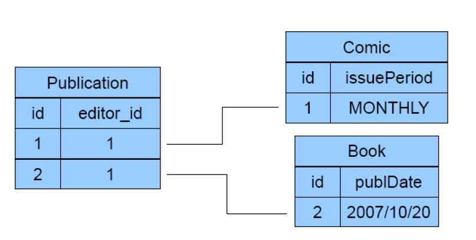

## Schedules and classification
- first, operations needs to be projected by resource, maintaing the order, for example


- build conflict graph is usually a good point to start, immediately classify w.r.t. CSR
  - to check for acyclicity, recursively remove nodes with no incoming arc toghether with the arcs that leave those node. If all nodes can be removed then it is acyclic and the schedule is CSR. (remeber that CSR is a big category and it is necessary to check in which subcategory it belongs)
  - if there are cycles but these are due to blind writes (3 writes in a row with no read in between) it maybe VSR. To check rebuild the conflict graph after swapping the first two writes (i.e. `W1 W2 W3 --> W2 W1 W3 //the final write must be preserved`). If there are no cycles it is VSR otherwise it is outside VSR. Be careful that a single arc maybe due to multiple conflicts and swapping the blind writes may still leave cycles.
- to check for 2PL try to simulate the lock acquisition process to see if it is compatible with the given schedule.
- to prove that is not 2PL strict it is sufficient to look for operations that forces a transaction to release a lock before the commit point.
- for TS
  - monoversion: if for each resource operation are ordered by timestamp then it is TS-mono. Otherwise check if out of order operation violate the rule. Remember that with thomas rule some killings on write maybe avoided and so the schedule can be accepted (specify that you used thomas rule). The rules to check are pretty simple, in practice a older transaction (i.e. lower timestamp) may not read values written by younger transaction (i.e. higher timestamp) and cannot overwrite the values that the younger transaction wrote.
  - multiversion: reads are always allowed, do not cause conflicts just read correct value. Writes are killed only if they would change the value that a transaction should have read, otherwise are accepted and maintain different version. Example of write that need to be rejected:  
  `R1 R4 W3`  
  In this case R4 should have read the value written by W3 but it came to late so it must be killed (RTM > timestamp of write).
- snapshot isolation does not keep track of RTM, can lead to write skew.

### Update locks
- UL can be shared with SL.
- mandatory to get an UL if i plan on writing later, i cannot get a SL, release it and then get XL later otherwise this would be pointless.
- UL cannot be shared, only one transaction may hold UL for each resource.
- deadlock may still happen with UL, they only protect against conflict on the **same** resource. An example of deadlock despite using update lock can be  
`R1(x) R2(y) W1(y) W2(x)`

### Hierarchical locking
- to acquire a lower level lock must hold a lock at an higher level that states the intention of doing so
- intentions are not in conflict with each other, two transactions can state the intention of locking exclusively at a lower level, conflicts arise only for the actual locks

### Obermark
- send information about wait graph when  
`E_x -> t_i -> t_j -> E_y    and i > j, send to E_y`  
Can also use the opposite rule (i < j) it doesn't matter w.r.t. correctness, it's only there to ensure that information is propagated one way only.
- update graph when receiving new information
- check the updated graphs and iterate
- when a cycle is found it means that there is a deadlock

## Query cost
- conjunction predicates, first evaluate the most selective (i.e. the one that returns less tuples).
- disjunction predicates, indexes are useful only if they cover all predicates, otherwise i need to full scan.
- evaluate if accessing the tuple is needed or it's enough to know if it exists or not.
- can assume to have 1 or 2 blocks of space in memory to cache results.
- remember all join methods.
- in nested loops if a table is small enough to fit in cache use it as internal.
- hashed indexes are useless for interval predicates, can only do a full scan.
- remember to use the information about selectivity to retrieve less blocks if possible. Things to look for are:
  - "only 10% of tuples satisfy x"
  - "there are 5k different values for this attribute" --> can estimate the amount of data that will satisfy the predicate (assume uniform distribution)

## Triggers
- general syntax  
```SQL
create trigger <trigger_name>
{before | after}
{insert | delete | update [of <column>]} on <table>
[referencing (to put aliases on old, new, etc)]
[for each {row | statement}]
[when condition]
<SQL_procedural_statement> --actions to execute or error notification
```

- to identify the triggering events think of all the possible operations (insert/delete/update) applied to every attribute of the different tables and see if they can somehow violate the constraint that we want to enforce. If yes we may have to write a trigger to fix it.
- after identifying the operations that can require a trigger, evaluate if they can actually occur or if they don't make sense and write down your consideration. Some triggers may be not required.
- remember that `new/new table` and `old/old table` are placeholders for the values that are being modified by the transaction and can be used by the trigger to check conditions.
- to rollback, just write rollback at the end of the action.
- to signal error, can use `raise SomeException` or simply write a function call that makes it clear that it signals an error.
- use "before" when we want to enforce some constraint on the integrity on data (e.g. cannot book a room that is already booked).
- use "after" if follow up updates are needed on other tables (e.g. update some status when some condition is reached on other attributes).
- can use some generalized events that are not triggered by data modification but are system events. For those events use a name that clearly states what event it is (e.g. `change_date()`).
- remember that a trigger can activate other triggers, when designing the set of trigger needed to enforce a constraint make sure that there aren't infinite activation loops or unwanted side effects.
- `for each statement` is required to compute statistics on inserted data. Can be useful to rename the `old/new table` using "referencing" for clarity.
- if the action part requires multiple statements remember to wrap them inside `BEGIN` and `END`.
- variables can be declared and used to store results across queries. The syntax is `DECLARE <name> <type>`.

## Object relational mapping in JPA
MAIN CONCEPTS ([full reference](https://www.jcp.org/en/jsr/detail?id=317)):
- ENTITY: java class (JavaBean) representing a collection of persistent objects. The class represents the table and the instances are the tuples.
- PERSISTENCE UNIT: set of all classes that are persistently mapped to one DB (notion of DB schema).
- PERSISTENCE CONTEXT: set of all the managed objects (managed entities) of the entities defined in the persistence unit (notion of DB instance).
- MANAGED ENTITY: an entity part of a persistence context for which the changes of the states are tracked.
- ENTITY MANAGER: the interface for interacting with a persistence context. The methods offered are:
  - persist: persists an entity in the DB
  - find: find an entity instance by its primary key
  - remove: removes an entity instance from the database
  - refresh: reloads data of an entity from the DB
  - flush: writes the state of an entity to the DB

  

### Entity
Must be associated with the database table it represents (mapping). Can enter in a managed state.

ANNOTATIONS:
- `@Id`: defines the primary key
  - use `@GeneratedValue(strategy = ...)` to auto generate a unique key (advised). Different strategies can be used:
    - `GenerationType.AUTO` let the provider decide the strategy (most used)
    - `GenerationType.IDENTITY` 
    - `GenerationType.TABLE` follow a generator table
    - `GenerationType.SEQUENCE` generate in sequence
- `@Temporal`: used for time and date
  - example: `@Temporal(TemporalType.DATE)`
- `@Column`: explicitly specify the column that maps the attribute (by default it goes by name). Useful to express also other constraints e.g. `nullable=false`
- `@Transient`: specify that an attribute is not persisted

### Relationships
Relationships have 4 characteristics:
- direction: can be uni or bidirectional. To obtain a bidirectional relation in JPA it is necessary to create both unidirectional relationships on both sides and mapped explicitly using `mappedBy`. Explicitly specifying `mappedBy` avoids the automatic creation of a bridge table.
- role: each entity plays a role w.r.t. the direction of the relation, one being the source and the other being the target
- cardinality: the number of entities that exist on each side of the relationship, there are 4 possibilities:
  - `@OneToOne`
  - `@OneToMany`
  - `@ManyToOne`
  - `@ManyToMany`
- ownership: one of the two entities is said to own the relationship while the other is mapped to it. It is important in the case of a one-to-many or many-to-one relationship. The table that has a foreign key as a column is said to be the owner and it is denoted in JPA using the `@JoinColumn` annotation.

#### Possible mappings
Possible mappings that we need (the cardinality is taken from the ER diagram that is given):
- 1:N
- 1:1
- N:M

Usually they are always implemented as bidirectional because it is easier and may turn out to be useful in the future.

##### 1:N
- expressed with `@ManyToOne` + `@OneToMany` +  `mappedBy`.
- the side with `@ManyToOne` is the owner of the relationship.

```java
//owner side
@ManyToOne
@JoinColumn(name="foreign_key")
private Attribute attr;

//other side
@OneToMany(mappedBy="attr")
private Collection<Type> fields; //collection since it's one to many
```
##### 1:1
- the owner can be either side, it depends on the DB design. Usually it is always the one with the FK column.

```java
//owner side
@OneToOne
private Attribute attr;

//other side
@OneToOne(mappedBy="attr")
private OtherType field;
```

##### N:M
- there is no FK column
- implemented using a join table (bridge table)
- the owner can be chosen arbitrarily

```java
//owner side
@ManyToMany
private Collection<Attribute> attrs;

//other side
@ManyToMany(mappedBy="attrs")
private Collection<OtherType> fields;

//optionally on the owner side i can specify the structure of the join table, by default is the table Table1_Table2 with the two columns
@ManyToMany
@JoinTable(name="AName", 
joinColumns=@JoinColumn(name="OwnerName"),
inverseJoinColumns=@JoinColumns(name="OtherSideName"))
private Collection<Attribute> attrs;
```

#### Fetch mode
Specify if there is the need to load also the related entities when an entity is loaded. There are 2 possible cases
- LAZY: doesn't load related entities, is just an hint to the provider that can decide to load them anyway if it thinks that it is convenient for performance (default for collections).
- EAGER: load related entites, strictly enforced by the provider (default for single values).

Can be specified explicitly in the declaration of the relationship.  
`example:  @OneToOne(fetch=FetchType.LAZY)`

#### Cascading operations
By default the Entity Manger operations apply only to the entity that is passed to it and **will not cascade** to the related entities. This is usually the desired behaviour for some operation (e.g. remove()) but the opposite can be true for others (e.g. persist()).  
The default behaviour can be overridden in the annotation.  
`example: @ManyToOne(cascade=CascadeType.PERSIST`  

There are different possibilities for cascading, one for each operation of the entity manager:
- PERSIST
- REFRESH
- REMOVE
- MERGE
- DETACH
- ALL (shorthand to specify all five operations above)

Cascading settings are unidirectional, they must specified explicitly on each side of the relationship.  
Optionally there is another setting called `orphanRemoval` that can be used in the 1:N scenario that removes the weak entities when the parent entity is removed.

### Mapping inheritance
Suppose that we have:
- abstract class Publication
- class Book extends Publication
- class Comic extends Publication

The syntax to annotate is very simple.
Use `@MappedSuperclass` to denote the superclass and allow it to share attributes with the subclasses.

```java
@MappedSuperclass abstract class Publication {
@Id private Long id;
@ManyToOne 
private Editor editor;
}

@Entity
public class Book extends Publication {
@Temporal(TemporalType.DATE)
private Date publDate;
}
@Entity
public class Comic extends Publication {
@Enumerated(EnumType.STRING)
private IssuePeriod issuePeriod;
}
```

There are 3 different strategies to implement the mapping that can be specified using the `@Inheritance(strategy=...)` annotation on the superclass.

#### Single table per hierarchy
The different entities are mapped on the same table that has an extra column called "discriminator" to distinguish between them. 

This is done using an annotation `@DiscriminatValue(value)` to specify the type.

```java
@Inheritance(strategy=SINGLE_TABLE)
@DiscriminatorColumn (name="Discr")
@MappedSuperclass abstract class Publication { ... }

@DiscriminatorValue ("B")
@Entity
class Book extends Publication { ... }

@DiscriminatorValue ("C")
@Entity
class Comic extends Publication { ... }
```

The resulting table will have the discriminator column to distinguish between the two classes. Some attributes that only belong to one of the two classes may be `null` in the other tuples.


#### Joined
There is a single table per entity including the superclass and the objects are reconstructed by join.

There aren't any specific annotations except from the strategy type set to JOINED  
`@Inheritance(strategy=JOINED)`



#### Table per class
One table for each concrete class. Inherited attributes are cached in the subclass. The whole population is reconstructed by union.

Also in this case there aren't any specific annotations except from the strategy type set to TABLE_PER_CLASS 
`@Inheritance(strategy=TABLE_PER_CLASS)`


