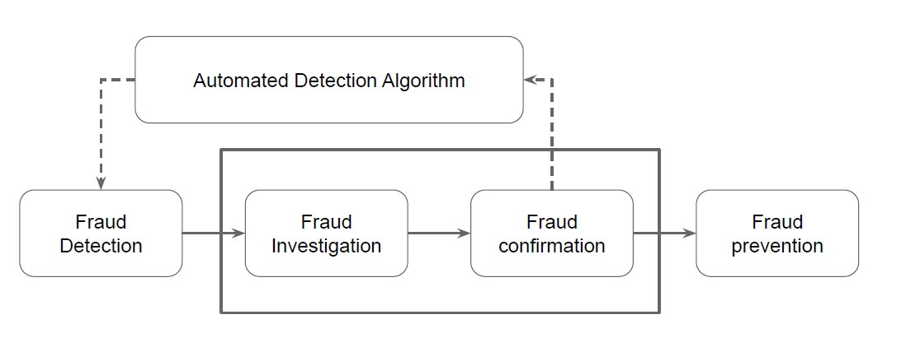
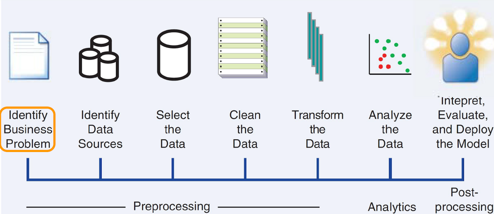
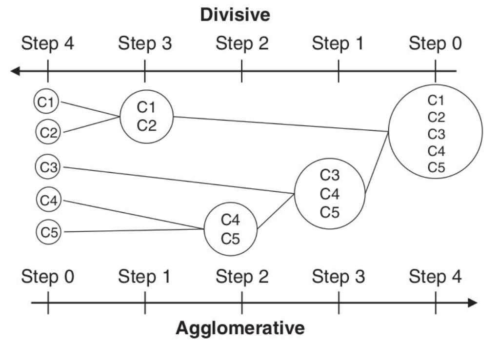
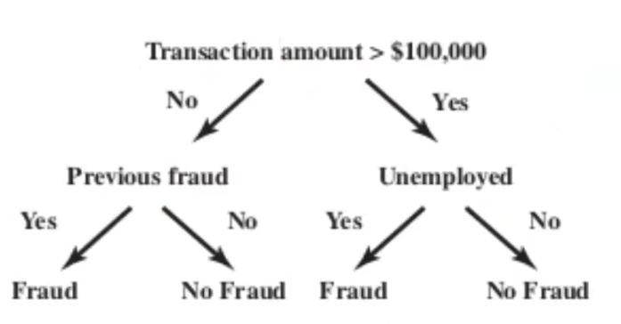
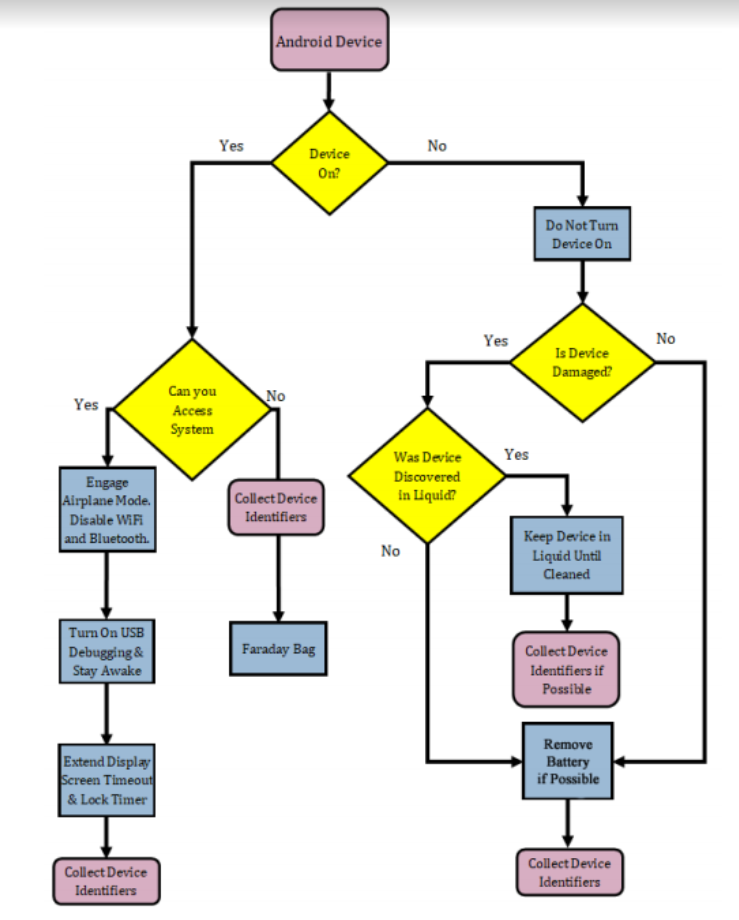

# Digital Forensics and Cybercrime
**Risk**: statistical and economical evaluation of the exposure to damage because of the presence of vulnerabilities and threats.

RISK = ASSETS x VULNERABILITIES x THREATS

Threats are not under our control, we need to understand their nature in order to create better defence against them.
### Threat landscape
We can classify threats according to different categories:
- internal vs external
- generic vs targeted
- financially motivated vs other motivations

Financially motivated threats are the most common and i a way easier to deal with because we need to make an attack not economically convenient to prevent them. Other motivations may be more difficult to predict and can include a variety of different actors from a grudged employee to a state sponsored attack.

While for a single attack the threat that can potentially deal more damage is an internal specific threat, for society as a whole the external generic are the one that cause more damage because in the end it's a numbers game (for examples, social engineering attacks)
>The attackers' job is to make one person in the company to click on one link. The security's job is to get every person in the company not to click on any link.

We need to understand that not all breaches can be prevented and we need to have a way to detect them fast and have an incident response strategy to deal with them.

### Cybercrime industry
In the beginning, during the '90 malware was made mainly for fun and demostration purposes or to show off one's capabilities. Malware produced for financial gain started to appear at the beginning of the 2000 when normal people started to connect to the internet and had valuable data to protect on their machines. This became a mass issue and criminals became more and more organized. Later during the 2010 years malware started to be used also in military operation and state sponsored espionnage or attacks against infrastructures.
##### APT
Advanced persistent threats that aim at taking control of infrastructures and planting backdoors to maintain access or repeatedly break into systems. Often associated with states.

### Financially motivated attacks
Attackers are interested in monetizing their attacks. Monetization can be:
- direct: stolen credit cards, selling fake AV, ransomware(surging in recent years)
- indirect: rent botnet infrastructure, collect data, abuse of computing resources

Mainly two categories of malware are employed:
- credential stealers, in particular banking trojans
- RAT, remote access tools, to take control of machines

Those malware are delivered mainly through email attachments or drive-by download from malicious websites. These activities are managed by different groups of people that provide services to enable cybercrime for instance selling exploits kits, building malware (CYBERCRIME PRODUCERS) rent infrastructure, money laundering, etc... (CYBERCRIME ENABLERS)

#### Money mules
How do criminals extract money from electronic accounts? As long as it is in the banking world there are two issues: it can be recalled and it can be tracked.
Common ways to launder money is:
- withdraw cash using stolen card (inconvenient)
- someone who willingly act as a money mule for you allowing to withdraw money
- directly buy goods with the stolen money or crypto (see section about crypto later)
- variants of the "nigerian prince scam"

The latter is used widely and works like this:
- convince someone to let the scammer deposit money on their account
- ask them to withdraw 90% and let them keep the other 10%
- transfer the 90% to the scammer via a wire transfer without passing through banks (MoneyGram, Western Union,...)
to an office in some suitable place with no controls
- the person worst case is being arrested by the police for stealing.

The trick here is to make people feel "smart" and they are cheating the system and taking advantage from it.
>Being evil feels good sometimes

### Cryptocurrencies in cybercrime
We consider bitcoin for simplicity.
Usages:
- ransomware
- money laundering
- black market payments

What are the advantages?
#### Bitcoin is pseudo-anonymous  
Each entity can create as many keys as he wants and they are not directly correlated to him. There are anyways things to look for because since the whole history of transaction is public they can be analyzed and correlate different addresses togheter to get the tree of entities involved (we still don't know who is behind an address but we knwo that several addresses belong to the same person/entity)  
example:
- multiple inputs to a transaction
- new address generated to gather the unspent amount of a transaction

By classifing addresses by owner we can get some information about the owner:
- did it get BTC through mining?
- was it used on an exchange?
- was it mentioned on some forum?
- was it used in a scam?

Further challenges are presented by other currencies that are built to achieve more anonymity like Monero.

## Introduction to Digital Forensics
FORENSICS: application of scientific analysis methods to reconstruct evidence. An evidence is a proof of something that will be used in a tribunal.

DIGITAL FORENSICS: forensics applied to digital data, computers, network data.

Court cases only care about demonstrable facts and evidence is subject to regulation about how it can be acquired, when it is valid. Regulation may change under different legislations.
For example in the USA there is the concept of chain of custody that can determine whether a piece of evidence can be shown to the jury or not while in Italy all evidence can be shown to the judge even if inadmissible (in this case it can't be used in the motivation for the conviction). It's up to the judge to evaluate proofs.

#### Daubert standard in US
EXPERT WITNESS: expert qualified by knowledge, skill, experience, training or education.  
An expert witness may testify if:
- his scientific, technical or other specialized knowledge will help the trier of fact to understande the evidence or to determine a fact in issue
- the testimony is based on sufficient facts or data
- the testimony is the product of reliable principles and methods
- the expert has reliably applied those principles and methods to the facts of the case

The last 3 points define that the testimony have to be scientific.

#### What do we mean by scientific?
There are two main requirements:
- REPEATABILITY
    - the experiment can be recreated by someone
    - a description of the experiment is sufficient to assess is validity
- FALSIFIABILITY
    - is there an experiment that can prove the contrary?

Factors to consider in court:
- is the technique generally accepted in the scientific community?
- has it been subjected to peer review and publication?
- can be and has been tested?
- is the known/potential error rate acceptable?
- was the technique/research conducted outside of the specific litigation? (can be biased)

## Four phases of investigation
1. source acquisition
2. evidence identification
3. evaluation
4. presentation

We will deal with them in order.  

### Source acquisition
NOTE: bear in mind that these techniques were developed in the US with the US legal framework in mind.  
The main point is that digital evidence is brittle. If it is modified there is no way to tell (not tamper evident) and theoretically it can also be created (a perfect fake)  
For these reason we need at least to ensure that when we collect digital evidence we are not modifying it in the process and no modifications occur after the acquisition.  
This is done using hashes. 
Hashes are used as a "digital seal" on the evidence to make sure that it has not been modified **since the moment the hash was calculated.** This is very important because it doesn't mean that it was not modified before, also the hash by itself cannot help us tell what was modified.
Hashes should alse be kept correctly, preferrably sealed in writing or digitally signed.

To acquire data often linux based tools are used or embedded devices that perform the copy. The copy that we want is a bit by bit copy of the whole drive (bitstream image) in order not to loose any information that may be present

General approach:
- disconnect media from orignal machine if possible
- use a write blocker to ensure no modification
- compute the hash of the source  
`dd if=/dev/sda conv=noerror,sync | sha256su`
- copy the source bit by bit  
`dd if=/dev/sda of=/tmp/acquisition.img conv=noerror,sync` 
- compute hash of the source and copy to compare them (yes we need to recompute the original to ensure no modification happened)  
`dd if=/dev/sda conv=noerror,sync | sha256sum`
`sha256sum /tmp/acquisition.img`
It can be good to also compute SHA-1 and MD5 hashes for redundancy

Challenges:
- TIME
  - modern drives are huge (several TB) but transfer speeds are slow (100-150 MB/s) so these processes take a lot of time (we can automate something but still takes a long time, see dcfldd that hashes and copies at the same time)
- SIZE
  - for a large scale investigation there can be hundreds of terabytes of data that require to have a NAS/SAN since using external drives is impractical. We also need a way to move data around
- ENCRYPTION
  - unfeasible to get the data without the key. Already an issue for mobile devices where full disk encryption is widely used

#### Variants
- booting from live distributions  
Useful for some machines like laptops with non-standard interfaces or too difficult to disassemble properly. RAID arrays can also be accessed this way if they are managed by hardware controllers. we of course need to use a proper forensic distribution (e.g. Tsurugi, BackBox)
- system is powered on  
A system cannot always be turned off (critical systems) or we do not want to turn it off (live analysis of an intrusion). Keep in mind also that shutting down a machine may tamper with our evidence for example in the case of a fileless attacks. Another case is when disks are encrypted at rest so if we find them turned on we want to keep them on in order to access them. In this cases we first need to disconnect it from the network (cuts off a potential intruder) and save information in "volatility order":
  - dump memory
  - save runtime information: process info, network info
  - disk acquisition  
  NOTE: document all the steps since each command may alter the state
- live network analysis
Observe network traffic of a compromised machine to gather information about the author of the attack without accessing directly the machine itself in order not to make the attacker suspicious.

Further challenges:
- peculiarities of SSDs
- mobile device
- cloud forensics

### Identification
Tools:
- operating system
  - linux distributions
    - extensive native FS support
    - native support for hotswapping drives and mounting them
  - virtualization
    - set of VMs with windows version using SAMBA to share drives  

Rarely use windows directly because it tampers a lot with the drives and there is no native support for other FS. There are anyway tools for windows to perform certain operation (e.g. drive acquisition through encase). In some case it is not possibile to use SAMBA and we need to run the windows VM in non persistent mode.

To ensure repeatability and validation we should know how the tools we use work and that it is teoretically be reproduced by hands. It would be better to use open source software (not necessarily released with the source code but there needs to be the possibility to inspect its source code to check it)  

A common tasks in forensic analysis is to retrieve deleted data by  carving.    
We can examine the bitstream image of the drive and look for sectors containing deleted data. (see how data is stored in a HDD). the carving technique consist of scanning the entire drive and look for file headers and footers of known file types. This way it is possible to retrieve files even when the original metadata to reach them have been deleted.  
Moreover since the OS allocates files in clusters which are composed by many disk sector there can be some "slack space" in the cluster that contains data from the previous file that was written on the cluster. This data maybe retrievable if it was a simple format like text, json or html. We can also try to match what we find against a specific file that we are looking for (if we find a 512 byte chunk that correspond bit by bit with another file that we are looking fore then we can be reasonably sure that the file was there)  
Tools for carving:
  - sleuth kit (autopsy for graphical interface) to analyze drive images, recover files, create timelines
  - gpart, testdisk: for partition recovery
  - photorec: to retrieve deleted photos

Remember that this can only give a positive confirmation  
The file is here  NOT ~~The file was not here before~~

#### Anti-forensics techniques
Aimed at creating confusion in the analyst, lead them off track or defeat the tools that he uses. There are two types of techniques:
- Transient (T) can be defeated if detected, doesn't destroy evidence -> interferes with identification
- Definitive (D) destroy evidence or make it impossible to acquire -> interferes with acquisition

Examples:  
TIMELINE TAMPERING (D)  
use tools (timestomp, touch) to modify creation date, access time and modification times of files, modifying the timeline of what has happened with the files

COUNTERING FILE RECOVERY (D) <-- most common  
- securely deleting files by overwriting them with 0
- wiping unallocated space
- use full disk encryption (FDE)
- using a VM in a cloud environment

FILELESS ATTACKS (D) <-- most common  
Do not leave traces of intrusions or attacks on the drive, inject malware in another process memory. All evidence is lost on shutdown, can only be noticed if we have a memory dump.

FILE SYSTEM INSERTION AND SUBVERSION TECHNOLOGIES (T)  
Hide data in places where it normally is not placed, for example inside file system metadata:
- partition tables
- using directory inodes (KY FS)
- adding ext3 journal on ext2 partition (WaffenFS)
- write in inodes marked as bad blocks (RuneFS)

LOG ANALYSIS (~T)  
Relies on the fact that logs are analyzed by automated tools. Insert something in the logs to make them fail to recognize patterns or try to exploit them

PARTITION TABLES TRICKS (T)  
- misaligned partition, may be missed by the analyst
- add multiple extended partition, sometimes tools fail to handle them
- generate many logical partition, same as above  
This happens because tools are often tested against reasonable partition schemes and may not handle extreme case.

Transient techniques in general relies on the fact that an analyst is not looking directly at a certain drive because of the size of data he has to analyze or time constraints. If an analyst is examining directly the drive it is very likely that they will be defeated.

#### Forensic charcteristcs of SSDs
SSDs are based on NAND memory that have particular characteristics
- limited lifespan (~10k writes)
- arranged in blocks that must be blanked before being rewritten

This lead manufacturers to optimize the duration and performance of the drive using a controller called FTL (flash translation layer):
- write caching
- trimming (blanking a block as soon as it is marked as deleted to speed up next writes)
- data compression (optimize lifespan)
- data encryption
- wear leveling (move data around the disk to wear all cells at the same rate)
- bad blocks handling (cells that have consumed all writing cycles)  

All of this is done directly by the FTL chip and it is transparent from the perspective of the OS. This means that the FTL can act independetly from the OS, as soon as it is powered on it can start to change and there is no way to bypass it by software.  
In theory we can read the NAND flash directly but it is extremely costly and time consuming and destroyes the drive. Even in this case, because of trimming, we cannot retrieve deleted data --> we lose carving.  
SSDs are also difficult to hash reliably because the FTL can sometimes reply with random data for unallocated blocks for performance optimization or because it is a cheap FTL.

### Evaluation
In this phase we need to match evidence elements (facts) wiht the required elements to support or negate a legal theoay. Cooperation is required between the expert and lawyer.  
What to evaluate:
- elements that support the indictment
- possible alternative explaination
- analyze what can be said, what can't be said and what further experiments would be needed to say more  
  - This last point is particularly important because we should assess toghether with the lawyer what we want to analyze and what risks does this involve for our client. For example if i'm defending someone accused of illegally accessing a system. If his laptop has been seized and not yet analyzed we need to discuss with the lawyer if we want to analyze it or not that the opponent may have it analyzed (remember that it is an adversarial setting)

#### Relationship with the different entities
RELATIONSHIP WITH LAWYER:
- lawyers own the choice of the defense strategy
  - they may ask for suggestion
- lawyers own relationship with the client
  - never tarnish the trust relation with the client
- lawyers do not dictate what to write
  - must NOT lie -> expert witness can commit perjury if he does
  - maybe asked to omit things as long as it is not the same as lying

RELATIONSHIP WITH CUSTOMER:
- assist the part of the judgement that hired you
  - find what helps the customer -> this is how law should work
  - this helps the judge in making the correct decision
- process truth != historical truth
  - it is better to let a potential criminal away than to have an innocent person jailed

RELATIONSHIP WITH PROSECUTOR:
- assisting prosecutor does not entail moral superiority
- remember to stick to facts, do not get your words shaped by justice

#### Analyzing previous documents
Review documents that have already been presented in the proceedings, in particular reports of other experts.
What to look for:
- technical/factual errors
  - acquisition
    - search and seizure process
    - serial numbers
    - hashing/cloning procedures (use of write blockers, missing hashes)
  - identification
    - integrity not verified
    - proprietary tools
    - technical mistakes
    - known bugs in tools
- unclear reasoning or methodologies
- suggestive writing
  - did not explore possibile alternative explainations of the facts
  - look for counter examples for the assumptions
  - are there missing explainations?
- not clear distinction between facts and theory/hypotheses

### Presentation
Writing the report is extremely important because it will be analyzed by the court and the other party's expert.  
- be clear
- don't overdo with english terminology and explain technical terms in footnotes
- be simple without being simplistic (don't make people feel stupid)
- explain why what you are writing is relavant, preferrably before starting the discussion of the experiment (give motivation to make the efforto to read and understand)
- remeber to explore possible alternatives and defend against possible counter-measures (defensive writing)  
What not to do:
- be overly technical, you will be ignored
- use innuendos or sarcasm
- use weak arguments when you have a better ones
- show bias with one of the two parties, be emotionless in the writing (especially do not empatize with the victims in the report)
- say things and not explaining them
- be excessively deferent to the judge

Structure of the report  
Model it on a scientific report but also structure as an "obstacle course" with each obstacle being a little higher than the previous to make it difficult for the judge to ignore your arguments. Example:
1. Foreword: state what you have examined and what you was asked to report on.
2. Introduction: brief summary of what the report is going to be on and why (a sort of abstract).
3. Acquisition issues and what could have happened because of this.
4. On the technical analysis, give alternate explainations for the facts, missing evidence, experiments that could have been done that could chenge the understanding of the facts.
5. Conclusions, this is likely the only part that the judge will read, recap what was shown in the report and state what can be concluded in a single strong phase.

### Testimony as a expert witness
In many jurisdiction expert witnesses provides a sworn testimony and can commit perjury and cannot "hide" behind professional secrecy. The examination usually has two phases:
- direct examination  
Called by your side, is the "friendly" part of the examination. Often it is prepared in advance with the lawyer. The approach during this phase is to take your time and explain everithing to the judge being very clear and helpful. In Italy it is also possible for the judge to ask questions of their own, be prepared.

- cross examination  
Unfriendly or outright hostile. Refer to your report to answer questions. If possibile reply with yes/no, otherwise be very complex and difficult to understand. Never get angry, even if competency is called into question (it is basically standard procedure).

Remember to never hide things that you know if you are asked, perjury is a crime!

## Fraud analysis and detection
FRAUD: an uncommon, well considered, imperceptibly concealed, time evolving and carefully organized crime with the objective of personal or financial gain.  
Frauds impact the whole society -> social phenomenon

- uncommon: only a minority of the cases/transaction are fraudolent which only a small part is knwon  
This makes more difficult to detect and to learn from historical cases
- well considered and concealed: fraudsters try to remain unnoticed and covered. Frauds do not behave differently from legitimate activity
- time evolving: adapt and refine methods to remain hidden. Also fraud detection need to continously be updated (adversary setting)
- carefully organized crimes: fraudsters do not operate independently and involve complex and organized structures. Frauds are not isolated events

Why are frauds committed?  
Basic driver: potential monetary gain
"fraud triangle"
OPPORTUNITY
MOTIVATION
RATIONALIZATION
The element we can control is the opportunity: we need to reduce the potential attack surface to discourage attacks

#### Categories
- banking and credit card frauds unautorhorized taking of someons's credit
  - application fraud: obtain new credit cards using fake/stolen identities
  - behavioural fraud: obtain a legitimate card details and use them
- insurance fraud: both from the seller (sell fake policies from non existent companies) and buyer perspective (exaggerate claims, falsified medical history)
- corruption: misuse of entrusted power for personal gain
- counterfeit: create fake products to be passed as genuine
- product warranty fraud: claim compensation based on a warranty
- healthcare fraud: typical in US
- telecommunication frauds:
  - cloning: clone phone number 
  - superposition: fraudolent usage of legitemate account
  - phishing through phone
- money laundering
- click frauds: increase ad click-through rates to gain money, can be manual or automated
- identity theft: disguise as someone else using stolen credentials
- tax evasion
- plagiarism

#### Fraud impact
A typical organization loses 5% of its revenue due to frauds
Frauds is costing the UK 73 £ a year. Credit cards companies lose 7 cents every 100 $ of transactions.

Frauds are a big problem therefore we need to have an up t date infrastructure and detection mechanism.

### Anti-frauds strategies
There are two main category of techniques:
- DETECTION: recognize and discover fraudolent activity
- PREVENTION: avoid or reduce frauds (example, enforce 2FA on payments, see PSD2 european regulation)  

These two categories are complementary but they must not be used independently. A good fraud detection system is a combination of both. Since the fraud evolve also our mechanisms need to evolve (cat and mouse game)
new prevention system -> fraudsters adapt -> detection power reduced  
new detection system -> fraudsters adapt -> impacts prevention power

#### Approaches
EXPERT BASED  
Use specific knowledge of fraud analysts to build rule-based systems. This approach is extremely time consuming and expensive since it requires manual investigation of suspicious cases. The advantage is that expert analysts can uncover new fraud patterns.  
Challenges:
- fraudsters learn rules and circumvent them
- not automatically signalled if new frauds appear  
A rule based engine must be continuously monitored and update to stay effective.

AUTOMATED  
Trying to find ways to automate the analysis of frauds to detecte fraudolent ones. Modern approach, often based on machine learning.

IN any case a good system there has to be a combination of expert based and automated parts.

### Fraud management
What to do when frauds have been detected and confirmed? What measures do we employ?
- corrective measures
correct the consequences of the fraud (e.g. compensate the victim) and perform retrospective screening, go to past transaction and inspect for the newly discovered fraud.
The sooner these measure are taken, the better
- preventive measures
investigate the mechanisms of the fraud and update the expert based rule system and adjust the detection system

NOTE: fraudolent patterns become easier to detect the more time has passed, because the more a technique is used the more data about it accumulates making it easier to see and learn from data

data driven fraud detection is surging in recent years because they have many advantages
- precision: can inspect more data and uncover frauds enhancing detection capabilities. Ask to experts only for very suspicious cases.
- operational and cost efficiency: can enforce time constraint on processing time which is impossible to do manually.

### Fraud detection techniques
There are two major complementary approaches:
- unsupervised learning (descriptive analysis): do not require dataset to be labelled and learn from historical observations. This can detect frauds if they behave differently from normal behaviour -> useful to find new patterns. Basically it builds a model of the behaviour and looks for deviations but maybe have many false positives (or false negatives if frauds are able to blend in well)
- supervised learning (predictive analysis): dataset is labelled (fraud/non fraud), can build directly the models for fraudolent and non fraudolent transactions. The problem is that the model for frauds will be based on small amounts of data (frauds are uncommon)

General evolution of fraud detection in an organization
1. expert based rule engine
2. unsupervised learning
3. supervised learning

All these approaches must work in concert to yield best performance.

#### Social network analysis
Extend the detection ability by learning characteristics of frausd in a network of linked entities. Using extra informations in the analysis that is the relationship between entities to uncover behavioural patterns.

### Fraud management cycle
  
This shows the feedback loop to update the detection model with the newly discovered patterns. the frequency of the update depends on several factors:
- volatility of fraud behaviour
- detection power of current model
- required effort
- possible downtimes  
The last point can be avoided using a model that can learn online using a reinforcement learning technique.

#### Fraud analytical process
There are many steps to take in analysing fraud data  
  
Preprocessing is the longer and most important part because the performance of the resulting model depends entirely on how good the data it was trained on was. This part involves selecting the data to use in traing, clean them of inconsistent values or outliers, transform data to select the features we are interested in. Then we can build the model using the technique we selected and proceed to validate the resulting model by measuring its performance on known patterns and testing its ability to detect a new pattern.  
Charateristics to evaluate:
- statistical accurancy and significance: need to make sure that it can generalize well and does not overfit the historical data
- interpretability: can we tell why the model flag a certain transaction? It is important to understand the reason behind the model behaviour. Different models have different grades of interpretability
  - white box: can be easily inspected to extract the motivation (e.g. decision trees)
  - black box: complex models, not clear how they flag (e.g. neural networks). Usually yields higher performances but require more work (=cost) from the expert to inspect the different case.
- operational efficiency: measure time and effort needed to collect and inspect transaction data and evaluate it. Very important when there are strict temporal requirements to evaluate data.

Fraud management is a problem of risk management, we always need to evaluate the risks and balance the reduction of vulnerabilities and potential damage with the costs (cost-benefit analysis), both direct (management, operational, equipment) and indirect (less usability, slower performance, reduce productivity of users, less privacy)  
MORE MONEY does not translate directly into MORE SECURITY  
Another important thing to keep in mind is that often sensitive data such as transactions need to comply with some regulation about how they can be used and stored

#### Recap of fraud management challenges
- skewness of data: finding frauds in the dataset is like finding a needle in a haystack making it difficult to learn a model
- operational efficiency: there are time constraint to reach a decision about a specific transaction and they can be very strict
- big data: need to be able handle the huge amount of data that needs to be analyzed, both to build the model and the data to evaluate. The model should not take too long to build or be updated

## Machine learning for fraud detection
General overview of the possible techniques used in fraud detection.
### Data collection, sampling and preprocessing
Real data is usually very dirty (inconsistency, missing values, duplicate data) and needs to be filtered prorperly.
>messy data will yield messy analytical models  
Data may come from many different sources:
- structural/unstructured data
- transactional data
- contextual or network infomation  
From transactional data when can extract aggregated parameters (averages, spending trends, min/max values) and especially extract the RFM parameters (recency, frequency and monetary value)

Types of data:
- continous: data elements defined on an interval
- categorical: values are extracted from a finite set of possiblities
  - nominal: no specific order
  - ordinal: i can specify an ordering between the different values
  - binary: very useful for flag values (e.g. 2FA yes/no, success/fail)

#### Sampling
Take a subset of the data to build the model.  
WHY? we want the model to correctly represent reality and predict the future. Because of this, to avoid bias, we often need to focus only on the most recent data to model only current user behaviour (ex. in 2020 spending patterns changed due to the pandemic). It is important to find the optimal timing windows, a trade off between:
- lots of data to get a robust model
- recent data to be more representative

Example:  
I have 12 months of credit card data, what can i select in order to be representative? keep in mind:
- spending pattern changes throughout the year (e.g. christmas, vacations,..)
- different types of items are purchased during the year  

How can i deal with this?
- build a model for each month -> very expensive to build and maintain
- average on the entire year -> lower performances usually (higher variance)

Main point: the choiche of the sample directly impacts the capabilities of the model that i am going to build.

##### Stratified sampling
Tries to maintain the pattern that are already present in the dataset also in the sample (same % of frauds, same product variety, etc...)

#### Visual data exploration
Try to get insights on the patterns/distribution among the sample by plotting them from different perspectives (amount distribution, distribution through the day, transactions per user,....) 

CLUSTERING ANALYSIS: check if data can be grouped into clusters (ex. PCA or hierarchical clustering, see later for more explaination)  
This is very important because an expert analyst can spot differences between fraud/non frauds or spot inconsistencies/problem with the dataset

#### Dealing with missing values
Missing calues in the dataset can be due to several reasons:
- not applicable field
- not disclosed (often to comply with regulation)
- errors/corruption

Some techniques can deal with these values automatically but usually additionally preprocessing is needed. We can have different approaches to dela with those values, all require first to evaluate if there is a correlation between the missing values and fraud behaviour (i.e. we cannot discard them outright, true also for outliers):
- replace with different data
- delete the data -> THIS ASSUMES THAT IT IS IRRELEVANT
- keep the data -> can be linked to fraud so it is better to keep the data element in the model building

#### Outliers
Extreme values dissimilar from the rest of the population. We can divide them in two categories:
- valid -> extreme value but it is "correct" (e.g. transaction with high amount for the CEO)
- invalid -> example: age of 300 years  
There are techniques to find them (Z-score for univariate, clustering or regression for multivariate)

Once they have been identified we need to deal with them according to their nature:
- valid outliers: can be treated the same as a missing value
- invalid outliers: impose upper and lower limit and "resize" the values to fit the chosen scale.

In any case we need to be really careful to deal with them.

NOTE: not all invalid values are outliers and can go unnoticed if they are not specifically looked out for. This is the case with data inconsistencies (e.g. category:child, birth date:01/01/1980 is clearly wrong). For this reason there needs to be a set of rules and checks, often written by expert analysts, to catch them.

#### Standardizing data
In order to avoid bias we need to scale all values of the different variables on a similar scale (z-score, min/max standardization)

#### Categorization
Transform all the features to make them comparable:
- divide continuous variables into ranges
- take the frequency of values for categorical data

Different techniques can be used to categorize:
- equal interval binning
- equal frequency binning
- chi-squared analysis

#### Variable selection
Normally in a model for fraud detection only 10/15 variables are used. How can we choose them among all the possible ones?
- filters: try to remove features that are redundant using statistical indicators in the preprocessing phase
- wrapper: keep all features, build a model and evaluate performance. Then we play with the features to see which ones impacts performance and remove the non relevant ones
- use PCA (principal component analysis) to build new independet features that are a combination of the original variables and contain the relevant information of the dataset. 
  - advantage is that the principal components are less than the original variables (dimensionality reduction)
  - disadvantage, makes it not interpretable

### Descriptive analytics (unsupervised learning)
MEMO: aims at finding frauds as deviation from the historical average behaviour:
- average behaviour of the user
- behaviour of the average user

Can identify new patterns in frauds.  
The real challenge is in building those averages:
- how do we sample?
- how to deal with evolution of user (spending patterns evolve over time)
- outliers
- frauds try to mimick normal behaviour

Basic mechanism: statistical outliers detection

#### Break-point analysis (intra account)
Detect sudden changes in the account behaviour:
1. define a time window that you want to analyze
2. split the window in 2 parts
3. compare the new part with the old behaviour. We select a metric to evaluate whether the new transactions are anomalous.

Problem: many false positive for occasional unexpected/seasonal expenses of the account.

#### Peer group analysis (inter account)
Compare the behaviour of an account against its peers. This poses 2 problems
- how to group peers?  
  - exploit business knowledge
  - define a similarity metric  
  We need to carefully balance the number of peers in eache group in order not to bee too sensitive to noise (too small) or too insensitive to local irregularities (too big).
- how to evaluate against peers?  
Through statistical tests or distance metrics.

This approach yields two major advantage:
- not as many false positives for seasonal expenses
- mitigate problem of new user with no previous data (== i don't have a model for them yet)

Break point analysis and peer group analysis are complementary techniques but they only deal with local anomalies rather than global ones.

#### Association rules
Tries to detect frequently occurring relationships between items. Need to have a database of transaction with associated items. Born to analyze market baskets and determine which items to place near on the shelves.  
INPUT: a database D of transaction associated with some items I  
OUTPUT: set of rules in the form of implication  
`X ⇒ Y where X ⊂ I, Y ⊂ I, X ∩ Y = Ø`  
The idea is to model which items occur toghether frequently. To do this we define:
- support(X) -> ratio between transaction containg x and total number of transaction
- confidence(X->Y) -> also noted as P(Y|X) is defined by the ratio of support(X ∪ Y) over support (X)

We need to specify a threshold for both of these value after which we consider them relevant

#### Clustering
Try to split the dataset in groups called clusters that:
- maximize homogeneity inside the cluster
- maximize etherogeneity outside of clusters
Then we can find anomalies by looking for small, less dense cluster far away from the big dense cluster (which represent the norm)

In order to group data we need to define a metric to evaluate the distance between the points in the dataset. This depends largely on the type of data, there are many options:
- euclidean distance (basic one)
- manhattand distance
- melahanobis distance

Also remember to standardize data to avoid bias for variables with high values.

##### Hierarchical clustering
Aggregate/divide iteratibely data into clusters.  
  
I need to be able to evaluate distance between single points as well as between clusters, there are different approaches to do it, distinguished by the points chosen to measure distance (of course choosing one over the other may yield totally different results):
- single linkage -> closest points in the clusters
- complete linkage -> furthest point in the clusters
- average linkage -> average distance between all points in the two clusters
- centroid method -> compute a centroid for eache cluster and measure the distance between centroids

We can use visual tools to see where to stop in the aggregation/division (dendogram or screen plot)

The advantage of hierarchical clustering is that we do not have to decide the number of clusters *a priori* but can be automatically decided given a threshold. The disadvantage is that this does not scale well on large datasets and the interpretation is up to the expert's knowlegde.

##### Non hierarchical clustering
- K-MEANS
  - select k random seeds
  - assign elements based on distance from the seeds (called centroids)
  - compute new centroids and recomput clusters
  - repeat until it remain unchanged  
  Tthe disadvantage here is that we have to determine the number of clusters (K) at the beginning so we may have to tweak it later. It is also sensitive to outliers and the result depend on the initial seed selection
- SELF ORGANIZING MAPS (SOM)  
Allow to visualize and automatically cluster high dimensional data to a low dimensional space using a 2 layers feed forward neural network. This is a great advantage to make it easy to visualize and understand the result + i do not have to specify the number of clusters initially. However there are still some limitations because it is hard to compare result across different SOMs and expert knowledge is needed to decide the size of the map properly.
- SEMI-SUPERVISED CLUSTERING  
Perform clustering but integrates beforhand extra knowledge in the data (e.g. "no fraud in this dataset"). We can also put constraints about the clusters at different level (e.g. pre-classifying some points, minimum separation between clusters, balanced clusters)  
- One-class SVMs  
Use a linear optimization problem to separate outliers  

##### Evaluating clusters
It is not easy and there is no universal methods. An approach maybe measuring the sum of squared errors (SSE) or visualizing the clusters to compare the distribuition of the variables in the different clusters.

WHAT TO KEEP IN MIND: even applying all these techniques we still cannot be sure that the clusters that were found are the correct ones or not

### Predictive analytics (supervised learning)
Aims to build one analytical model predicting a target value, whose nature determine the technique used:
- regression for continous target
- classification for discrete target

#### Linear regression
Estimates the target value as a weighted sum of the input variables. The weights are the things that needs to be learned, usually by trying to minimize the minumum square error of the data from the linear model (find the best fitting line)

#### Logistic regression
We apply a bounding function, like a sigmoid and try to model along that. Data is classified in the different categories if the value of the bounding function goes over a certain threshold, define a linear decision boundary to separete the two classes.  
Of course this wuold work only if the two classes are linearly separable.

#### Decision trees
Specify a series of splitting decision to classify fraudolent data. The idea is basically to pose a series of yes/no question at the end of which the transaction is classified. This can be structured as a tree where in each node there is a question (splitting decision) and the leaves contain the labels for fraud or non fraud, for example  
  

The goodness of the model depends on many factors:
- splitting decisions -> how do we decide where to split? The idea is trying to minimize the impurity in the datased (entropy gain, gini index)
- stopping decisions -> when do i stop splitting? too much splitting can lead to overfitting and poor generalization performance (try to avoid this by using 70% of data for training and 30% for validation and minimize misclassification error in the validation set)
- leaves assignement -> how do i assign the labels to the leaves? 

The main advantage of decision trees is that they are completely white box, their decision are very clear and can be inspected easily. they can also be extended to have probability values in the leaves instead of 0/1 values.  
Trees are widely used also to perform variable selection (the ones that appear at the top are the most important)

#### Neural networks (NN)
Can model very complex patterns and decision boundaries in the dataset and are trained by optimizing a cost function. The number of hidden neurons to be used depends on the complexity of the patterns that we want to identify.  
This approach has two main problems:
- local minima: the cost function is not convex so the algorightm may end up in a local minimum of the function instead of the true optimum.
- black box: they are completely non interprateble, opaque mathematical relation.
  - there are some ways to extract some information (rule extraction procedures)

#### Support vector machines (SVM)
Deals with the shortcomings of NN, these are based on linear programming. The idea is to find the separation plane to classify the data by maximizing the different classes of data. Can also model non linearly separable classes with some tweaks or by using kernel function to map to another space where they are linearly separables. Solves the local minima problem but has still the same problems of interpretability, so we need to extract rules from them.

#### Ensemble methods
Combine different models to exploi the benefits of them. Typically used toghether with decision trees, these techniques are (see ML notes for details):
- bagging
- boosting reweight data sample according to classificaiton error -> higher error means that it will get a higher weight in the next iteration (keep attention on "difficult" details) -> be careful not to overfit
- random forest <- best performant method in fraud detection application, create a "forest" of decision trees

#### Evaluate predictive models
Two major decisions to make:
- how to divide the dataset?
  - splitting in training and validation set (70/30 generally) -> it is a strict separation, using validation data to train will get you overfitting
  - using cross-validation, especially useful if we have small dataset to "expand" them
- parameters to evaluate performance:
  - false positives=FP, false negative=FN, true positive=TP, true negative=TN
  - classification accurancy -> (TP+TN) / (TP+FP+FN+TN) correctly classified observations
  - classification error -> (FP+FN) / (TP+FP+FN+TN) misclassified observations
  - specificity -> TN / (FP+TN) percentage of correctle classified non -fraudsters
  - precision -> TP / (TP+FP) percentage of true positive (how many fraudsters are actually fraudsters)

## Mobile forensics
Recover, extract and analyze evidence from a mobile device under a  forensically sound approach. This usually mean to leave the evidence untouched and unmodified by working on a copy of the media. In the case of mobile devices this becomes very difficult because:
- memory is soldered on the phone -> have to destroy to access it and it is still difficult
- it is not possible to boot from a different OS under normal conditions
- memory is often encrypted and the keys can be stored in the device itself in some dedicated chip

This means that in many case it is necessary to interact directly with the phone to access the data, potentially modifying the evidence. For this reason it is extremely important to document every action that was taken on the device and try to minimize modification. It is common to use exploits (both at a software and hardware level) to gain root access to the device or bypass codes/fingerprints.

It's evident that dealing with mobile phones is more challenging compared to a pc:
- market fragmentation: there are many different manufacturers each one may use some proprietary chips
- cloud plays a big part: large portion of data accessed through a phone is not stored directly on the phone
- encryption
- authentication bypass (often offered by third party services through zero-day exploits)
- variety of application with many different database structure (there are tools to parse common apps data)

### Guidelines to collect evidence on mobile devices
Many guidelines have been prepared:
- [SWGDE](https://www.swgde.org/documents/published)
- [ISO/IEC 27037:2017](https://www.iso.org/standard/44381.html)
- [NIST](https://www.nist.gov/publications/guidelines-mobile-device-forensics)

We will briefly go over the first one.

#### Collection, preservation and handling
- remember to document all actions taken on the device
  - state in which device was found
  - identifiers of the device
  - if it is damaged/in liquid/...
  - take pictures of the scene
- take related items
  - charger
  - packaging/notes (useful to determine the exact model)
  - paired devices (can help in unlocking)
- refer to graph for preserving evidence (similar approach for iOS devices)  
  
It is very important to keep the device on if it is found already on because if we turn it off it can be difficult to unlock it again. Also extremely important to keep disconnected from all networks to prevent someone from the outside from wiping the phone.  
- do not try to guess the passcode at random -> can lead to the phone wiping itself
- if the device was powered on and unlocked at least once it is usually easier to get access to it, so this is an important thing to look for

#### Extraction of data
- identify the exact device (e.g. IMEI number). This usually dictates what tools and exploits are available.
- use proper tools to extract data. Make sure to use reputable and approved tools for example:
  - belkasoft
  - cellebrite
  - grayshift
  - ...
- check warranty status -> can be useful to determine since when the phone was in use
- extraction methods (we aim at dumping the whole internal memory of the device):
  - physical non invasive: use exploit at os or chipset level to gain root privileges (ideal scenario)
  - physical invasive: physically disconnect memory from phone and read it on external equipment (very complex and often destroy the device)
  - logical: can only access to certain files or folders (better than nothing)
  - file system: extract all file system information but not a complete dump
  - manual: often used if the device is found unlocked, interact directly with the device to extract/document data

Remember also to check for:
- external memory like an SD card
- possible backups on cloud services

What types of data can be extracted?
- call logs, contact
- messages from apps databases
- images
- geolocation information
- tools looks for files with mismatched/missing extension (can come from cached data)
- timeline for events
- authentication tokens for accounts  

## Cloud forensics
RECALL:
- private cloud, controlled and used by one company, easier to access but we do not deal with those
- public cloud, offer services to third parties and enables those to run on the infrastructure:
  - IaaS Infrastructure as a service, get the virtual machines hosted by someone
  - PaaS Platform as a service, get the platform (OS, DBMS, ..)
  - SaaS Software as a service, use directly a software no access to os or other

We will deal with public cloud because they poses significantly more challenges than private clouds

#### Acquisition
In cloud there is no direct access to metal, so it is not possibile to get the drive directly. The space allocated to a VM may be spread across different drives. Cloud providers do not keep all logs or make them accessible to customer
- IaaS, network/os logs available only to provider
- PaaS, customer may have application logs
- SaaS, only the service provider has log

Moreover, data in cloud is often transactional, which means that it does not exist at rest but it is there only in the constext of a specific interaction or execution, for example dynamic pages generated on the fly by social network or the association between certain ads on certain pages because this may also depend by the specific user who is visiting it. Often it is very difficult if not impossible to reconstruct what page the user saw if they did not took picture of it. 

Acquiring a specific page is not trivial since many pages are composed of different components coming from different servers that may be controlled by many different entities (e.g. ad banners are usually served by third parties and the site owner often does not control what exact ads are displayed and the ad provider himself might not know why a certain ad was served)

Remember to record immediately the "attribution" data:
- IP
- whois domain
- connectivity providers

These info may change over time and there is not history of who was assigned at a certain moment in time.

### Analysis
Many analysis techniques are not available in cloud environment because direct access to metal is not feasible:
- cannot look for deleted files on disk
- metadata often not accessible
- investigation of hypervisor compromises is basically impossible (but are also extremely rare and often outside of the trust boundary)

### Attribution
Already a difficult challenge in cyberspace (e.g. IP spoofing) becomes more difficult in cloud environment. Determining who is behind a certain VM in the cloud is difficult because payment info that may help in identification may be stolen.

### Legal issues
- LOCATION:
  -  extremely important to determine under which jurisdiction the case should be processed but it is difficult to determine because a single page may get data from all over the world
- SEARCH AND SEIZURE
  - How to do it for data outside of the country? What if it is stored in many datacenters across the world? What about obstacle removal?
- CLOUDS OF CLOUDS
  - many cloud providers are based on services of other cloud providers so who is the actual service provider that should be target by the court order to access data?

### Duality: forensically enabled clouds and cloud enabled forensics
Some cloud services evolved over time, also to comply with regulation like GDPR, to store some log data or ensure data locality. Also with the growing size of data to analyze in investigation experts have started using cloud services for their infrastructure capabilities. This also poses challenges because it means that we are sharing the evidence with the cloud provider and questions how can the analysis be repeated by other experts.
