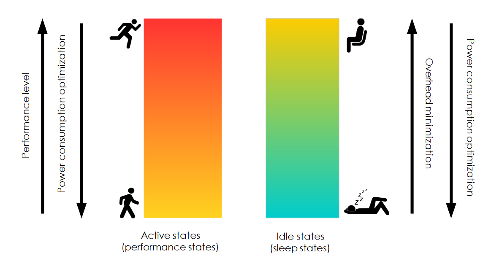
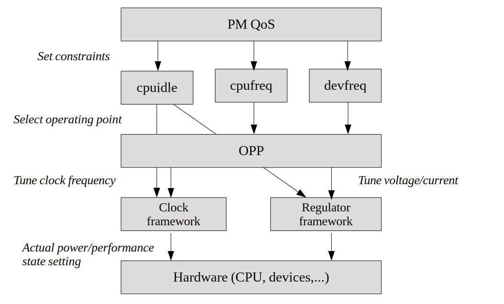

# Embedded Systems

## Introduction
### Overview on technology
Current CMOS technology is reaching its physical limits:
- cannot increase frequency of the single cores
- "dark silicon" not all the areas of a piece of silicon can be used simoultaneously due to heat generated that cannot be dissipated
- limit to how low the PSU voltage can get
- limit to how small transistor can be

Packing more transistor in the same package increase the power density raising thermal issues. This impacts the reliability of the system since it cannot operate at high temperatures for long periods.  
Managing the thermals is becoming more and more complex:
- dynamic voltage and frequency scaling
- better and more spread out sensors to monitor hot spots
- liquid cooling, two phase cooling for datacenters
- air cooling not always is applicable due to noise

### Platform based design
Design is becoming increasingly more complex and takes more time. Entering late in the market leads to great losses in potential revenue. Adding more people to the project is not always beneficial because in each project there is a critical number of people after which productivity starts to fall.  
This is why there is the need to design reusable platforms that are suited to develop other devices to speed up the design process.

## Microprocessors
Microprocessors are present in embedded systems (ES) to implement in sw the algorithms:
- more flexible
  - maintainability
  - faster and less complex to develop
  - verification is less critical
  - sw designers are more available
- shorter time to market vs designing hw
- lower cost (depends on volume)

However, typically a custom hw solution has a much better performace, not only in terms of computing speed but also in terms of:
- chip area
- power consumption
- security
- memory footprint
- ...

Moreover, designing a sw solution requires a deep knowledge of the microprocessor architecture and the different alternatives that are present on the market both in terms of class of processors and the type required ("form").

Classes of processors
- Application Specific Processor (ASP):  
tailored to specific types of applications (e.g. image processing, audio processing)
- General Purpose Processor (GPP):  
flexible general purpose, can be used in different types of applications

A typical ES use a GPP for supervising and controlling the operation of other components or ASP that do the real computations. The choice is dictated by the nature of the algorithm that needs to run on the system.

Form of processors
- Component Off The Shelf (COTS)  
buy components and mount them on a PCB and the interfaces between the different parts
- Intellectual Property (IP)  
buy the design of the microprocessor, there can be different levels of abstractions:
  - soft-macro: HDL description at an RT level. It's like acquiring the "source code" for the processor, easier to modify but costs more in terms of royalties
  - hard-macro: described to the level of the layout. It's like having a "binary" for the processor, cannot modify

Due to the diffusion of programmable logic devices like FPGAs, the use of IP is becoming more  and more popular.

Performance, power consumption and royalties can make the difference in the final decision.

### Selection process
Different metrics to consider:
- performance
  - IPC instruction per clock, comparison only make sense between the same family of components
  - MIPS absolute measure of the throughput, also in this case it dependes on the ISA
    -  MFLOPS only focus on floating point operation
  - for ASP there can be different metrics depending on the specific functionality that it needs to implement
- power consumption
  - average power, related to the total energy consumed by the system
  - peak power, affects the choice of the cooling solution and psu
  - can be considered in conjunction with the performance, especially at the beginning of the selection process
    - mW/MHz
    - MIPS/mW
- memory
  - size, how much memory do i need?
  - bandwidth
  - sometimes it is not possible to increase it with external memory
  - address space, simple arch still use 16 bit addressing (64kB of memory)
- peripherals
- available software
  - OS and SDK platform
    - community and ecosystem present
    - compilation flow and quality of the resulting code
    - presence of analysis tools, debuggers etc
    - always need to assess their quality
  - availability of libraries to do standard functions
    - simplifies design and validation
    - makes development more practical
- packaging
  - COTS comes in different packages (pinout, material, certification)
- certifications
  - needing particular certifications can constraint the choice of components

### GPP
Can have different architectures
- CISC, many instruction types and addressing modes
  - built to have a compact code due to the memory limitations that there were back in the day
  - ideally addressing mode and operations are orthogonal but in practice this is too complex to achieve
  - instructions are usually of different lengths --> more complex fetch and decode (read expensive and power hungry)
  - complex datapath for the ALU
  - complex dynamic schedule to exploit pipelines and parallelism --> more area more power
  - prevalent arch in desktop and laptops but RISC is starting to gain traction
- RISC, few simple instruction and addressing mode
  - fixed length instruction to exploit pipelining more easily
  - simplify the architecture design
  - increase software size but memory is no longer a pressing issue
  - more instructions but they execute faster
  - typically load/store, data transfers are crucial to performance --> need to design good memory hierarchy
  - inherently lower power than CISC (20-100 mW/MHz)

Both can exploit superscalarity (duplicate execution units to execute instructions in parallel). Of course this improves the performance but require complex scheduling and take up significantly more area --> more cost, increased power consumption.  
CISC instructions (e.g. x86) can be decomposed in RISC instructions and executed on a simpler core. This is useful for backwards compatibility with older programs.

- VLIW, designed to overcome the complexity of scheduling in hw.
All parallel instruction are scheduled statically by the compiler because the arch explicitly support parallelism. This has limitation due to the poor intrinsic parallelism of code (e.g. many data dependencies that force sequential execution). For this reason it is not very common for GPP.

In ES, if there is a GPP usually it exploits a RISC architecture because of their lower power consumption and comparable performance to CISC.

### ASP
- Digital Signal Processing, use very simple operations to perform complex operations like convolutions. Hw is optimized to do this operation in parallel when possible and optimize loops (e.g. increment control variable without using ALU). Characterized by large bus to memory to increase bandwidth. Frequently implemented using a VLIW approach.
- Network processors, optimized for packet managing in routers/switches (e.g. CRC computations, crypto operations)

## Microcontrollers
Embed in a single chip everything that is needed to run the system. Can achieve lower power consumption giving up raw performance. Often they do not offer interface to external memory because typically they run very simple programs and to reduce the pinout. Include serveral peripherals and interfaces (I2C, SPI, JTAG, PWN, UART, watchdog, timer, analog I/O, ... see later lectures).  
These are programmed in C (sometimes assembly) SDK can range from a simple compiler to fully fledge develepment environments with analysis tools.

Main characteristics:
- simple arch (8, 16, 32 bits) with small pipelines
- low clock (8 -160 MHz)
- low cost (0.5 -10 €)
- very low power consumption (0.1 - 300 mW)
- designed to interact with the environments (often include ADC/DAC to get signals)

The whole package includes everything it needs:
- CPU (usually an ARM-based core)
- RAM
- flash
- peripherals
- buses to external devices

Since they are very simple components, there is a variety of manufactures that produce them (contrary to the microprocessor space where basically there are only Intel and AMD).

### Overview of microcontroller subsystems
- clock, used to synchronize all subsystem (speed usually configurable). Typically there are two clocks:
  - main clock, used for core, memory and peripherals (2 - 144 MHz)
  - RTC clock, used mainly for timekeeping, almost always at 32,768 Hz. Can be external to the MCU. In some systems can be used as a clock for extremely low power modes.
  - can be internal or external
    - internal, cheap but less precise
    - external, independent from the MCU, more reliable
  - partitioned in domains to run different subsystems at different clock speeds or to perform power saving optimization (see clock gating). Require a network generate the different speed and distribute it to the different domains.
- memory, often 16 or 32 bit addressing mode.  
RAM and flash are mapped to different areas in the same address space. A small cache may be present.
- GPIO (General Purpose I/O) can be configured as input or output. Usually organized in groups and can be digital or analog.  
There are registers that can be used to configure the functionality of the GPIO
- comparators, made with differential amplifiers. Usually the output is either 0 or saturated to Vdd. Can be read via interrupt (for rare events) or polling
- ADC, encodes an input voltage to a numeric value. Require stable clock source and power supply. A single ADC can be multiplexed over multiple inputs at the expense of conversion speed.
- timer, basically a counter. Can generate interrupt periodically, measure time intervals, count events, generate PWM signals.
  - watchdog, particolar timer to monitor the evolution of the system and detect possible failures. It needs to be periodically reset by the sw to ensure that it is operating correctly.  
  Since the watchdog is used to monitor the functionality of the system it is better to have an external clock for more reliable operation.
- PLL, phase locked loop. Electronic circuit that consist of a phase detector, a low pass filter and a voltage controlled oscillator (VCO) connected in a loop to maintain the VCO frequency locked to that of the input signal frequency. Adding a multiplier/divider it is possible to obtain multiples of the input frequency allowing to synthesize different clock signals at different frequency. F_out = F_ref*(N/R)

### Boot process
Sequence of steps that brings the system from power on to a fully operational state. The complexity of this process depends on the system (what hw is used, presence of an OS, ...).

Linux boot process:
- HW
  - poewr on the system
  - keep in RESET state the CPU until the power supply is stable
  - start the oscillators and waits for the PLL output to be stable
- BIOS
  - Power On Self Test (POST) executed from flash or ROM
  - find and executes peripheral's BIOS
  - find memory, ports and HDD
  - select the device to boot from based on pior user setting
  - executes the specific bootloader
- Bootloader
  - locates and loads the kernel at a fixed physical address
  - start executing from the kernel entry point
- Linux
  - load additional kernel modules to
  - start the init process
  - init starts all the services
  - init runs the login process
  - on login, a shell is started to allow interaction with the system

The BIOS execution is a crucial part for each system because it is the first firmware execution to start. For microcontrollers we will consider a system with:
- microcontroller
- flash memory where the binary is stored
  - the binary contains all the code to run
  - the code is run directly from flash
  - the binary have specific formats (e.g. ELF)
- RAM memory to store data during execution

Microcontroller boot sequence.  
The text section of the binary contains different infromation:
- Interrupt Vector Table, fixed size table containing
  - initial stack pointer
  - address for the reset handler
  - addresses of interrupt service routines
- startup code
  - to initialize the system, normally provided by the MCU vendor
  - usually written in assembly
- application code

The first thing to be exectued is the second entry of the IVT (i.e. execute the reset handler). :
- copy stack pointer in the SP register
- invokes a system initialization function (configure clocks)
- prepares memory
  - copy DATA section to RAM
  - zeroes the BSS section
- jump to main (OS or bare metal application)

What is the bootloader role in a MCU?
Loading the binary in the flash memory requires specific hw and sw tools and can only be done in a controlled environment. If in-field firmware update is required then a bootloader is needed to handle the replacement of the old firmware with the updated version.  
The bootloader is a separate binary from the application code, has a dedicate flash area and IVT.  
When the bootloader has completed the replacement of the firmware it has to:
- switch to the correct IVT of the new firmware
- jump to the firmware

There can be two cases, depending on the MCU
- presence of an IVT offset register
  - prepare the firmware execution
    - disable interrupts
    - wait for all memory operation to complete
  - execute the firmware
    - switch to the new IVT by changeing the value in the IVT offset register
    - load the new stack pointer value according to the new IVT
    - jump to reset handler
- no IVT offset register
  - IVT can only reside at two fixed addresses, one flash and one RAM (assume it is in flash)
  - prepare the firmware execution
    - disable interrupts
    - copy IVT from flash to RAM
  - execute firmware
    - switch to new IVT by enabling memory remapping
    - load the new stack pointer value according to the new IVT
    - jump to reset handler

### Programming microcontrollers
Microcontrollers are conceived to host the final application not to support code development, also because of limited resources available. This is why there is the need to use an IDE to support development like:
- KEIL, for ARM microcontrollers
  - C/C++ compiler
  - debugger support
  - libraries, templates
  - device driver support
  - RTOS features
  - Common Microcontroller Software Interface (CSIM), standardized platform for ARM Cortex based MCUs
- Gem5, allow also to simulate the system
- Code Composer Studio, focus on Texas Instruments products
  - includes C/C++ compiler
  - debugger, profile
  - built on top of eclipse
  - processor trace (trace instruction executed, timings, ...)
  - support linux kernel and application development
- CodeWarrior
- MPLAB
- IAR Systems
  - targets different arch
  - support RISC V

These are frequently linked to boards they target, some features may depend on the family of MCUs.

Fixed Virtual Platforms: software simulators of target boards, can execute code at near native speed, provides an environment to start developing and testing code.

## Firmware Update Over The Air
NOTE: naming --> OTA DFU, FOTA, OTAF  

Objective:
- add new functionality to the system
- address bugs and vulnerabilities
- ship product faster and add non-core functionality later on

Device Firmware Update (DFU) is the operation used to replace, partially or fully, the firmware on a device and relies on the presence of a bootloader.  
This functionality does not come for free, there needs to be specific hw support, extra memory to store new firmware, etc... not to mention the risks involved during the update operation like a power failure.

The bootloader is optimized and kept at a minumum
- to minimize boot time
- reduce the possiblity of having bugs
- maximize the available space for the application code

The DFU process involves many operations that add complexity:
- update the application
- verify the authenticity
- verify the integrity
- decrypt data
- downgrade prevention

Ensuring a robust OTA DFU:
- security: encrypt + verify identity with digital signatures
- reliability: verify integrity and recover in case of failures
- version management: rollback prevention + versioning system

Steps:
- firmware image and manifest are encrypted, signed and uploaded to the firmware update server
- devices query the server to fetch the new image and manifest
- decrypt, validate and apply the update

The firmware server is also a vulnerable part of the process and it must be kept secure.
Usually the binary is split in different packets (packetizing), each packet contains part of the data toghether with the address to where to store it in memory.  
Challenges:
- memory
  - new software must be organized in memory to be possible to execute it after the update
  - keep the previous version in case the new update has problems
  - retain the state of the device between resets and power cycles
- communication
  - packetization of the new binary
  - cost, both in terms of
    - battery energy consumed by the radio
    - metered network connections (e.g. GPRS)
- security, to ensure authentication, confidentiality and integrity

These actions are typically carried out by a Second-Stage Boot Loader (SSBL) that only enters into action when performing an update. Using a SSBL is better than having an application on to do this work because this can cause issues:
- if there is a RTOS, the application runs as a thread in the RTOS concurrently with other applications that can mess with the update process.  
Since the SSBL is not a RTOS program it doesn't have concurrent code running alongside it and can do this operations safely
- need to relocate the IVT to run the new application

What does th SSBL do exactly?
- determine which is the current application and branch to it at the start (their location is usually kept in a table of contents)
- update the ToC when the update process completes
- portions of the OTA update functionality can be pushed to the SSBL
  - e.g. check the integrity of the applications

Design tradeoffs
- compression
  - saves potential bandwidth costs and battery power for the radio
  - more processing on device to extract the binary
- caching
  - *no cache* can decide to wirte directly to flash at each packet --> wear flash quicker but simple to implement
  - *partial cache* in RAM to flash more packets in a single write --> more complex
  - *full caching* only available if the RAM is big enough to contain the firmware
- communication protocols
  - may be dictated by the presence of receivers on the device that are already there for other functionality
  - support for secure communication

Addressing security:
- keep OTA updates confidentials and verify integrity and identity of server  
--> use encryption: shared password between client and server to encrypt data. The crypto accelerator in the MCU may support AES 128/256.  
--> send hash of the firmware to enable integrity verification on the device.  
--> use of asymmetric encryption to verify identity of the server. Often there are not accelerators to do this and needs to be done in sw.

Summary of best practices
- digital signing <-- critical for integrity and verify identity
- encryption
- protect communication channels, both physically and the protocol used
- versioning <-- prevent downgrading
- recoverability
- logging and status reporting during DFU process <-- both anomaly detection and debugging purposes
- timely updates
- minimize downtime
- make user aware that there is an update to ensure ideal conditions
- use crypto accelerators if possible
- small scale tests before deploying to all devices to check functionality

## Timer and watchdog
A timer is a specialized type of clocks to measure time intervals while a counter stores the number of times an event occurred w.r.t. a clock signal.  
To read a timer we can look at the value stored in the register or wait to detect the overflow.
Timers and counters are the most pervasive peripherals in MCU design:
- improve performance
- replace looping CPU with timer interrupt
- there are COTS that are tailored to support programmable timers
- PWM for motor control to free the processor from this task

Every timer needs a clock source:
- can have different clock source
- there can be a prescaler to divide the clock before inputting it to the counter (factors of powers of 2)
- the count range is stored in a register and is called the modulus M

Common configuration for timers:
- select clock source
- dividing factor of the prescaler
- modulus value
- enable an interrupt
- ...

Periodic timers are useful to schedule activity, sampling correctly in an ADC.

### Watchdog
It is a particular timer used to detect software anomalies and reset the processor if necessary.  
Basic idea:
- normally the system resets the watchdog timer to prevent it from timing out
- in case of a fault the timer is not reset and the timeout generates an interrupt
- the interrupt initiates the corresponding actions (not necessariliy a RESET)
- the action usually include going in a safe state (e.g. turn off controlled motors or heaters) and restore the correct functionality

Why are those critical? --> Detect and recover from faults on its own, necessary in IoT world with billions of devices.

There are different ways to implement a watchdog:
- internal vs external
- sowftware enabled/disable vs cannot disable
- windowed vs not windowed
  - windowed means that there is a minimum time that needs to pass before the watchdog can be cleared. If an attempt is made before this time the watchdog forces the reset.

Single stage watchdog: invokes a restart immediately after the timeout. It relies on the system reset to force outputs to safe states
Multiple stage watchdog: more timers in cascade. Each stages kicks the next and perform a set of corrective actions and only at the end a reset will be forced.  

To ensure safety there can be two sets of control states: runmode vs safemode. The timeout of the watchdog causes the selector to switch to safemode state to control the ouput and ensure that there are not potentially harmful values.

To have a more reliable watchdog it needs to be implemented as an external component with a separate oscillator to generate the clock. This is called independent watchdog

TIPS:
- never disable the watchdogs
- do not clear the watchdog using a periodic interrupt without checking functionality
- use an independent watchdog
- windowed is better

## Design of hardware systems
Different possibilities
- COTS
- ASIC
- programmable logic
- microprocessors or microcontrollers

### ASIC
Based on planar process. Use a semiconductor to realize all the main components (transistors, capacitance, diodes, ...) directly on silicon. The elements to do this are:
- silicon n --> more free electrons
- silicon p --> less free electrons
- insulator --> SiO2
- conductor --> depositions of aluminum or copper

All the regions are created on silicon at the same time using diffusion masks, which are very expensive to produce. This is why ASICs are an option only on large volume components.

Once the chips are ready they need to be integrated in a package to give mechanical stability and provide interconnect to the external world. There can be different choice for the package material like plastic, ceramic, metal.

New packaging techniques allow to build System in Package (SIP), interconnecting different components inside the same package. 

To reduce the complexit of a custom design there are so called *standard cells* that are offered by the silicon provider as a sort of "library" to develop the IC.

### Programmable logic
Hw platforms that allow fast prototyping of a system. These types of systems consume more power and take up more area than an ASIC but they have the advantage to be reprogrammable and cheaper to produce.

Classification can be based on different criteria:
- programming modes
  - One Time Programmable OTP (fuse and antifuse)  
    The lines are always connected and the programming step burns some connections and maintein only the one that are needed (opposite for antifuse)
  - Reprogrammable (EEPROM)  
    Non disruptive connections based on a floating gate. The idea is to place/remove charge from the floating gate to create/destroy a channel
  - Reprogrammable and reconfigurable (SRAM, Flash)  
    Allows to reprogram the system while it is running (reconfigurable)
- connections
  - global connection  
    Can be shared by may components on the device --> long delays and low flexibility
  - local connection
    Shared among few elements --> less delay, more flexible routing although more complex
  - hierarchical connection  
  - other e.g. programmable switch matrix

### Architecture and design
Due to their intrinsic heterogenousity and wide variety of constraints there is no standard architecture for embedded systems. The development process is usually done by prototyping the system on a development board to see if the performance of the selected processor is fine, the range of power consumption, etc. These boards often offer also integrate FPGA modules to add pieces of logic allowing for fast development of complex application.  
The connectivity that the board provides allow the developer to focus the effort on the application (see example on slides).  

## PCB based design
Printed Circuit Boards provide support and connectivity for the different components that will be mounted on it. They can also provide points for testing the system like monitoring power consumption or debugging interface that will be later removed from the final product.  
Virtually any ES makes use of PCBs to connect components, except in very particular cases.

The first step in designing a PCB based system is to select the componets that will be mounted on it (i.e. compile the Bill Of Materials BOM):
- passive --> resistors, buttons, LEDs, capacitors
- power supply --> create a specific power distribution to power the components, e.g. control power up sequences, create the different voltages, ...
- converters and filters --> ADC, DAC, amplifiers, oscillators
- others
  - electro-optical components to interface electromagnetic signals and optical signals (e.g. photodiodes, laser diodes, ...)
  - RF components like antennas
  - display
  - sensors --> convert physical measurements to voltages
  - digital components (microcontroller, dedicated ICs, ...)  

It is also important to evaluate the different packages available that can influence the design of the PCB:
- mounting 
  - Through Hole TH, more robust connection and easier prototyping
  - Surface Mounted SMD it has several advanteges
    - smaller parts
    - denser layout
    - cheaper PCB (no holes to drill)
    - easier to shield from EMI/RFI
    - easier to automate
    - improved frequency response  
    They also have disadvantages:
    - small clearence for cleaning
    - generate more heat
    - difficult to visually inspect
- pin positioning
  - pin count
  - pitch (distance between pins)
- materials
  - influence thermal conductivity, metal transfers better but it's more expensive

### Structure of a PCB
A PCB consists of 3 main components
- conductor
  - usually copper, used for wires and connecting components
- insulator
  - fiberglass epoxy
- glue (still an insulator)
  - adhesive materials are called pre-peg

In PCB with many layers there are ground and supply layers in between.  
The final board is a stack of layers of insulators, where their faces host the wires, separated by pre-peg. The process to realize a PCB is quite complex and there exist specific file formats  to specify the design like [*Gerber*](https://en.wikipedia.org/wiki/Gerber_format).  
The footprint of the components that needs to be mounted on the board is necessary to make sure that all the components fits and the connections are right.

The manufacturing steps are
- realization of the dielectric supports
- realization of the wires 
  - use photoresist to cover parts, use acids to remove other areas and expose the wires
- assembly of the layers
  - stack them alternating pre-peg foils, a heated press finalize the step
- drilling of the *vias*
- fabricating external layers, writing the schema
- finisching by applying a protective coating

After manufacturing the boards are tested to ensure that all the connections are working properly, this involve both optical inspection and electric inspections.  
After this we can proceed to the mounting step. For small boards and limited volumes it is done by hand, otherwise specific equipment is used. In any case the assembly requires the following steps:
- solder paste dispensing
- component placement
- reflow
  - increase the temperature to solder the components following a specific temperature profile.
- inspection (look for misplaced components)
  - some fixes can be carried out by hand
- wash up the flux residuals
- passivate the surface with insulators if necessary

### PCB design criteria
Partition the develpment in separate groups in order to work in parallel until the final integration. Partitioning is not only driven by the functionality:
- number fo signals necessary to connect
- bandwidth of the signals --> at high frequency is better to keep the components on a single chip
- delays of the signals --> length and width of the wires affects the speed at which the signals can go

NOTE: software to design PCB:
- altium
- eagle

### Testing
Boundary scan testing: use a chain of cells and multiplexers that can be used to force certain operating states/read some values:
- normal operation --> the cells work normally
- test mode --> connect the registers in a chain and use them to force inputs or read values

See later for JTAG interface.

## System-on-Chip
Complete system integrated on a single silicon die:
- reduction of discrete external components
- small form factor

However not all parts of the system can be integrated for mechanical or electrical reasons
- high currents
- not supported by the integrated silicon process
- robustness of connections

Why implement an SoC?
- unit cost
  - NOTE: this includes only the production not the design
- performance, greater than PCB based solution
- reduced energy and power required
- number of requested I/O, it's like having the possibility of fusing toghether multiple components
- security, both IP and sensitive information in memory

An SoC can include a variety of components
- one or more processors
- different types of memories
- dedicated accelerators for specific operations
- time related functions --> timers, watchdogs, oscillators
- power supply distribution
- interfaces --> network, serial ports, ADC, DAC

Similarly to a PCB design, the first step is to partition the system in different functional units.  
The next step is to define the memory hierarchy and architecture. Classical buses solutions are falling out of favors due to bottleneck and are being substituted by a network on chip (NoC) approach.  
A NoC basically implements a small network directly on the chip with basic funcitonality like addressing and routing to allow communications between different parts of the chip. NoC can take up to 20/30% of the hw resources but they solve several complex problem in the design of the communicaiton part and are suitable for highly scalable solutions (e.g. beyond 8 cores a NoC is necessary).  

### Testability
Testing an single chip made of different components is a difficult task because they cannot be tested independently and the integrated in the chip. This is why the design needs to account also for the testing part by preparing suitable interfaces:
- boundary scan like in PCB
- Built In Self Test (BIST)  to overcome the limitation of the scan (operate at lower frequency)

## Distributed/Networked ES
Processing and data storage are split over multiple devices. There is slight difference in terminology:
- distributed when computation are equally distributed
- networked when the nodes are just connected but are different

The critical part is implementing the communication between the nodes:
- wired
- wireless --> more complex
  - A relevant interest is in Sensor Networks

Examples
- domotic  
This is more tricky because there are a variety of different devices with different computing capabilities and functionalities.
- automotive  
Usually in this fields distributed systems are used to ensure safety and avoid a single point of failure that can be a centralized system. the different systems are interconnected over a shareed bus (CAN bus).
- wireless sensors networks
  - limited possibility to connect and store energy
  - operating in hasrsh enviroments
  - need for redundancy, both for failure of nodes and communications  
  The general architecture consists of a high number of sensors that communicate with a gateway to exchange information with the host. The typical approach to expose the data is using a publish-subscribe model.

## Thermal and power management
Digital logic power consumption can be distinguished in two categories:
- active power `P = C*V*f^2`  
Related to the switching activity of the circuit, cannot be changed arbitrarily since to operate at a given frequency a certain minimum voltage is required.  
Over the past years due to Dennard's scaling it was possible to build a chip on smaller process, increaseing density and frequency but consuming the same active power due to the possibility of operating at lower voltages and decrease in capacitance C. This is coming to an end because we are at the limits of how low the voltage can get.
- leakage power (static power) `P = I_leak*V`  
Increases as transistor size decreases and increases exponentially with temperature. This is not related to the circuit doing actual computations, it is just due to the fact the the system is powered on. This can only be reduced by reducing the voltage or interrupting the current flow by powering off devices via *clock gating*.

High temperatures have negative effects on ICs in general:
- increase gate delay, slowing down the operating frequency
- lower MTBF
- thermal runaway: leakage power increases with temperature lead to increase the temperature --> positive feedback to the destruction of the IC

To model the thermals of a chip we can use a simplified model that exploits the parallelism with electrical circuit (e.g. thermal conductivity --> electrical conductivity, heat source --> voltage generator, thermal mass --> capacitance).  
For silicon, thermal phenomenas are very fast (+20 °C in <100ms) so in chip design the approach is to run thermal simulators to builld a 2D map of the chip (e.g. 3D-ICE).  
To model it directly an IR camera is needed and the chip needs to be delidded (i.e. change the condition w.r.t. normal operation) or use a Thermal Test Chip that is able to simulate the behaviour of the chip by heating up some areas and compare different cooling solutions.

### Heat dissipations
The Thermal Design Power (TDP) is the power rating of a computing system that represent the maximum amount of heat that the cooling system is required to dissipate. We can have different approaches to cooling based on the power dissipated by the chip:
- Passive cooling: no heatsink, transfer heat directly from package to environment. Only viable for low power IC (single digit W)
- Heat sinks: metal components with high surface area and thermal conductivity placed on top on the package. Can deal up to tens of W because it still relies on natural convenction.
- Forced air cooling: a heat sink with fans mounted on it to force convenction and increase heat transfer up to a few hundred W
- water cooling: replace air with water that can transfer heat faster, requires a radiator to cool the water
- evaporative cooling: takes advantage of latent heat of state transitions of fluids with very specific boiling points
- thermoelectric cooling: use Peltier effect, useful to remove heat from localized hotspot (still research in progress)

### Thermal control policies
The amount of heat that can be removed from a high end IC is limited but in many cases the thermal output is variable and depends on the load.  
The idea is to design a MPSoC that in the worst case draws more power that it can be dissipated and use thermal control polici to limit power draw during peaks. This allows the MPSoC to be faster on average than if it were limited by worst case dissipation.

Possible policies:
- stop and go: very simple policy (idle injection). Halt the CPU if exceeding a certain temperature threshold and restart when it falls below the threshold. This has a high impact on performance so it is often kept as a last resort policy to prevent thermal runaway.
- use Dynamic Voltage and Frequency Scaling (DVFS): very complex to implement, change dynamically the voltage and the frequency reducing the active power of the chip. Selecting the correct operating point is also complex but this allow to regulate more finely the performance.  
Typical policies are:
  - based on control theory and needs to be executed at a fast rate (1-100ms)
  - optimization-based, maximize performance given certain thermal constraints
- task migration: in multicore architectures when a core is overheating, the tasks it is executing can be moved to another core. This doesn't require to slow down cores but incurs in overhead to migrate tasks and there is still the need for a secondary policy if all cores are equally hot.
- event based: not execute policy at a fixed rate, require hw-sw co-design. A small hw state machine monitors sensors and generates events when it detects the needs for thermal response. Those events trigger the execution of the policy.  
This approach allows to have a faster response with less overhead.

### Power management at OS level
Power states are power saving policies that can be applied to the system. They are divided depending on the load of the system, we can have:
- active power states, save dynamic power, regulate the operating point depending on the load. Lose some performance.
- idle power states, save static power, put the system in sleep state by switching off components after some inactivity. Overhead to wake up the system.

  

Different power states can be defined at a device level (e.g. switch off display while CPU is active). To do this a standard interface was defined, ACPI (Advanced Configuration and Power Interface), that moves the power management under the control of the operating system by providing a standard way to discover and configure power state of the devices.  
The power states defined by ACPI have different hierarchical levels:
- G-states, global system states, example
  - G0 --> system is working, processes running, peripherals powered on
  - G1 --> sleeping, no user processes, preserve context info and resume without reboot  
  In G1 we can be in different S-states depending on the powewr saving measures.
  - G2 --> soft off, no code is run, no context preserved, needs a reboot (e.g. wake-on-LAN)
  - G3 --> mechanical switch off, no power supplied, no context, require complete restart
- S-states, system wide sleep states
  - S1 is standby
  - S2 CPU powered off
  - S3 sleep or suspend to RAM:  
  low wake up latency because all the state is saved in main memory that is kept powered on while the rest of the system is turned off.
  - S4 hybernation or suspend to disk  
  higher latency to recover since all context is saved to disk but all the hw and peripherals can be switched off.
- CPU specific (note, can be applied to the single cores or at a package level)
  - C-states for power/sleep states (more can be implemented)
    - C0 active --> CPU is fully operational according to a P state
    - C1 halt --> CPU is idel, scale down clock
    - C2 stop-clock --> CPU idle, clock and frequency are scaled down
    - C3 sleep --> cache retained but disable coherency
  - P-states for performance states
    - P0 full speed
    - P1 reduced speed, scaled voltage and frequency, lower performance than P0
    - Pn further levels of scaling up to 255 maximum but usually there are not many due to the difficulty of selecting an optimal policy
- D-states for device level power/sleep
  - D0 device is fully on
  - D1 intermediate sleep, device specific, can be more than one
  - D2 or more is switched off

#### Power management philosophy
We can have different power consumption profiles with equivalent energy consumption. Which approach is better?
- race-to-idle: completes the tasks as fast as possible and go to sleep.  
Good for HPC or systems that do not require interactivity due to the wake-up latency. this approach also allows to save static power but can lead to have higher peak temperatures, affecting the choice of the cooling.
- slow down: usually adopted on ARM processors, use DVFS to save dynamic power. Takes longer to complete the task but no delays in waking up the system, suitable for interactivity (e.g. smartphones)

There is not better approach overall, it depends on the applications and the requirements that we have.

#### OS integration: Linux
There is an ACPI daemon that listen to events to handle power events (e.g. close laptop lid, battery events, ...). The device tree (DT) is exploited to include also power management information. Specific frameworks are used in the kernel in order to manage active and static frameworks. For the active power we have:
- cpuidle, manage transitions between C-states
  - latency limitations
  - minimum residency time (i.e. is it worth to save power?)
  - heuristics on CPU load
  - next predictable events (e.g. timers)
- Operating Performance Point (OPP) library, manage the P states by setting a pair of frequeny-voltage values supported by the SoC power domains.
- cpufreq, most popular framework to perform DVFS, several governors ara available based on the different policies:
  - performance
  - powersave
  - schedutil, select according to utilization
  - ...  
  Interacts with the CPU driver to set the actual P-state
- devfreq, same idea but for specific devices
- PM QoS Interface, used to set performance goals by drivers and application, can be set system wide or device speific. Poses constraints on the other frameworks governors for the selection of C, P and D states

  

For the static power management:
- Runtime PM, each device can register callbacks to be called on inactivity, does not involve directly user-space. In many case a driver must perform explicit active or idle requests. There is a reference counting mechanism to make sure not to turn off a devices that is needed by someone else.
- Generic Power Domains (PD), goup devices in groups and apply policies directly at the domain level.
- Suspend --> standy, suspend to RAM, hybernation

## Battery operating embedded systems
Typically embedded systems are powered by rechargable batteries, factors to consider when choosing a battery are:
- reliability
- capacity in terms of Ah
- maximum peak current
- temeperature operating range
- charging time
- deterioration
- cost

All batteries exploit a redox reaction to produce current, today the most common are based on litium ions and alkaline (NiMH).  
Capacity rating systems
- reserve capacity RC: time required for a fully charged battery under a costant 25 A current draw to reach 10.5 volts at 80 °F.
- Cold Cranking Amps (CCA): Amperes that can be provided for 30 seconds at 0 °F while maintaining 1.2 V per cell.

Batteries also have a leakage current that discarge them over time (8 - 20% per year) so it is often the case that the operating period of an embedded system is more due to the battery discharging itself than the power consumption of the system.  
Litium batteries needs protective circuitry to protect the battery from:
- short circuit on power supply
- complete discharge
- high voltage during charging
- high temperatures

### Supercapacitors
High-capacity capacitor with higher capacitance but very low voltage limits. Can store 10-100 times more energy per unit volume than electrolytic capacitors and can accept/deliver charge much faster than batteries.  
They are used where there is the need for many rapid charge/discharge cycles and to have a burst in power delivery or store temporarily some poewr.

### Power management
Often it is needed to generate different voltages from a single battery. It is done using DC-DC converters, like an LDO.

### Wireless charging
Works using magnetic induction like in a transformer, but without the ferromagnetic core. In compact devices planar coils are used and can reach good efficiency (>90%) if the distance is small enough, usually around 0.5 cm.

Example  
Qi standard: can provide up to 5 W of power from transmetter to receiver and defines 3 key areas of the system:
- transmitter: provides the inductive power
- receiver: uses the energy
- communication: unidirectional from receiver to transmitter, usually done using load modulation
  - protocol:
    - analog ping: detects presence of an object.
    - digital ping: longer version of analog ping, gives the receiver time to reply to ensure that the device is capable of wireless charging.
    - identification and configuration: receiver send necessary information to be identified and configure power trnasmission.
    - power transfer: receiver send regular messages (every 250 ms) to increase/decrease charge
    - end transfer: explicitly tells the transmitter to end or doesn't give signal for 1.25s

### Battery models
Energy density in battery is increasing but not at a rete to keep up with the computational and portability needs. Moreover they are non linear:
- the amount of energy that can be extracted depends on the current drawn (discharge profile)
- battery recovers some charge when it is given some rest

Guidelines:
- whenever possible use small current, taking into account the efficiency of the DC-DC converters
- avoid large current variations, use (super)capacitances to absorb these peaks
