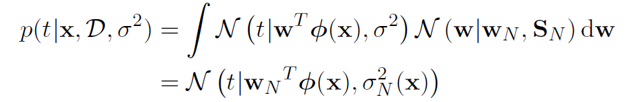
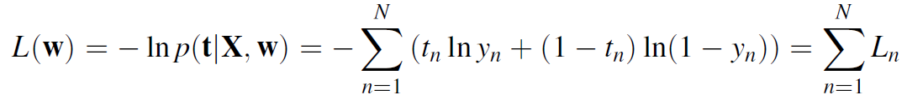
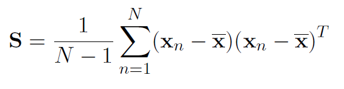
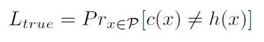
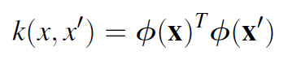
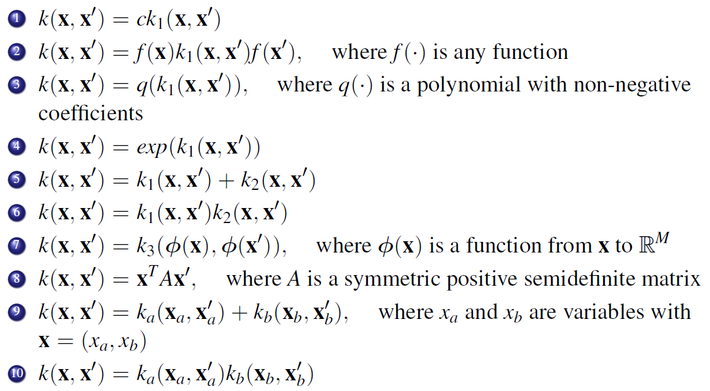

# Machine Learning

What is learning?
>“A computer program is said to
learn from experience E
with respect to some class of tasks T
and performance measure P,
improves with experience E”  
Mitchell 1997

Knowledge in machine learning comes from:
- experience
- induction

Can only learn what is present in the data, if the dataset is not rich enough i cannot learn anything

Traditional programming:  
data + program -> output  
Machine learning approach:  
data + output -> program

Used when it is easy to solve the task for a human but it is very difficult to code a program to do the same task (e.g. tell if there is a cat or a dog in a picture)

Why machine learning?  
We need computer to make informed decisions on new unseen data where writing a program directly is difficult or unfeasible. Machine learning allows to automatically extract information from data and applying it to new data -> automating automation.

Fields:
- computer vision
- speech recognition
- finance
- biology
- video gaming
- space exploration
- ...

## Overview
There are 3 main subfields in machine learning:
- Supervised learning
  - learn the model, relationship between the input data and the desired output
- Unsupervised learning
  - learn the representation, there is no output value we want to find structure in the input data (e.g. find clusters, grouping according to some property)
- Reinforcement learning
  - learn the policy, to control, make the best decision to collect the best utililty.

We will deal mainly with supervised and reinforcement learning.

### Supervised learning
Goal: estimate an unknown model that maps known inputs to known outputs.  
Problems:
- classification, target is a discrete set of values
- regression, target value is continous
- probability estimation, target is a probability value (basically a constrined regression)  

Techniques:
- Artificial Neural Networks
- Support Vector Machines
- Decision Trees
- ...

Dataset: `D = {<x, t>}`, we want to find `f(x) = t` where:
- `f` the function we want to approximate
- `x` features, predictors, attributes given in input
- `t` target, responses, labels, represent desired output
  - discrete
  - continuous
  - probability

When to apply?
- task for which there is no human expert
- where it is too difficult to write a program to do it (remember image classification example)
- the desired function changes frequently
- each user needs a customized function(e.g. spam filtering)

#### Essence
We want to approximate the **unkwown** function `f` given the dataset `D`. The steps are:
- define a loss function `L` 
  - measures the distance between any function to the function you want to estimate, define how good or bad a candidate function is.
- define an hypothesis space `H`
  - subspace of all function in which we search the best function (e.g. only linear functions).
- optimize to find an approximate model `h`
  - search the best function in `H` that minimizes our loss function.

The size of the hypothesis space depends on the sample that we have -> the larger `H` the more samples we need.  
Also we do not have the true loss function but only the empirical loss function given by the samples that we have -> it's only an approximation of the true loss and can be (very) noisy. The more samples we have the more `L` will be close the true loss (is the true loss if we have infinite samples).  
It is not possible to learn complex models with few data -> will lead to overfitting. Choosing the right `H` is the most difficult task in supervised learning.  

NOTE: assumption of supervised learning is that the distribution of the dataset is the same of the real world data we will observe, if not we need to take this into account and basically it is like having fewer samples.

### Unsupervised learning
Goal: learning a better representation of a set of unknown inputs.  
Problems:
- compressing
- clustering

Techniques:
- K-means
- Self Organizing Maps
- Principal Component Analysis (the only one we will see)
- ...

### Reinforcement learning
Goal: learning the optimal policy to collect the maximum utility through a series of actions  
Problems:
- Markov Decision Problems
- Stochastic games  

Techniques:
- Q-learning
- SARSA
- ...

## Linear regression
Map an input space `x` to a continous target output `t`.  
Examples:
- predict stock market
- predict age of web user
- predict price of a house
- predict temperature in a building
- ...

Many problems can be approximated by linear models that can be solved analytically (can also model non-linear relations using kernels, see later). This means that i can always find the global optimum of the problem.

A linear model is a parametric method, linear in the **parameters** (not necessarily linear in the variables):  
  
- **`x`**` = (1, x1, x2, ..., xD-1)`
- `w0` is the offset

NOTE:
- parametric methods: size of `H` independently from the number of samples in the dataset.
- non parametric methods: size of `H` changes accordingly to the number of samples, see later (for examples kernel).

### Loss function
Needs to measure if a model is good or not.  
`L(t, y(`**`x`**`))`  
We do not have the true loss function, we can only define it over the samples that we have.  
Common choices:
- squared loss function, sum of all the inputs of the squared loss `(t - y(`**`x`**`))^2` for each sample  
The optimal solution is the conditional average:  `y(`**`x`**`) = E[t|`**`x`**`]`
- minkowski loss function, generalization of squared loss `(t - y(`**`x`**`))^q` where `q` is a parameter that we can adjust based on what we want to learn (from easier to harder to learn):
  - `q = 2` (squared loss), conditional average (mean)
  - `q = 1`, conditional median
  - `q → 0`, conditional mode

Since the model is linear in the parameters we can transform the input variables as we please, also using non linear function. These are called basis functions:  
  
where **`Φ`**`(`**`x`**`) = (1, Φ1(`**`x`**`), ..., ΦM-1(`**`x`**`)` is called *feature vector* and each component is a *feature*.  
Examples:
- polynomial
- gaussian
- sigmoidal

This is very useful because often the input variables are not linearly related to the target but there can be more complex relationships and all of these cann be modeled using linear models.

Different approaches to supervised learning:
- statistical
  - generative, approximate the joint probability `p(x, t)`
  - discriminative, model the distribution `p(t|x)`
- direct, find a regression function `y(x)` from training data

We start with the direct approach to minimize the least squares.
### Minimizing the least squares
Consider the following loss function on `N` samples.  
  
This is called Residual Sum of Squares (RSS) or Sum of Squared Errors (SSE) and it is our empirical approximation of the true loss function given the samples that we have.
We can optimize it in closed form:
- rewrite using matrix notation  

- compute first and second derivative  

- assuming the second derivative is a non singular matrix we can compute the parameters (gradient = 0)  

The computational complexity of this method `O(NM^2 + M^3)` where `N` is the number of samples and `M` is the number of features, so it becomes unpractical for large number of features. Where is the matrix singular (and therefore i cannot compute inverse)?
- linearly dependent features
- more features than samples

NOTE: it is always positive semidefinite.

If we have too many feature we can avoid using the closed form solution and use instead the **gradient approximation**  
  
This is guaranteed to converge if the learning rates `α` comply with the following conditions (e.g. `1/k` satisfies both conditions):  
  
This iterative approach has a quadratic complexity and therefore more convenient if the number of iteration is lower than the number of features.

### Maximum Likelihood (ML)
Discriminative approach where we assume that the target value is given by:  
`t = f(`**`x`**`) + ε`  
We want to approximate `f(`**`x`**`)` with `y(`**`x`**`, `**`w`**`)`

If the noise `ε` is gaussian with `0` mean and variance `σ^2` we can write the likelihood function given `N` samples  
  
Our objective now is to find the parameters that maximize the likelihood. We can compute it in two steps:
- compute log-likelihood  

- put gradient = 0 and solve for `w`

We can see that the result is the same as minimizing the least squares, this means that those two approaches are two equivalent ways of looking at the same problem. Note that the optimal model is independent from the variance of the noise.

We can estimate the variance of the parameters that we have found by computing the variance-covariance matrix (need to estimate `σ^2` using RSS)  
  
This allows to perform some feature selection. If the parameter is small and has high variance then likely it is not relevant to our estimate and can be removed. Statistical tests are used to determine what parameters can be discarded.

NOTE: can be used also in case of multiple outputs, the inverse matrix only needs to be computed once and cam be reused for each component.

#### Gauss-Markov theorem
The least square estimate of **`w`** has the smallest variance among all linear unbiased estimates.

NOTE:
- there maybe other biased solutions with smaller MSE
- unbiased estimators are not always the best approach, as we will see low bias means high variance so there are trade-offs to be made.

### Overfitting and underfitting
- low order polynomial (small hypothesis space) lead to underfitting, performs bad both on data and on generalization
- high order polynomial (big hypothesis space) yield excellent performance on the training data but generalize very poorly on new data because it is a poor representation of the true function.

Increasing the size of the hypothesis space always lead to reducing the training error but the true error raises.

How can we avoid overfitting?  
It is a problem of model selection
- use more samples in the same `H`
- regularization techniques

### Regulatization techniques
- RIDGE REGRESSION  

Constraints the value of the weights by adding a penalization factor in the loss function for large values of the weights:  
`L(`**`w`**`) = Ld(`**`w`**`) + λ*Lw(`**`w`**`)`  
where:
- `Ld(`**`w`**`)` is the error on the data (e.g. RSS)
- `Lw(`**`w`**`)` is the model complexity (e.g. squared sum of the norm of the weights)
- `λ` is a parameter that we can tweak to decide how "heavy" we want to regularize (usually very small: 10^-8 to 10^-6)

The optimized weights are computed in a similar way as RSS and ML:  
  
The effect of this technique is to "smooth" the value of the parameters uniformely towards 0 (avoid overfitting) while still maintaining a closed form solution. I can use this approach also to test models with many features to see how they work.

NOTE: another intesting point is that the matrix is always invertible.

- LASSO REGULARIZATION

Similar to ridge but is is not linear. The loss function is  
  
where `||`**`w`**`||1` is the sum of the norms of the weights.

The disadvantage is that we no more have a closed form solution.
The advantage w.r.t. to ridge is that for some `λ` some values of the weights can be put to 0. Lasso performs feature selction and is able to yield sparse models.

### Bayesian linear regression
In contrast with the approaches seen before, adds prior information to the problem. Also it does not compute the optimal weights but yields a probability distribution for them starting from a prior distribution that encodes our prior knwoledge about the problem. After observing the data we combine what we have observed with our prior and compute our posterior distribution for the parameters.

This allow to also have the uncertainty about our decision directly encoded in our posterior.

The posterior distribution is obtained using the bayes rule:  
  
where:
- `p(`**`w`**`|D)` is the posterior probability of the parameters **`w`** given the dataset `D`
- `p(D|`**`w`**`)` is the likelihood of observing `D` given **`w`**
- `p(`**`w`**`)` is the prior distribution of the parameters
- `p(D)` is a normalization factor (marginal likelihood)

We want to obtain the most probable value for the weights given the data that we have -> Maximum A Posteriori (MAP).

NOTE: if the prior distribution does not bring any knowledge (i.e. uniform distribution) then it is equivalent to the maximum likelihood approach.

What is the advantage?  
Thanks to the prior we can avoid overfitting and there is no need to regularize, the prior act as a regularizer.

#### Gaussian prior
Using a gaussian prior is very useful in a scenario when we have sequential data (prior -> new data -> posterior -> use posterior as new prior -> new data -> new posterior -> ...) because this ensures that the posterior will also be a gaussian (so i can iterate the process indefinitely). If the prior and posterior are distributions in the same family we say that the prior is a *conjugate prior* and this allows to have a closed form solution:  
  
As we can see:
- **`wN`**, the mean of the new posterior, depends on the mean of the prior and the OLS solution, in particular if we choose a prior with 0 mean and variance this approaches reduces to ridge regression.
- with infinite variance (uniform distribution) it is reduced to ML.

The more data we have the less the prior becomes relevant in determining the posterior distribution (for lots of data it is usually preferred to use ML since it is cheaper to compute BUT yields a point prediction instead).

#### Posterior predictive distribution
In the gaussian case, the posterior predictive distibution is also a gaussian (the distribution of our prediction, obtained for instance by performing a weighted average of the outcome of all the models based on their posterior):  
  
And the uncertainty is given by  
  
where:
- `σ^2` is the noise in the target value
- the second term is the uncertainty associated to our parameters value

The good news is that in the limit of infinite samples the second term goes to 0, so the variance of our prediction depends only on the noise in the target value.

#### Challenges
- specify a suitable prior distribution and suitable model
- computational cost for the posterior distribution if we do not have gaussian distribution (no closed form, approximations like gaussian approximation or monte carlo integration)

## Linear classification
Goal: assign an input `x` into one of the `k` discrete classes `Ck`. Typically each input is assigned to only one class.

To achieve this the input space is divided into regions whose boundaries are called *decision boundaries* or *decision surfaces*. For classification we would like to use a non-linear function:  
  
We call this **generalized linear model** because the expression of the decision surfaces remains linear (`y(`**`x`**`, `**`w`**`) = constant` that solving for x yields the hyperplane equation of the decision surface).

#### Notation
- In 2 class problems we assume `t ∈ {0, 1}` where `t = 0` represents the negative class and `t = 1` represent the positive class (we can interprete `t` as the probability of the positive class)
- if there are `K` classes we can use:
  - one-hot encoding
  - probability vector (extension of one-hot)

### Approaches
Similarly to regression we can have different approaches:
- probabilistic, models the conditional distribution `p(Ck|x)` and uses it to make optimal decision. We can distinguish in:
  - discriminative, models it directly
  - generative, models the conditional densities `p(`**`x`**`|Ck)`and then computes the conditional distribution using bayes rule (not treated in this course)
- discriminant function (direct approach), build a function that directly maps input to classes, does not output a probability value of an input belonging to other classes

### Discriminant function
We start with the 2 classes case using a linear model(spoiler alert: not a good idea to use a linear model):
- we pick a linear model (e.g. the same as logistic regression)
- explicitate the boundary
  - assign to `C1` if `y(`**`x`**`) >= 0`
  - assign to `C2` otherwise
- if we compute the parameters of our model we obtain that it is orthogonal to the decision surface.

What if i have`K` classes?
- ONE-VERSUS-THE-REST
  - `K-1` classifiers, each classifies if it belongs to one class or all the others. Can lead to ambiguous points
- ONE-VERSUS-ONE
   - `K(K-1) / 2` classifiers, one for each pair of classes, leads to similar problems of ambiguous

How do we solve this ambiguitly?  
Assign the class based on the largest value(remember that the output represents the probability). the advantage in doing this is that the decision boundaries are singly connected and convex.

#### Least squares for classification
The idea is to use linear regression for each target class using K models.

PROBLEMS:
- outliers: very sensitive to outliers because it will try to "bend" the linear model towards those outliers to reduce the squared error, moving the decision surface and causing misclassification.
- non-gaussian distribution in the target noise, since linear regression

#### Fixed basis function
As seen for regression, we do not have to find linear boundaries in the input space but we can define a feature space in which the boundaries are linear, obtained by transforming the input using vectors of basis functions `Φ(`**`x`**`)`

#### Perceptron
Oldest approach to classification, it is a two class model  
  
where +1 correspond to class `C1` and -1 to `C2`.  
The idea is to find the separating plane by minimizing the sum of the distance of the misclassified points from the decision boundary.  
The loss function to be minimized is the following  
  
where:
- `M` is the set of misclassified points
- 0 error is given to correctly classified points

This can be optimized using gradient descent  
  
The value of the learning rate `α` is not relevant since the separating plane does not change with the value of `w` (is a vector orthogonal to the plane), so we can put `α = 1` (the opposite from regression where `α` had to respect certain conditions). 

The alghorithm iterates over all the points until all the points are correctly classified. It is guaranteed to converge if the points are linearly separable (but if they aren't it never stops, it is semidecidable -> cannot distinguish between non separable and slowly convergence by running the algorithm). If there are more than one solutions the one that is found depends on the order in which we inspect the points.  

### Probabilistic discriminative model: logistic regression
We want to learn the probability for a certain element to belong to a certain class. We start with the 2 classes scenario:  
  
the probability of belonging to the second class is given by  
`p(C2|Φ) = 1 - p(C1|Φ)`  
We use the non-linear [sigmoid function](https://en.wikipedia.org/wiki/Sigmoid_function), also known as logistic function, hence the name. As we said before, the model is non linear in **`w`** but if we put a threshold on the probabilty to have a linear decision surface.

#### Maximum likelihood for logistic regression
To train the parameters of the logistic regression we use maximum likelihood, by finding the weights that maximize the likelihood of getting the right label:  
  
Using the same approache we saw before we take the log likelihood(cross-entropy error function) and find the maximum by imposing gradient = 0.  
  
  
It has similar structure to the SSE but since the sigmoid function is non linear there is no closed form solution. However the function is still convex and can be optimized using the gradient descent technique.

MULTICLASS CASE  
We represent the posterior probabilities using a *softmax* transormation where the probability of belonging to each class is given by:  
  
Then we can apply again a maximum likelihood approach to find the weights obtaining a similar result, the only difference is that i have weights for each class so i have multiple gradients to compute.

### Comparison perceptron vs logistic regression
The percetron can be seen as a particular case of logistic regression where the sigmoid becomes a step function. Both algorithms use the same update rule. The advantage of using logistic regression is that we can obtain a result even if the samples are not linearly separable (altough there will be some misclassification).

## No free lunch theorems
First some notation:
- `ACCg(L)` = generalization accuracy of learner `L` (its accuracy over non-training samples)
- `F` = set of **all** possible concepts `y = f(x)`

THEOREM  
For any learner `L` the average accuracy over all possible concepts is 0.5 -> cannot perform better than random guessing. In formula  
  
What is the problem?  
We are considering accuracy over **all** possible concepts! If all functions have the same probability (i am trying to learning *any* function with the same probability) i have no hope of learning because it means that the patterns that i see in the data maybe not related at all to what happens in other points. 

Machine learning can only work if generalization of the problem is possibile -> there is some structure in the data that i can learn. If i cannot propagate what i learn in one point to other points then it's not possible to learn.

COROLLARY:  
For any two learners `L1`, `L2`  
if there exist a problem s.t. `ACCg(L1)` > `ACCg(L2)`   
then there existis a problem s.t `ACCg(L2)` > `ACCg(L1)`  

This means that there is no one technique that is always superior to another, the correct (best) technique to use depends on the problem. Do not expect your favourite learner to always be the best :^).

## Bias-Variance trade-off
Assume to have a dataset `D` generated by a function `t = f(`**`x`**`) + ε` , where `ε` is a gaussian noise. We want to consider that function. Let's considere the expected squared error:  
   
where:
- `Var[t]` is the variance of the noise (irreducible)
- `Var[y(`**`x`**`)]`  is the variance of our approximation, describes how sensible to the noise it is, if we have high variance we are very sensitive to noise and it means that we are overfitting
- `E[f(`**`x`**`) - y(`**`x`**`)]^2` is the bias squared of our approximation, how far from the true function we are. If the bias is high it means that we are really far from the real function and we are underfitting

Ideally we want to minimize both variance and bias to have the smallest possible error:
- bias -> reduced with model complexity, independently from the number of samples
- variance -> reduced with many samples or with simpler models  
  

So when we have a large number of samples we want to use unbiased estimators since this will reduce the variance and so the total erro. On the other hand we have to use biased estimators when we have a few samples to compensate for the high variance.

### Training error and prediction error
Given a dataset `D` with `N` samples we can choose a loss function to measure the error of our model on our samples. This is what we have focused so far using for example RSS. The problem of considering only the train error does not take into account the variance, it reprensents only the bias of the model.  

What we want to estimate to select our model is the true error (prediction error). How can we do so?  
- split dataset in training set and test set
- train over training set
- evaluate performance over test set  
  
How do we split depends on the problem and the samples that we have.

IMPORTANT:  
Do not use test samples to select our model, we need to use it only in the end to evaluate performance or else it is like we are using the test error for learning (training).  
We will see that this can be overcome by splitting in 3 sets:
- training set, to train the model
- validation set, to select the model
- test set, to evaluate performance in the end

### Curse of dimensionality
When we introduce more dimension (parameters or features) in our problem leads to an exponential increase in the number of samples needed to train it properly.  
Working in higher dimension is hard because there is large viariance.

### Managing bias-variance trade-off
We will see two approaches to manage it.

MODEL SELECTION  
- feature selection
- regularization
- dimensionality reduction

MODEL ENSEMBLE, meta algorithms that can be applied on many techniques, often perform very well  
- bagging
- boosting

#### Feature selection
I want to select a subset of `K` features from the starting `M`. It is not possible to test all subset by bruteforcing, we need to use some heuristic approach:
- filtering, rank the features and select the best one using some statistical tools 
- embedded, the learning algorithm does this automatically (e.g. lasso)
- wrapper, only evaluate some subsets, it is a greedy approach
  - forward selection, start from empty set and add one at a time selecting the best one at each step
  - backwards selection, start from all features and remove it one at a time  

How do we evaluate performance to select the model?  
- use a validation set to tune our model, separate from training and test set.
- use adjustment techniques, add to train error a term that accounts for model complexity

##### Validation
If we want to compare a lot of model on the same validation set we will overfit in the validation set. To avoid this we use the cross-validation technique to create multiple training and validation sets from the same dataset while also maximizing the number of samples that we leave for training.  

LEAVE-ONE-OUT CROSS VALIDATION (LOO)  
We build `N` validation sets in this way:
- training set `D \ {n}`, dataset without the nth element
- validation set, the one element we left out of the training set  

Then we can train `N` models and evaluate the error for each model:  
  
This estimator is almost unbiased and in the end i have validated my model over all `N` samples.

The major drawback of this approach is that it requires to build all `N` models so it is very computational intensive

K-FOLD CROSS VALIDATION
Same idea of LOO but reduces the number of models that i have to train. Divide the dataset `D` in `k` equal parts `D1, ..., Dk` and train them in a round robin style. For each i from 1 to k:  
- learn model on `D\Di` (dataset excluding set `Di`)
- validate on `Di`

The advantage is that it is much cheaper to compute than LOO but it is usually more pessimistically biased. A typical value for `k` is 10.

After selecting the model using cross validation we can now use all the dataset (training + validation) to train the final model and evaluate its performance on the test set. If the result are not satisfying we are screwed, we cannot use the same datased! USE THE TEST SET ONLY AT THE VERY END, ONCE USED I CANNOT MODIFY THE MODEL.

##### Adjustment techniques
Combine train error with a term that accounts for the model complexity without using a validation set. Usually used when i have too many samples and building too many models is not feasible There are a number of parameters that are used (`d` is the number of parameters):
- `Cp = (RSS + 2dσ^2)` where `σ` is an estimation of the variance of the noise
- `AIC = -2log(L) + 2d` where `L` is the maximized value of the likelihood function for the estimated model
- `BIC`
- `adjusted R^2`

#### Regularization
We have already seen some techniques (ridge and lasso), the idea is to shrink the parameters towards 0 to reduce the variance. Can be used in combination to cross validation, for examples i can select the `λ` using cross validation (trial and error) and then regularize.

#### Dimensionality reduction
Find a new set of features that performs well and encodes (almost) all the information of the starting features. The advantage is that the resulting set is way smaller than the orginal one so the dimensionality of the problem is greatly reduced. We will see Principal Component Anlaysis (PCA).

##### PCA (unsupervised approach)
Project the original feature space into a subspace that accounts for most of the variance of the input. The idea is that input features with low variance are less important in determing the final outcome. In this particular analysis the new features are a linear combination of the starting one.

How can we compute the new features?  
- compute the average of our data `x`
- build covariance matrix `S`  
  
- compute eigenvectors `ei` and eigenvalues `λi`
- sort eigenvectors by their eignevalues
- the first principal component is the one with the largest eigenvalue, the second is the one with the second largest eignvalues, ...
- the proportion of variance caputered by each eigenvector is the ration between its eigenvalue and the sum of all eignvalues  
  

- the eigenvectors create a new space (they are an orthogonal basis) in which we can work, we select the first `k` eigenvector and project the initial data on the new space determined by those vector.

We are basically "compressing" the information that we had in the original dataset. Unfortunately there is no way to tell beforehand if the variance that we are losing is important to our problem or not but it is used because it greatly reduces the dimensionality.

Example:  
We want to build a face recognition system on 256x128 pixel images --> 256*128 = 32768 dimensions.  
If we observe that faces are not randomly distributed in the image space, the "face-space" is very small compared to all the possible images. Using the PCA we find that there are only 15 relevant eignevector, that we call [eigenfaces](https://en.wikipedia.org/wiki/Eigenface).

PCA is very useful to reduce complexity and filter noise out of the dataset but there are some caveats:
- fails when data consist of multiple clusters (in general, when the distribution is far from gaussian)
- direction of greatest variance may not be the most informative for the specific problem
- PCA can only build new features that are a linear combination of the old one

#### Bagging
Often used with decision trees ([random forest](https://en.wikipedia.org/wiki/Random_forest)), reduce the variance without significantly increasing bias. The general idea is to learn multiple models and combine them toghether (same for boosting, see later).

In bagging we average models to reduce variance.   
How can we build multiple models having only one training set?  

##### Bootstrapping
We produce `k` dataset from one dataset obtained by sampling uniformly the original dataset with replacement. The new `k` datasets contain the same number of samples as the orginal samples but they wwill have some that are missing and some that are duplicate. Then we train a model for each dataset (of course they are not completely independent).

We can then use these models for prediction:
- regression: average the prediction of each model
- classification: classify according to majority

NOTE: we prefer to have unbiased models when we apply this technique

Bagging improves the performance of unstable (overfitting) learners.

#### Boosting
Sequentially train weak learners (underfitting models) that performs slightly better than random guessing with the lowest variance possible. This technique allows to reduce bias without increasing variance by a lot. The idea is to combine very weak learners to build a strong model.

Steps:
- train first model on all samples
- compute error on the training samples
- increase weights on the samples with the most error
- retrain on new new dataset with updated weights
- compute error again on the new training set
- iterate until satisfaction  

This sequentially build models that toghether will build a final model whose prediction is the weighted prediction of each model (see [AdaBoost](https://en.wikipedia.org/wiki/AdaBoost) for classification).

## PAC Learning and VC dimensions
Overfitting happens because:
- the train error is a bad estimate of the generalization error --> can we find a relation between the two?
- the learned did not have enough sample to learn a complex model --> how many samples is enough samples?

PAC learning tries to answer theoretically to these two question.

Consider this scenario (can be extended to regression):
- set of instances (samples) `X`
- set of hypothesis `H`
- set of possibile target concepts `C` (boolean functions)
- the samples are generated by a fixed distribution `P` over `X`

The learner observes a sequence `D` of training examples `<x, c(x)>` where:
- instances `x` are drawn from `P`
- teacher provides deterministic `c(x)`

The learner must output and hypotesis `h` estimating `c`
- `h` is evaluated by its performance on the instances drawn from `P`, we want to minimize:  
  
- can we bound the `Ltrain` to `Ltrue`?

VERSION SPACE (VSh,d)  
Subset of the hypotesis space `H` that contains all hypotesis with 0 training error.  
Can we bound `Ltrue` in this region?

Theorem:  
If the hypothesis space `H` is finite and `D` is a sequence of `N >= 1` independent random examples of some target concept `c`, then for any `0 <= ε <= 1`, the probability that `VSh,d` contains a hypothesis error greater then `ε` is less than `|H|e^(-εN)`.  
  

Interpretation: we can bind the prediction error (misclassification in this case). The error increases when we have a large hypotesis space (as expected), but we can bound it given a certain threshold on the probability of error.

This answes our question:
- if we want to bound the probability of error to a certain threshold `δ` (*PAC bound*)  

  - compute `N` (the number of samples) after picking `ε`  
  
  - compute `ε` (the error) having `N` samples  
  
- note: don't get fooled by the `log` in those formulas, these bound are still exponential in the number of features `M` (there are 2^2^M boolean function). This makes these theoretical bounds difficult to apply in practice.

When is a problem PAC-learnable?  
Consider a class `C` of possible target concepts defined over a set of instances `X` of length `n` and a learner `L` using an hypothesis space `H`
- PAC-learnable
  - if there exists an algorithm `L` s.t. for every `f ∈ C`, any distribution `P`, any `ε`, `δ` between 0 and 1/2 that with proability of at least `1 - δ` probability outputs a concept `h` s.t. `Ltrue(h) < ε` using a number of samples polynomial in `1/ε` and `1/δ`
- Efficiently PAC-learnable
  - same as above if polynomial in `1/ε`, `1/δ`, `M` and `size(c)`

In practice usually we need to work outside of the version space.  
We can still bind the error w.r.t. the train error:  
`Ltrue <= Ltrain + ε`    

We can define the bound for the probability that the empirical mean diverges from the expected value for more than `ε`:  
  

In a finite hypotesis space `H` using the Hoeffding bound written above we can bound the probability for the training error to be different from the true error for more than `ε`:  
  

Similarly as before, if we bound this probability to be <= `δ` we can get the value of `ε` and decompose the true error in the two components given by the bias and the variance  
  
Interpretation:
- for high `|H|` --> low bias, high variance
- for low `|H|` --> high bias, low variance

We have now a theoretical formula that confirms what so far we only said empirically by looking at the different techniques.

We still need to consider the case when `|H|` is infinite. Need to define a measure that measures the "effective size" of an hypothesis space.

### VC-dimension
What is important in determining the size of `H`? Before that, some concepts:

- dichotomy: given a set `S` of points a dichotomy is a partition of that set `S` in 2 disjunct subsets
- shattering: we say that a set `S` is shattered by an hypothesis space `H` if and only if for every dichotomy in `S` there exist some hypothesis in `H` consistent with this dichotomy. Basically `H` is shattering `S` if it is able to perfectly classify  all the examples in `S` independently of how they are labelled.

This encodes the flexibilty of the hypothesis space `H`.

DEFINITION:  
The Vapnik-Chervonenkis dimension, `VC(H)`, of hypothesis space `H` defined over instance space `X` is the size of the largest finite subset of `X` shattered by `H`. If arbitrarily large finite sets of `X` can be shattered by `H`, then `VC(H)` is infinite.

Example:  
For linear models in bidimensional space, the VC dimension is 3 (This is the number of points that can be classified, in general for a linear classifier, the VC dimension in a N-dimensional space is N-1).  
Rule of thumb: VC dimension = number of parameters (although not always true).

Having the VC dimension we can compute the number of samples needed to have at most `ε` error with `1-δ` confidence:  
  
We can express the PAC bound using the VC dimension  
  
This function can be used to do model selection by minimizing it, choose the `H` that minimize the upper bound to the true error (Structural Risk Minimization).

## Kernel methods
Dual version of parametric methods, the work in the sample space instead of the feature space This are called *memory based methods* because the training data is used in prediction, making them fast to learn but slow to predict (because of this they are not suitable for real time application).  
The equivalent of finding good feature is finding the correct similarity function between the data.

Goal:  
capture non linear relationships in the data by mapping the input to a bigger feature space bu avoid to actually compute it.

Kernel methods are ideal if we want to work in a large feature space (even number of features > number of samples) because they allow to avoid computing those explicitly.

Example  
If we want to consider polynomial features, their number grow exponentially with the degree of the polynomial. Not considering overfitting here, the computational power required to compute them can be prohibitive. Kernel methods allow to avoid this computation, i do not have to expand the input into features because the kernel does this implicitly (computationally efficient). How is that possible? We need to define *kernel functions*.

### Kernel functions
Measure the similarity between samples in the input space (they are symmetric functions).  

To be a valid kernel function it needs to be possible to express them as the scalar product of the feature vector. This does not mean then i have to compute them this way but only that they are need to be equivalent to a scalar product between feature vectors. The idea is to find efficient ways to compute them to avoid the feature expansion.

To perform the prediction, each sample is weighted by the similarity between that sample and the new observation that we are trying to predict.

Example of kernel functions are:
- stationary kernel, only depends on the difference between the samples    
  
- homogeneus kernel, only on the magnitude of the distance between points  
  

KERNEL TRICK  
If we can find a kernel that is faster to compute than the scalar product of feature vectors, we can substitute the kernel to those product and obtain a faster algorithm (*dual representation*).  
The advantages are:
- can build complex model with few data
- allow for high dimensional or infinite feature space
- can be applied to non numerical values [symbolic kernels](#Kernels-on-symbolic-data)

The drawback is that the prediction phase then needs to work on the samples:
- slower
- need to store the samples
- not suitable for big data

### Dual representation
We will see this for ridge regression as an example.

First, let's define the **Gram matrix**:

  
where each component is  
  

It is a symmetric matrix of all the similarities between our samples.

Now we can write the dual of the ridge regression problem.  
We want to minimize the regularized SSE  
  
- calculate gradient w.r.t. **`w`** and equal it to `0`, obtaining  
  
- substitute **`w`** in the loss function  
  
- we can rewrite it using the Gram matrix  
  

Solving for our new variables **`a`** we obtain:  

The rewritten version of ridge regression using kernels has a complexity that is independent from the number of fetures, it only depends on the number of samples.

To perform the prediction now we substitute **`a`** into the linear regression model:

  
where `k(`**`x`**`)^T` is the vector of the similarities between the samples and the new observation.

As we see the prediction is a linear combination of the target values of the samples. The advantage is that we can use an arbitrary large feature space (even infinite) and, if we are able to find it, use a kernel function that is faster to compute.

The problem now is: how do we build kernel functions?

### Building kernels
MEMO: we need to ensure that we find a valid kernel (can be computed as a scalar product between feature vectors).

Our kernel function needs to encode some kind of similarity, the basic idea is:
- if two inputs are close, their two target will be close
- if two inputs are distant, their target will be different 

The more a sample is similar to our observation, the more weight they will have in the final prediction.

We can construct kernels directly and them prove that they are equivalent to a scalar product, for example  

We can expand it and rearrange terms to show that this is equivalent to a scalar product  

Where is the advantage?
- kernel: 2 multiplications + 1 squaring
- features: compute 6 features + 9 multiplications

As we see the kernel is much faster to compute than the feature.  
It can be shown that thiis kernel can be expanded:
- `(x^T*z + c)^2` includes constant, linear and second order terms
- `(x^T*z + c)^p` all terms up to degree `p` (*polynomial kernel*) 

The function is very quick to compute and allows to work in a huge feature space.

There are specific conditions that allow to prove that a kernel is valid in a more convenient way:

NECESSARY AND SUFFICIENT CONDITION  
When the Gram matrix is positive semidefinite for any set of samples we are guaranteed that the `k(x, x')` is a (valid) kernel.

Mercer's theorem:  
Any continuous, symmetric, positive semi-definite kernel function
`k(x, y)` can be expressed as a dot product (scalar product) in a high-dimensional space.

This makes it easier to build a "personalized" kernel for a specific problem and make sure that it is valid. Also, new kernels can be built from simpler ones exploiting the properties of positive semidefinite matrixes. These are the rules to transform kernels ensuring that they remain valid:  

We apply these rule to prove that a commonly used kernel, the *gaussian kernel*, is a valid kernel.

The gaussian kernel is  
  
- we can rewrite the norm using scalar products  
  
- substitute in the gaussian kernel  

- using the second and the fourth rule and knowing that the linear kernel `k(x, x') = x^T*x'` is valid, we see that the gaussian kernel is valid.

#### Kernels on symbolic data
We can extend kernel to symbolic data like graphs, sets or something else. The important thing is that we somehow encode the similarity of two object in the kernel. For instance, suppose `A1` and `A2` are sets, we can define a kernel function like this:  

## Support Vector Machines (SVM)

## Markov Decision Processes (MDP)

## Dynamic programming

## Reinforcement learning in MDPs

## Multi Armed Bandit (MAB)
