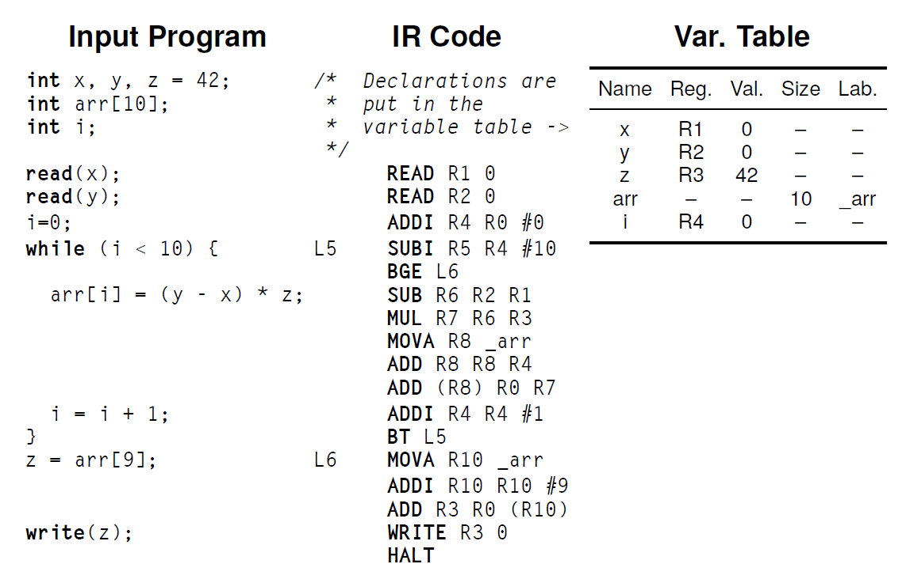
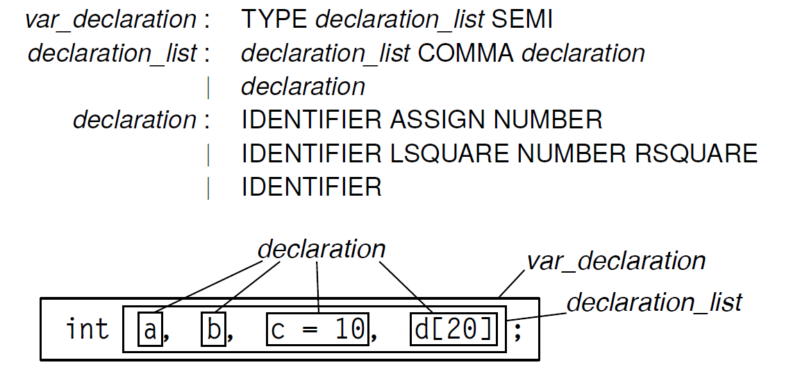
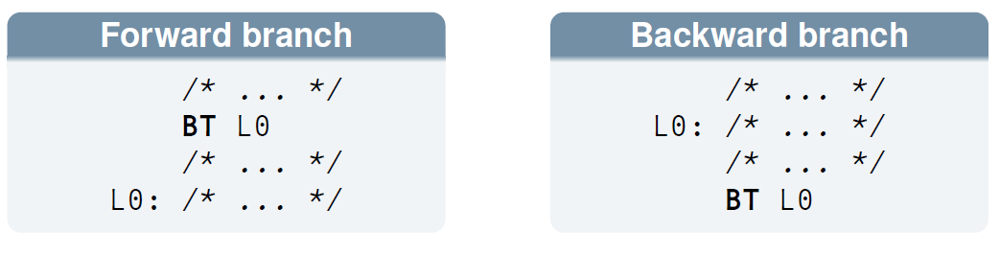
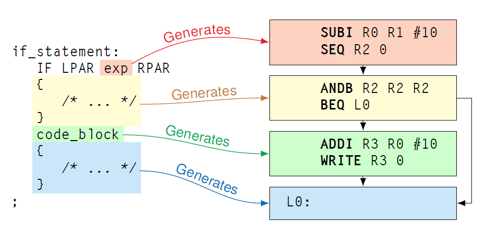
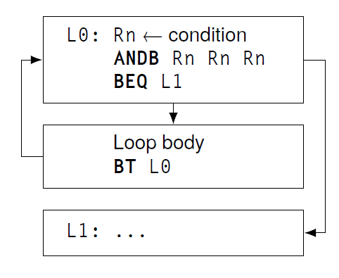
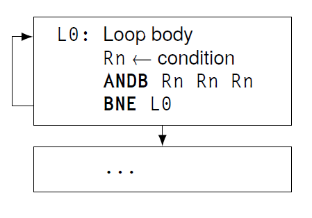
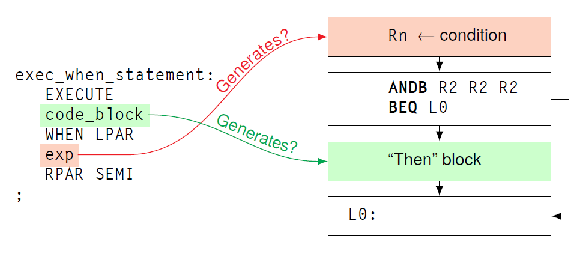
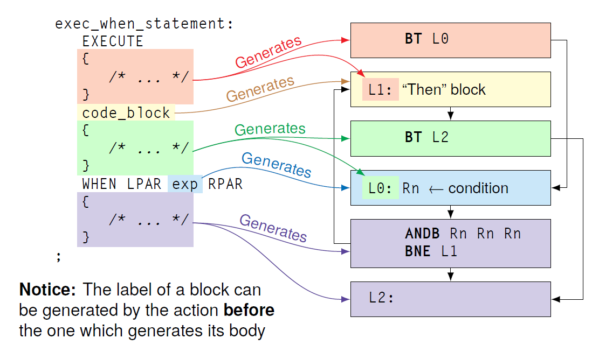

# FLC LAB

Compiler: translate program written in a language into a semantically equivalent program in another language.

Pipeline design ---> sequence of stages that progressively apply some transformations to the source program to get the final output.

Can use an intermediate representation to abstract from the language that is used (both in input and in output).

- front end: converts source to intermediate language (or intermediate representation IR)
- middle end: operates on the IR and does some optimizations (e.g. use vector operations)
- back end: converts optimized IR to the target machine language

We focus on the front end.

- lexical analyzer: text file to token stream (done by flex)
- syntax analyzer: recognizes structure of the specified grammar, produces the AST (done by bison)
- semantic analyzer: translates AST in the intermediate language

They all rely on a symbol table containing all the names that are defined in the program.

## ACSE

Simple compiler:

- accept C-like source language (LANCE)
- emits a RISC-like assmbly language (MACE)

It comes with other tools to form the entire toolchain:

- asm: assembler (translate from assembly to machine code)
- mace: simulator for the MACE processor

ACSE doesn't have a middle end because it only supports one language both on front and backend (also, it's very simple).

Front-end:

- source code tokenized by a flex scanner
- token stream is parsed by a bison parser
- the code is translated to a temporary intermediate by the semantic actions with the parser

Back-end:

- normalize representation to account for physical limitations of MACE processor
  - have finite registers, size of immediates is bounded, etc
- print out each instruction to generate the assembly file

### LANCE

Subset of C99

- only int variables (both scalar and array)
- only `if`, `while`, `do-while` control flow
- declarations must come before all other statements
  - because of this it is not possible to initialize a variable with an expression
- no functions
- no strings

```C
// declarations
int x, y, z = 42;
int arr[10];
int i;

// statements
read(x);
read(y);
i = 0;
while (i < 10) {
    arr[i] = (y - x) * z;
    i = i + 1;
}
z = arr[9];
write(z);
```

The source file is split in two sections:

- variable declaration: the root non terminal for this section is `var_declarations`
- list of statements: the root non terminal for this section is `statements`

It is defined using a simple BNF grammar (bison only supports BNF).

```yacc
program : var_declarations statements ⊣

var_declarations : var_declarations var_declaration
                  | ε

statements : statements statement
            | statement

code_block : statement
            | LBRACE statements RBRACE

var_declaration : …
statement : …
```

Statements can be:

- simple: indivisible element of computation
  - assignements, read, write
- compount: statements which contain multiple statements
  - if, while, do-while

### Intermediate Representation IR

In ACSE the IR is composed of two main parts:

- instruction list
  - assembly like instructions
- variable table

The IR is a RISC-like language, very similar to the final MACE assembly output.

There are different types of instructions:

- arithmetic and logic (ADD, SUB, AND, ...)
- memory access instructions (LOAD, STORE)
- conditional and unconditional branches (BEQ, BT, ...)
- special I/O instructions (READ, WRITE)

We have unbounded registers and memory locations (register allocation is done later).

Registers are the variables of the intermediate language and all have the same type (32-bit signed int), it will depend on the instruction if this is interpreted as a pointer.

Immediates are **constant** values encoded directly in the instruction.

Labels are **constant** pointers to a given location in memory:

- conditional jumps
- pointing to location of statically allocated arrays
- the actual address is decided by the assembler

#### Instructions formats

- ternary: 1 destination and 2 source registers
  - `ADD R3 R1 R2` <-- sums R1 and R2 and stores result in R3
- binary: 1 destination and 1 source register + 1 immediate operand
  - `ADDI R3 R1 4` <-- sums R1 and 4 and stores result in R3
- unary: 1 destination register and 1 address operand
  - `LOAD R1 L0` <-- loads in R1 the value pointed by L0
- jump: 1 address operand
  - `BEQ L0` <-- if condition is satisfied, move execution to instruction pointed by L0

#### Operands and addressing modes

- register direct `R1`: get the value stored in the register
- register indirect `(R1)`: get data at the address contained in R1
- symbolic address `L0 or <label id>`: address defined by the label
- immediate `#3`: the scalar integer 3

There are also some special registers:

- `R0` will always containt the constant 0 (can be used also to discard results since assignements will not change its value)
- `PSW`, status word, implicitly modified by arithmetic instruction, containes some status flags that are set when
  - `N`: the operation result was negative
  - `Z`: the operation result was 0
  - `V`: there was an overflow
  - `C`: there was a carry

Carry and overflows are the same for unsigned ints, but in ACSE we only have signed ints

- in the case of overflow, the result can fit in the representation but it will cause the sign to change and the number wraps around (e.g. (127 + 1 = -128) 01111111 + 1 --> 10000000)
- carry when the number doesn't physically fit in the bits we have (e.g. 11111111 + 1)

#### Conditional jumps

There are 15 conditional jump instructions, many make use of the flags of the PSW, the most common are:

- `BT`: branch true, it's an unconditional jump
- `BEQ`: branch if last result was zero (i.e. zero flag was set)
- `BNE`: branch if last result was NOT zero (i.e. zero flag NOT set)

#### Variables

There can be only scalars or arrays. Each variable has an associated identifier (its name).

- scalars have a
  - registers in which they are stored (not stored in memory or stack)
  - initial values
- arrays have a
  - size
  - label to a memory location where they will be stored

They are all stored in the variable table.



### Structure of ACSE

- scanner: flex source in `Acse.lex`
- parser: bison source in `Acse.y`
- codegen: instruction generation functions in `axe_codegen.h`

ACSE is a direct syntax translation:

- instructions are produced while parsing
- order of compiled instructions depend on syntax (no reordering)

A real compiler first builds an AST and then it is transformed in a list of instructions.

Acse.y is the most importat part since the semantic actions are the ones that actually perform the translation from LANCE to assembly.

Instructions are emitted using some `gen_XXX_instruction()` that more or less do the following (example for the return instruction that generates a HALT)

```C
return_statement: RETURN
{
  // allocate an instruction
  t_axe_instruction *inst = malloc(sizeof(t_axe_instruction));
  // set the correct opcode (and other paramters if necessary)
  inst->opcode = HALT;
  // add instruction at the end of the program
  // (this is just to do an example, in the exercises we will not add
  // instructions manually to the program but instead we will make use
  // of the gen functions)
  program->instructions = addLast(program->instructions , inst);
}
;
```

At the end of the parsing, all instructions are printed to a file as assembly instructions (that is basically a simple switch case on the opcode that prints them out).

## Variable declaration



Tokens for identifiers have their corresponding name allocated dynamically by the lexer.
**This means that it needs to be freed it in the semantic actions!!**.

Each variable must be added to the variable list, we can do so by calling `create_variable()`.
This function already frees the identifier. Arrays cannot be initialized at declaration time.

Creating variables only tells the compiler that the variable exists, no space is allocated for it. The compiler knows in which register or memory location the value of the variable will be.
See compiling as a sort of "planning", it's just a translation.

## Accessing variables

Generate code to access the variables

- scalar variable:
  - read: returns an integer corresponding to the register identifier. **I need to free the identifier myself.**

  ```C
  int get_symbol_location(
    t_program_infos *program,
    char *ID,       /* the variable name */
    int genLoad     /* always zero */
  );
  ```

  The return value is just the register number, do not mix up variables and register identifiers.
  to get the corresponding value.

  - write: there are two cases, assign immediate and assign another variable
    - immediate: use an addi instruction with register 0 to load a value in the variable using the `gen_xxxi_instruction()` (`i` stands for immediate)

    ```C
    // a = 42;
    int r_var = get_symbol_location(program, "a", 0);
    gen_addi_instruction(program, r_var, REG_0, 42);
    ```

    - variable: need to generate a ternary instruction (i cannot do a simple assignement, it's always an operation, use zero register in case)

    ```C
    // a = b + c;
    int r1 = get_symbol_location(program, "a", 0);
    int r2 = get_symbol_location(program, "b", 0);
    int r3 = get_symbol_location(program, "c", 0);
    gen_add_instruction(program, r1, r2, r3, CG_DIRECT_ALL);
    ```

MEMO:

- `gen_xxxi_instruction()` family generates binary instructions (those with immediates)
  - (program) 2 registers, 1 immediate
- `gen_xxx_instruction()` gamily generates ternary instructions
  - (program) 3 registers + 1 flag (specify which registers are indirectly referenced, that is they are used as pointers)

## Read values

Pretty simple, just need to store the value read as input in a variable.

```C
// read(variable);
read_statement : READ LPAR IDENTIFIER RPAR
{
  int location;
  // get register corresponding to the variable
  location = get_symbol_location(program, $3, 0);
  // generate a read instruction that saves the value to that register
  gen_read_instruction(program, location);
  // need to free identifier
  free($3);
}
```

## Expressions

All operators are left associative (except NOT operator) and have the same precedence as in C.

MEMO: bitwise operations have the lowest priority so i need to parenthesize them to have them execute correct (for instance before a comparison).

NOTE: specific ACSE bug. The minus operator is left associative, this doesn't behave correctly if it is inteded to use as a negation, for instance:

- expression `-1 * 2 - 3` (the first - is the negative)
  - normal interpretation `((-1) * 2) - 3`
  - LANCE interpretation `(-(1 * 2)) - 3`

To have normal interpretation i need to explicitly put parenthesis. Nobody knows why this bug is not fixed. (at least as of version 1.2.3)

For complex expression involving multiple variables (registers) we have the need to use temporary registers to store the intermediate results. These registers are NOT associated to variables.

For instance this expression

```C
a + b + c / 15;
```

is represented in IR as:

```asm
MUL R4 R2 R3
ADDI R5 R0 #15
DIV R6 R4 R5
ADD R7 R1 R6
```

Involving the following registers

- `R1`, `R2`, `R3` for the variables `a`, `b`, `c` respectively
- `R4` for the intermediate `b * c`
- `R5` for the immediate `15`
- `R6` for the intermediate `b * c / 15`
- `R7` for the final value `a + b + c / 15`

ACSE provides a simple function to ask for a new register to be used for storing temporary values.

```C
int getNewRegister(t_program_infos *program)
{
  int result;
  // pick the first free register
  result = program->current_register;
  // keep track of allocated registers
  program->current_register++;
  // return the number corresponding to the register
  return result;
}

// usage
int temp_reg = getNewRegister(program);
```

To return the value of an expression:

- constants: generate code to put constant in a new temp register
- variables: reuse the register associated to that variable
- paranthesis: reuse the register of the subexpression

```C
exp : NUMBER
{
  $$ = getNewRegister(program);
  gen_addi_instruction(program, $$, REG_0, $1);
  // note can do the same thing with a gen_load_immediate() helper function
  // it returns the register number where the value is stored
}
| IDENTIFIER
{
  $$ = get_symbol_location(program, $1, 0);
  // remember to free identifier
  free($1);
}
| LPAR exp RPAR
{
$$ = $2;
}
| /* ... */
```

For operators, store values in a register and generate the corresponding instruction.

```C
// NOTE: this doesn't do constant folding
// see later for that (also look in Acse.y for the final implementation)
exp : /* ... */
| exp PLUS exp
{
  // temp register for the result
  $$ = getNewRegister(program);
  // add instruction, store result in the register
  gen_add_instruction(program, $$, $1, $3, CG_DIRECT_ALL);
}
| exp AND_OP exp
{
  // same as before
  $$ = getNewRegister(program);
  gen_andb_instruction(program, $$, $1, $3, CG_DIRECT_ALL);
}
| exp OROR exp
{
  $$ = getNewRegister(program);
  gen_orl_instruction(program, $$, $1, $3, CG_DIRECT_ALL);
}
| /* ... */
```

What about comparisons? They need a more complex code sequences using set instructions to implement the same logic conditions as branching, they are used to save the result of the comparison in a register (remember that at compile time i do not know the actual outcome of the comparison).

```C
exp : /* ... */
| exp LT exp
{
  // temp register for the result
  $$ = getNewRegister(program);
  // do the comparison (the operation sets the flag)
  gen_sub_instruction(program, REG_0, $1, $3, CG_DIRECT_ALL);
  // helper function to set the result of the specified comparison in the register $$
  gen_slt_instruction(program, $$);
}
| /* ... */
```

## Constant folding

Optimization implemented in ACSE to save time at runtime if the result of the operation is known at compile time.
Specifically, expressions containing operations between constants are simplified to substitute that subexpression with its result (i.e. i can compute the value at compile time instead of generating the code to compute the value).

This causes the `exp` to possibly have two values, a register identifier for a temporary result or an integer value derived by some constant operation.
To support this we add a field to the expression type stating if it is a register or an immediate. Use this field to optimize operations between immediates.

```C
// in axe_struct.h:
typedef struct t_axe_expression {
  int value;           // register identifier or actual value, it depends on expression_type
  int expression_type; // IMMEDIATE or REGISTER
} t_axe_expression;

// in Acse.y:
%union {
  /* ... */
  t_axe_expression expr;
  /* ... */
}
%type <expr> exp

// to create an expression
{
  $$.expression_type = /* IMMEDIATE or REGISTER */
  $$.value = /* constant or register id */
}

// alternatively, there is an helper function to create it
t_axe_expression create_expression(int value, int type)
```

We can update all semantic actions to distinguish between immediates and registers:

```C
exp : NUMBER
{
  // specify that it is a constant
  $$ = create_expression($1, IMMEDIATE);
}
| IDENTIFIER
{
  int location = get_symbol_location(program, $1, 0);
  // specify that it is a register
  $$ = create_expression(location, REGISTER);
  free($1);
}
| LPAR exp RPAR
{
  // this doesn't change
  $$ = $2;
}
| /* ... */
```

And use this information in all other operations (for instance in plus):

```C
exp: exp PLUS exp
{
  if ($1.expression_type==IMMEDIATE && $3.expression_type==IMMEDIATE)
  {
    // both immediate, the result is known, can compute at compile time
    // doesn't generate code to compute the result, puts directly the value in the expression
    $$ = create_expression($1.value + $3.value, IMMEDIATE);
  }
  else
  {
    // at least one value is a register, so it's unknwon at compile time
    // in any case get the register to store it
    int r1, r2, r_res;   // these are all register numbers
    if ($1.expression_type == IMMEDIATE)
      // allocate new temp reg and store the immediate value
      r1 = gen_load_immediate(program, $1.value);
    else
      // it's a register, so the value field is directly the register id
      r1 = $1.value;
    // same as above
    if ($3.expression_type == IMMEDIATE)
      r2 = gen_load_immediate(program, $3.value);
    else
      r2 = $3.value;
    // new register to store result
    r_res = getNewRegister(program);
    // add the operation to the program
    // it will be executed at runtime
    gen_add_instruction(program, r_res, r1, r2, CG_DIRECT_ALL);
    // return the expression, the value will be known at runtime
    $$ = create_expression(r_res, REGISTER);
  }
}
```

Since all the code to handle immediates is the same for every operand, ACSE offers two helper function to do have the same result as the above code.

```C
/* Valid values for `binop' are: *
* ADD SUB MUL DIV ANDL ORL EORL *
* ANDB ORB EORB SHL SHR *
* generates the above code, just change the binop to the specified op*/

t_axe_expression handle_bin_numeric_op(
  t_program_infos *program ,
  t_axe_expression exp1,
  t_axe_expression exp2,
  int binop
);

/* Valid values for `condition' are: *
* _LT_ _GT_ _EQ_ _NOTEQ_ _LTEQ_ _GTEQ_ 
* similar logic but for comparisons */
t_axe_expression handle_binary_comparison(
  t_program_infos *program ,
  t_axe_expression exp1,
  t_axe_expression exp2,
  int condition
);
```

RECAP: All operations on expressions can be handled by the functions `handle_bin_numeric_op` and `handle_binary_comparison`, which have support for the constant folding optimization, and return the resulting expression (either REGISTER or IMMEDIATE).
I can use these instructions if i need to perform some operation that require constant folding to compose a more complex operator.

## Statements with expressions

Also in the case of assignements, the expression can be IMMEDIATE or REGISTER so we need to distinguish the two cases:

```C
assign_statement: IDENTIFIER ASSIGN exp
{
  int location;
  // get the register corresponding to the identifier
  location = get_symbol_location(program, $1, 0);
  if ($3.expression_type == IMMEDIATE)
    // load the immediate value at the specific register (materialization)
    gen_move_immediate(program, location, $3.value);
  else
    // move the value from the source register to the destination register
    gen_add_instruction(program, location, REG_0, $3.value, CG_DIRECT_ALL);

  // always free identifier
  free($1);
}
;
```

And similarly for the write statement, it always needs a register to print the value that it contains:

```C
write_statement: WRITE LPAR exp RPAR
{
  int location;
  if ($3.expression_type == IMMEDIATE)
    // allocate a register and store the value
    location = gen_load_immediate(program, $3.value);
  else
    // i already have the register
    location = $3.value;
  gen_write_instruction(program, location);
}
;
```

## Arrays

Contrary to variables, arrays are stored in memory so they need to be accessed via their memory location.
The addess is identified by a label, an identifier for a constant pointer.

In the IR we can use the `MOVA` instruction to load the address in the register, so to access the array we just have to:

- load address in a register
- add the offset of the desired element to that address
- use indirect addressing to r/w elements of the array

ACSE provide helper function to load and store values in an array, defined in `axe_array.h`

```C
// e.g. arr[5] --> loadArrayElement(program, "arr", 5)
// the return value is the register id where the value is loaded
// does NOT return the value itself
int loadArrayElement(
  t_program_infos *program,
  char *ID,                 // the array identifier
  t_axe_expression index    // index to get the value from
);

// e.g. arr[5] = 23 --> storeArrayElement(program, "arr", 5, 23)
void storeArrayElement(
  t_program_infos *program,
  char *ID,                 // array identifier
  t_axe_expression index,   // index to store the value to
  t_axe_expression data     // value to be stored
);

// note that since index is an expression it can be both a REGiGISTER or an IMMEDIATE
```

We can use these helper functions to access the array:

```C
// use loadArrayElement
exp: /* ... */
| IDENTIFIER LSQUARE exp RSQUARE 
{
  int reg;
  // reg is the register where the value is loaded
  reg = loadArrayElement(program , $1, $3);
  // value of the expression is the register containing the value
  $$ = create_expression(reg, REGISTER);
  // free the identifier
  free($1);
}

// use storeArrayElement
assign_statement:
IDENTIFIER LSQUARE exp RSQUARE ASSIGN exp
{
  // store array accepts directly expressions, no need to do any work
  storeArrayElement(program , $1, $3, $6);
  // remember to always free the identifier
  free($1);
}
|  /* ... */
;
```

How can i check if a variable is an array or not? I can retrieve information about an identifier with the `getVariable()` function.

```C
// struct containing variable information
typedef struct t_axe_variable {
int type;       // always int
int isArray;    // specifies if it is an array or not
int arraySize;  // if isArray is set, contains the size of the array
int init_val;   // only for scalars, the value at which they were initialized
char *ID;       // variable identifier
t_axe_label *labelID;   // if isArray is set, memory location of the array
} t_axe_variable;

// function to retrieve variable information
// do not free the struct returned by the getVariable
t_axe_variable *getVariable(
  t_program_infos *program,   
  char *ID   // identifier of the variable
);
```

## Control statements

### Sharing variables between semantic actions

Since ACSE is a direct translator, each semantic action is an independent block, so the declared variables are local to that block. However, in some cases (as we will see) it is necessary to share state between different blocks to build higher level constructs.
For this example we will consider a save statement, that stores the old value of a variable and restores it later.

```C
int a = 10;
save a {                        // basically save temp_a = a
  a = 7;
  write(a); // prints "7"
}                               // restore a = temp_a
write(a); // prints "10"

// corresponds to the following grammar rule
save_statement :
SAVE IDENTIFIER
{
// Generate code to save the variable
// The code will appear before the block
}
code_block
{
// Generate code to restore the variable
// The code will appear after the block
}
;
```

There are 3 main ways to share a variable between different semantic actions.

- global variables
  
  ```C
  int r_save;
  /* ... */
  save_statement :
  SAVE IDENTIFIER
  {
    // allocate temporary register
    r_save = getNewRegister(program);
    // get location of a
    int r_var = get_symbol_location(program, $2, 0);
    // store old value of a in the temporary register
    gen_add_instruction(program, r_save , REG_0, r_var, CG_DIRECT_ALL);
    // do not free identifier yet, i need it later
  }
  code_block
  {
    // get location of a
    int r_var = get_symbol_location(program, $2, 0);
    // restore the old value in a
    gen_add_instruction(program, r_var, REG_0, r_save , CG_DIRECT_ALL);
    // now i can free identifier
    free($2);
  }
  ;
  ```

  - pros: very easy to implement
  - cons: doesn't support nesting, since there is only one variable if i nest the construct i will overwrite the saved values for the outer statement

- global stack: idea similar to the global variable, but use a stack instead to allow nesting

  ```C
  // linked list from collections.h
  t_list *save_stack = NULL;
  /* ... */
  save_statement :
  SAVE IDENTIFIER
  {
    // temporary register to store old value
    int r_save = getNewRegister(program);
    // get location of a
    int r_var = get_symbol_location(program , $2, 0);
    // copy old value of a to temporary register
    gen_add_instruction(program, r_save, REG_0, r_var, CG_DIRECT_ALL);
    // push on the stack the temporary register number
    save_stack = addFirst(save_stack, INTDATA(r_save));
    // do not free identifier yet, i need it later
  }
  code_block
  {
    // get data from the top of the stack
    // it's the register value not the actual number
    int r_save = LINTDATA(save_stack);
    // pop the value from the stack
    save_stack = removeFirst(save_stack);
    // get location of a
    int r_var = get_symbol_location(program, $2, 0);
    // restore the old value from the register i used to save it
    gen_add_instruction(program, r_var, REG_0, r_save, CG_DIRECT_ALL);
    // now i can free identifier
    free($2);
  }
  ;
  ```

  - pros: works with nestable statements
  - cons: more cumbersome to implement

- semantic value as a variable: use the token associated to the new statement to store the value that i have. The keywork itself doesn't need to have value but i can use it to store values that i need to share.

  ```C
  // specify that it is an int
  %token <intval> SAVE
  /* ... */
  save_statement :
  SAVE IDENTIFIER
  {
    // $1 is tha "save" keywork, store the temporary register there
    $1 = getNewRegister(program);
    // get location of a
    int r_var = get_symbol_location(program, $2, 0);
    // store old value of a in the temporary register
    gen_add_instruction(program, $1, REG_0, r_var, CG_DIRECT_ALL);
    // do not free identifier yet, i need it later
  }
  code_block
  {
    // get location of a
    int r_var = get_symbol_location(program, $2, 0);
    // restore old value of a from the register that i saved in SAVE
    gen_add_instruction(program, r_var, REG_0, $1, CG_DIRECT_ALL);
    // now i can free the identifier
    free($2);
  }
  ;
  ```

  - the steps to follow are:
    - add type declaration in `Acse.y`
    - do NOT assign a semantic value in `Acse.lex`
    - use the usual `$n` notation to access the value of the token in the actions
  - pros: simple to implement, nestable (each token will have its own separate value)
  - cons: doesn't work when the value needs to be accessed by different rules (uncommon, but keep in mind, in this case use the global stack if nestable, global variable otherwise)
  - recommended method to use for most cases
  - NOTE: remember that mid rule actions count for the `$n` access, so remember to count them correctly (for instance, above the `code_block` part would be `$4` instead of `$3`)

### Branches

Control statements are translated in branches in the IR. We have 2 kind of branches:

- backward: jump to a label that is located before the branch (typical in loops)
- forward: jump to a label that is located after the branch (typical in if statements)



To allocate labels, some functions are provided. A label points to the next instruction that will be generated.

```C
// create a new label, does not insert it in the instruction list
t_axe_label *newLabel(t_program_infos *program);
// insert label in instruction list
void assignLabel(t_program_infos *program, t_axe_label *label);
// for forward branches, use these two separatly (see later)

// they are combined in this single function
t_axe_label *assignNewLabel(t_program_infos *program)
{
  t_axe_label *label = newLabel(program);
  return assignLabel(program, label);
}
// can be used for backward branches
```

We can pass labels to the functions that generate branch instructions, note that the approach is slightly different for forward and backward jumps:

```C
// backward branch
t_axe_label *label
label = assignNewLabel(program);
// ...
// more code generation
// ...
gen_bt_instruction(program , label, 0);

// forward branch
// first create an empty label
t_axe_label *label = newLabel(program);
// use the empty label to output branch instruction
gen_bt_instruction(program , label, 0);
// ...
// more code generation
// ...
// when i actually reach the label, assign its correct location
assignLabel(program , label);
```

### If statement

For now ignore the else part of the statement. If the condition is satisfied, execute code in the block, if the condition is not satisfied, skip the code in the statement.
Basically in the assembly what we have is that we jump after the if it the condition is negative. Exploit the status register flags to decide the jumps.



Note that the `exp` non terminal could also not generate code because of constant folding.

In order implement the control flow shown above, we need to store the label between the two semantic actions. We can use the methods that we have see before, in ACSE it is stored in the IF token.
The complete code for the if statement (without else) becomes the following:

```C
/* ... */
if_statement:
IF LPAR exp RPAR
{
  // manage value of the expression of the condition
  int r_cond;
  if ($3.expression_type == REGISTER)
    // it's a register, get it's number
    r_cond = $3.value;
  else
    // it's an immediate derived from costant folding, move to a register
    r_cond = gen_load_immediate(program, $3.value);

  // generate the branch
  // first, store the condition in the status register flags
  // this trick allows to change the zero flag without touching the value of any register
  // if the condition was 0 (false --> skip the if block), the zero flag will be set after this
  gen_andb_instruction(program, r_cond, r_cond, r_cond, CG_DIRECT_ALL);
  // prepare the label for later (if it's a forward jump)
  // the label is stored in the IF token ($1)
  $1 = newLabel(program);
  // generate the branch to that label
  // jumps only if zero flag is set --> condition was 0 (false)
  gen_beq_instruction(program, $1, 0);
}
code_block
{
  // assign the label defined before, i can find it in $1
  // the label is defined at the end of the code block so that it will point to
  // the first instruction after the code_block (outside of the if)
  assignLabel(program, $1);
}
;
```

NOTE: if the condition is constant i already know the result of the branch so i can optimize the if in this case and directly jump to the correct location.

### While loops

In this case there are two branches:

- backward branch: unconditional, goes back to the code that checks the condition of the loop (next loop iteration)
- forward branch: when the condition becomes false, jumps to the code after the loop (end the loop)



Also in this case we need to store the label between semantic action, but we have 2 labels to store. The solution is to define a specific type for the WHILE token that is able to store both labels.

```C
// in axe_struct.h
typedef struct {
  t_axe_label *label_condition;
  t_axe_label *label_end;
} t_while_statement;

// in Acse.y
%union {
/* ... */
  t_while_statement while_stmt;
}
/* ... */
%token <while_stmt> WHILE

/* ... */

while_statement:
WHILE
{
  // store the label for the code that checks the condition
  $1.label_condition = assignNewLabel(program);
}
LPAR exp RPAR
{
  // manage the condition value
  // in both cases the zero flag is updated
  if ($4.expression_type == IMMEDIATE)
    // load constant into register (zero flag set if immediate is 0)
    gen_load_immediate(program , $4.value);
  else
    // if register, update the flag
    // (zero flag set if the value in the register was 0)
    gen_andb_instruction(program, $4.value, $4.value, $4.value, CG_DIRECT_ALL);
  // create the label for the end
  $1.label_end = newLabel(program);
  // use the label to create the jump out of the loop
  gen_beq_instruction(program , $1.label_end , 0);
}
code_block
{
  // unconditional (bt == branch true) branch to the condition
  gen_bt_instruction(program , $1.label_condition , 0);
  // assign location for the end of loop, point to instructions after the loop
  assignLabel(program , $1.label_end);
}
;
```

NOTE: also in this case i can optimize the loop if the condition is constant (infinite loop or never do the loop).

### Do-while statement

Simpler that the while, no need to have two labels.



And also the resulting semantic actions are simpler.

```C
// label is stored in the DO token in this case
%token <label> DO
/* ... */
do_while_statement:
DO
{
  // create and set the location of the label
  $1 = assignNewLabel(program);
}
code_block WHILE LPAR exp RPAR
{
  // manage the condition value, same as in the while
  if ($4.expression_type == IMMEDIATE)
    gen_load_immediate(program, $6.value);
  else
    gen_andb_instruction(program, $6.value, $6.value, $6.value, CG_DIRECT_ALL);
  
  // go back to the beginning (if loop ends, no jump --> fallthrough next sections)
  gen_bne_instruction(program, $1, 0);
}
;
```

### Control statements pitfalls

We cannot have control flows that cross each other. For instance consider the execute-when statement.

```C
execute {
  /* code */
} when (<condition>);
```

It is basically equivalent to a normal if, but reversed. The problem is that the condition is specified after the block but needs to be evaluated before the block is executed.
This is not possible in ACSE since it is a direct translator.



We need to do things in a more complex way to achieve this result.



Basically:

- jump to the condition
- if satisfied, jump back to the code
- at the end of code, jump after the condition

So that statement will need to store 3 labels in the EXECUTE token, 2 unconditional forward jumps and 1 backward jump.
